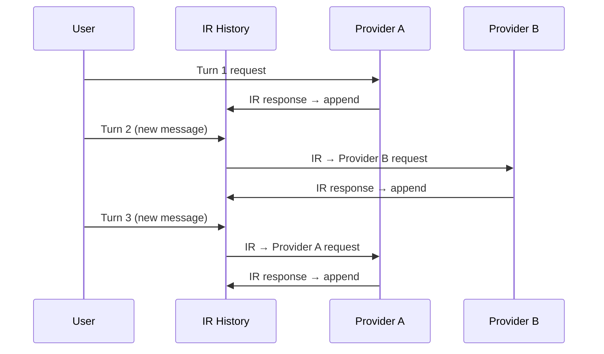

# 跨提供方对话

此示例展示了在两个不同 LLM 提供方之间交替进行多轮对话，使用 LLM-Rosetta 实现消息的无缝转换。

## 概念



对话历史以 IR 格式维护。每次 API 调用前，完整历史被转换为目标提供方的格式。

## 示例：OpenAI ↔ Anthropic

```python
from llm_rosetta import OpenAIChatConverter, AnthropicConverter
from llm_rosetta.types.ir import extract_text_content, IRRequest

openai_conv = OpenAIChatConverter()
anthropic_conv = AnthropicConverter()

# 以 IR 格式维护历史
ir_messages = []

def chat(user_text: str, use_provider: str = "openai"):
    # 添加用户消息到 IR 历史
    ir_messages.append({
        "role": "user",
        "content": [{"type": "text", "text": user_text}],
    })

    # 构建 IR 请求
    ir_request: IRRequest = {
        "model": "gpt-4o" if use_provider == "openai" else "claude-sonnet-4-20250514",
        "messages": ir_messages,
        "generation": {"temperature": 0.7, "max_tokens": 1000},
    }

    # 转换为提供方格式并调用 API
    if use_provider == "openai":
        req, _ = openai_conv.request_to_provider(ir_request)
        response = openai_client.chat.completions.create(**req)
        ir_resp = openai_conv.response_from_provider(response.model_dump())
    else:
        req, _ = anthropic_conv.request_to_provider(ir_request)
        response = anthropic_client.messages.create(**req)
        ir_resp = anthropic_conv.response_from_provider(response.model_dump())

    # 将助手响应追加到历史
    assistant_msg = ir_resp["choices"][0]["message"]
    ir_messages.append(assistant_msg)

    return extract_text_content(assistant_msg)

# 在提供方之间交替
print(chat("你好！", "openai"))
print(chat("请告诉我更多。", "anthropic"))
print(chat("谢谢！", "openai"))
```
