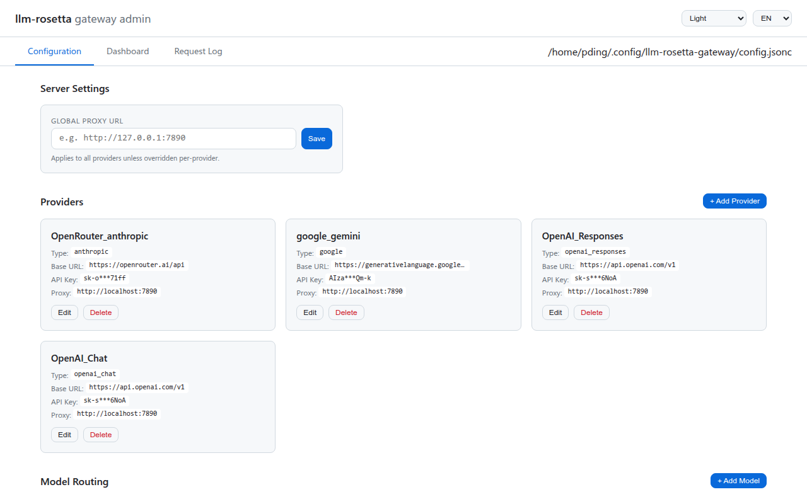
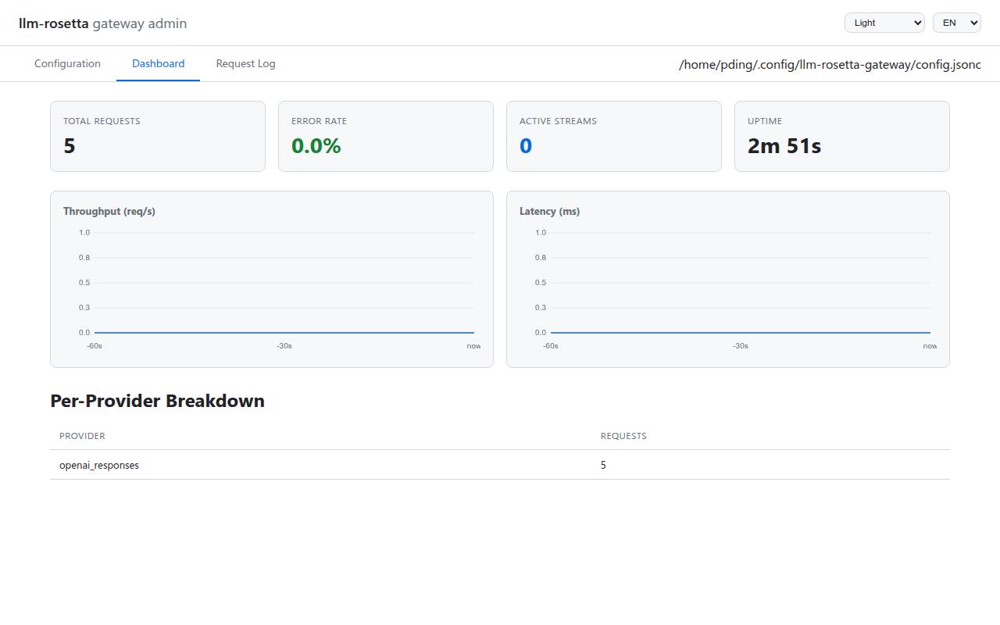
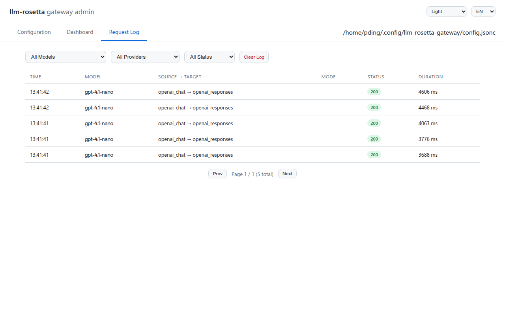
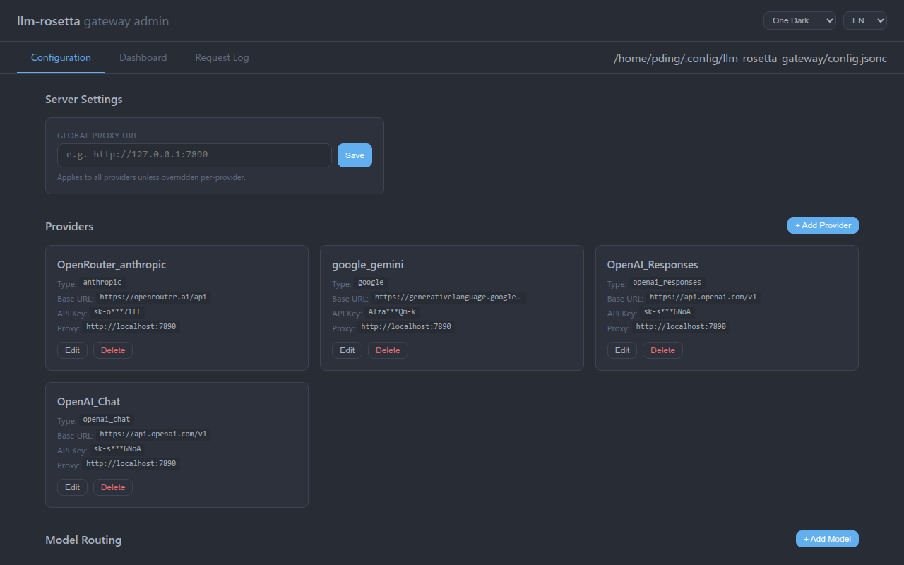

# 管理面板（Admin Panel）

网关内置了基于 Web 的管理面板，用于管理配置、监控流量和查看请求日志——无需编辑配置文件或重启服务器。

访问地址：**`http://localhost:8765/admin/`**

## 配置管理

**Configuration** 标签页可通过可视化界面管理提供商、模型和服务器设置。



### 服务器设置

设置全局代理 URL，适用于所有提供商（除非在提供商级别单独覆盖）。

### 提供商管理

每个提供商卡片显示名称、API 标准类型、Base URL、脱敏后的 API Key 以及可选代理。支持以下操作：

- **添加**新提供商（"+ Add Provider" 按钮）
- **编辑**现有提供商（名称、类型、Base URL、API Key、代理）
- **重命名**提供商——所有关联模型引用自动更新
- **删除**提供商

编辑时，API Key 显示为密码字段，支持可见性切换和复制按钮。卡片上显示的脱敏 Key 不会被写回配置文件。

### 模型路由

提供商区域下方是模型路由表，列出所有已配置的模型及其目标提供商和能力标记（text、vision、tools）。支持以下操作：

- **添加**新模型并指定提供商
- **编辑**模型能力（内联编辑）
- **删除**模型路由条目

## 仪表盘

**Dashboard** 标签页提供网关流量的实时指标。



### 摘要卡片

- **Total Requests** — 自启动以来的累计请求数（或自上次持久化加载）
- **Error Rate** — 非 2xx 响应的百分比
- **Active Streams** — 当前活跃的流式连接数
- **Uptime** — 网关启动以来的运行时间

### 时间序列图表

两个滚动 60 秒窗口的图表：

- **Throughput (req/s)** — 每秒请求率
- **Latency (ms)** — 每秒平均响应时间

### 按提供商分类

按目标提供商分组的请求计数表，便于了解流量分布。

## 请求日志

**Request Log** 标签页显示通过网关的每个请求。



每条记录包含：

| 列 | 说明 |
|----|------|
| Time | 请求时间戳 |
| Model | 请求中的模型名称 |
| Source -> Target | 来源 API 格式和目标提供商 |
| Mode | 流式或非流式 |
| Status | HTTP 状态码（颜色标记） |
| Duration | 端到端延迟 |

### 过滤

使用顶部的下拉筛选器可按以下条件过滤：

- **Model** — 按特定模型筛选
- **Provider** — 按目标提供商筛选
- **Status** — 仅显示成功（2xx/3xx）或错误（4xx/5xx）响应

点击 **Clear Log** 清除当前视图中的所有条目。

## 主题

管理面板提供 8 种主题，可通过右上角的下拉菜单切换：

| 主题 | 风格 |
|------|------|
| Light | 默认，简洁白色背景 |
| Indigo Dark | 深色，靛蓝色调 |
| Dracula | 经典深色主题 |
| Nord | 北极风格的柔和色调 |
| Solarized | Ethan Schoonover 配色方案 |
| Osaka Jade | 深色，翡翠绿色调 |
| One Dark | Atom 编辑器深色主题 |
| Rosé Pine | 柔和的玫瑰与松木色调 |



主题选择存储在 `localStorage` 中，浏览器关闭后依然保留。

## 国际化

管理面板支持 English 和中文。通过右上角的语言下拉菜单切换。选择同样保存在 `localStorage` 中。

## 数据持久化

指标和请求日志数据会自动持久化到配置文件旁的磁盘目录中：

```
~/.config/llm-rosetta-gateway/
    config.jsonc
    data/
        metrics.json              # 累计计数器
        request_log.jsonl         # 近期请求记录（JSONL 格式）
        request_log.1.jsonl.gz    # 轮转备份
        request_log.2.jsonl.gz    # 更早的备份
```

### 工作原理

- **请求日志**条目每 10 秒刷新到 `request_log.jsonl`
- **指标计数器**每 30 秒保存到 `metrics.json`（原子写入）
- **关闭时**执行最终刷新，确保数据不丢失
- **启动时**加载持久化数据——指标和日志在重启后恢复

### 日志轮转

当 `request_log.jsonl` 超过 2 MB 时：

1. 现有备份依次后移（`.1.jsonl.gz` -> `.2.jsonl.gz`，以此类推）
2. 当前日志压缩为 `.1.jsonl.gz`
3. 日志文件被清空

最多保留 3 个压缩备份。所有操作使用 Python 标准库（`gzip`、`json`、`os`），跨平台兼容。
