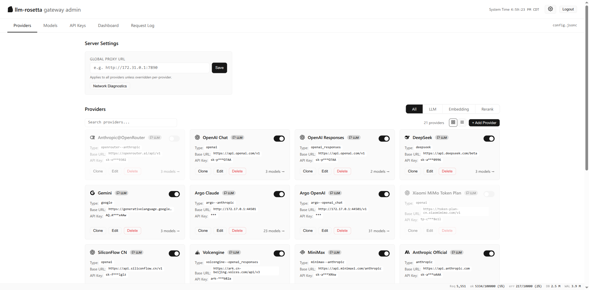
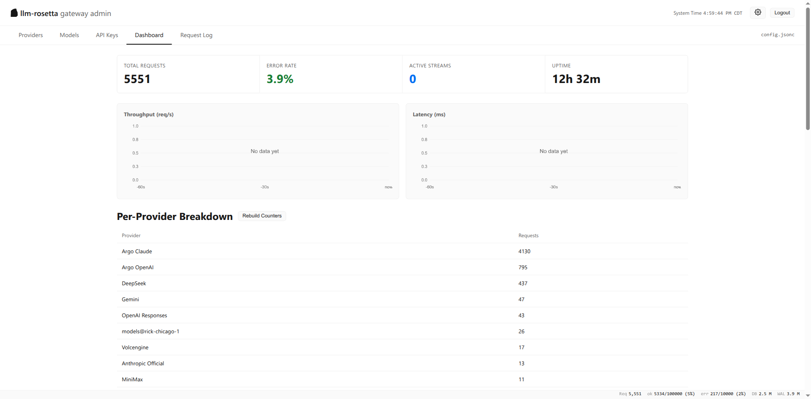
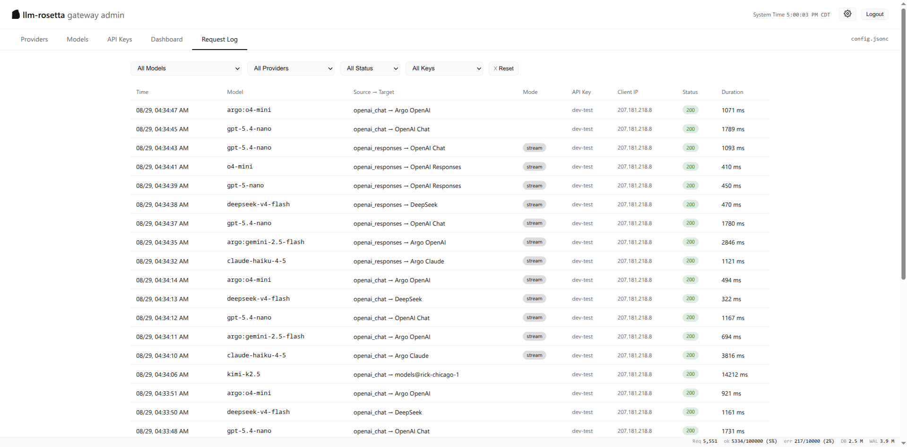

# Admin Panel

The gateway includes a built-in web-based admin panel for managing configuration, monitoring traffic, and inspecting request logs — all without editing config files or restarting the server.

Access it at: **`http://localhost:8765/admin/`**

## Configuration

The **Configuration** tab lets you manage providers, models, and server settings through a visual interface.



### Server Settings

Set a global proxy URL that applies to all providers unless overridden per-provider.

### Providers

Each provider card shows its name, API standard type (or shim name), base URL, masked API key, optional proxy, and provider logo. When a provider uses a [shim](../guide/shims.md), any active transforms (e.g. `strip_fields("logprobs")`) are also displayed on the card. You can:

- **Add** a new provider with the "+ Add Provider" button
- **Edit** an existing provider (name, type/shim, base URL, API key, proxy)
- **Rename** a provider — all model references are updated automatically
- **Clone** a provider — opens the Add Provider modal pre-filled with the source provider's settings as a template
- **Delete** a provider

When editing, API keys are shown as a password field with a visibility toggle and copy button. Masked keys displayed on cards are never written back to the config file.

#### API Key Multi-Entry

The API key field auto-detects comma-separated values and switches to a multi-entry list with individual password inputs, one per key. An **+ Add key** button is always visible to append additional keys. Each row has an eye toggle and copy button; the modal footer provides combined view-all and copy-all actions for the full comma-separated value.

#### Provider Search

When more than 6 providers are configured, a search bar appears at the top of the providers section. It filters providers in real time by name, type/shim, or base URL.

#### Grid / List View

Two icon buttons in the providers header let you switch between **grid** (card) and **list** (compact row) layout. The selected view is persisted in `localStorage`.

### Model Routing

Below the providers section, a model routing table lists all configured models with their target provider and capabilities. You can:

- **Search** models by name or **filter** by provider using the dropdown
- **Sort** by model name or provider by clicking column headers
- **Add** a new model with provider assignment
- **Fetch from Provider** — query the upstream `/v1/models` endpoint, browse available models with checkboxes, and bulk-add with optional prefix. Error responses show actionable diagnostics:
    - **Connection refused** — the upstream service is not running or a firewall is blocking the connection
    - **Timeout** — the upstream host is not reachable from the gateway container
    - **DNS failure** — the Base URL hostname cannot be resolved
- **Edit** model capabilities inline
- **Delete** a model routing entry
- **Test** a model directly from the admin panel

### Model Capabilities

Each model can declare capabilities that determine available test types and are returned in the `/v1/models` response:

| Capability | Description | Badge Color |
|------------|-------------|-------------|
| `text` | Text generation | Blue |
| `vision` | Image comprehension | Green |
| `tools` | Function/tool calling | Orange |
| `embedding` | Text embeddings (mutually exclusive with vision/tools) | Teal |
| `reasoning` | Extended thinking / chain-of-thought (mutually exclusive with embedding) | Purple |

### Model Testing

Click the **Test** button on any model row to run a quick test. The available test types depend on the model's declared capabilities:

| Test Type | Description | Requires |
|-----------|-------------|----------|
| Text | Simple text query | `text` |
| Vision | Image comprehension (embedded test image) | `vision` |
| Stream | Streaming text response | `text` |
| Tools | Function calling with a weather tool | `tools` |
| Embedding | POST to `/v1/embeddings`, displays dimension count | `embedding` |
| Reasoning | Text query with `reasoning_effort: "low"` | `reasoning` |

Embedding models show a single Test button (no dropdown) since only one test type applies.

While a test is pending, a **Cancel** button is visible so you can abort the request. A live elapsed timer is displayed alongside the status (e.g. "Sending request... 5s") to give immediate feedback on long-running completions. Test payloads use `max_tokens=256` for fast completion.

Test results show the extracted model reply in the main output area, with collapsible sections for the raw request payload, raw response body, and (for vision tests) the test image preview.

### Delete Confirmations

Destructive operations use two different confirmation patterns depending on severity:

- **Provider delete** — opens a type-to-confirm modal that warns about cascade effects (all associated models will be removed).
- **Model delete**, **API key delete**, and **Clear Log** — use an inline two-step confirmation: the button changes to "Sure? Yes" and automatically reverts after 3 seconds if not confirmed.

## Dashboard

The **Dashboard** tab provides real-time metrics about gateway traffic.



### Summary Cards

- **Total Requests** — cumulative request count since startup (or last persistence load)
- **Error Rate** — percentage of non-2xx responses
- **Active Streams** — currently active streaming connections
- **Uptime** — time since the gateway started

### Time-Series Charts

Two rolling 60-second charts show:

- **Throughput (req/s)** — request rate over time
- **Latency (ms)** — average response time per second

When there is no traffic yet, charts display a "No data yet" message instead of rendering a flat line.

### Per-Provider Breakdown

A table showing request counts grouped by target provider, useful for identifying traffic distribution.

### Network Diagnostics

The dashboard includes a Network Diagnostics section that checks connectivity from the gateway process. Three items are displayed:

| Item | Description |
|------|-------------|
| **IP Location** | The gateway's outgoing public IP and geolocation, detected via an external lookup service |
| **Host IP** | The Docker host's gateway IP (e.g. `172.29.0.1`), detected from the container's default route via `/proc/net/route`. Useful for reaching services running on the host machine. Only shown when running inside a container. |
| **Google** | Basic connectivity check to `google.com` |

## Request Log

The **Request Log** tab shows individual requests flowing through the gateway.



Each entry includes:

| Column | Description |
|--------|-------------|
| Time | Request timestamp (date and time) |
| Model | Model name from the request |
| Source -> Target | Source API format and target provider |
| Mode | Streaming or non-streaming |
| Status | HTTP status code (color-coded) |
| Duration | End-to-end latency |

### Filtering

Use the dropdown filters at the top to narrow by:

- **Model** — filter by specific model
- **Provider** — filter by target provider
- **Status** — show only successful (2xx/3xx) or error (4xx/5xx) responses

Click **Clear Log** to remove all entries from the current view.

## Themes

The admin panel ships with 8 themes, selectable from the dropdown in the top-right corner:

| Theme | Style |
|-------|-------|
| Light | Default, clean white background |
| Indigo Dark | Dark with indigo accents |
| Dracula | Popular dark theme |
| Nord | Arctic-inspired pastel palette |
| Solarized | Ethan Schoonover's color scheme |
| Osaka Jade | Dark with jade green accents |
| One Dark | Atom editor's dark theme |
| Rose Pine | Muted rose and pine tones |

Theme selection is stored in `localStorage` and persists across browser sessions.

## Authentication

The admin panel does **not** require the gateway API key.

Set `server.admin_password` in your config to enable built-in password protection for the admin panel:

```jsonc
{ "server": { "admin_password": "${ADMIN_PASSWORD}" } }
```

See [Configuration — Admin Panel Security](configuration.md#admin-panel-security) for details.

When password protection is enabled:

!!! info "No content flash"
    While the browser verifies your stored session token, the admin UI remains hidden (`body.auth-pending`) until authentication is confirmed. This prevents a brief flash of the full interface before the login overlay appears.

- The login token is stored in `localStorage`, so your session survives browser restarts — not just the current tab.
- A **Logout** button appears in the top-right corner to end your session manually.
- Sessions automatically expire after **30 minutes of inactivity**. Mouse movement, keyboard input, scrolling, and clicks all count as activity.
- The login form uses standard HTML form semantics, so browser password managers can save and autofill credentials.

Alternatively, protect the admin panel using a reverse proxy:

- **Caddy**: Use `basicauth` directive
- **Nginx**: Use `auth_basic` directive
- **Traefik**: Use BasicAuth middleware

The gateway API key (configured via `server.api_key`) only protects AI request endpoints (`/v1/*`). See [Configuration — Gateway API Key](configuration.md#gateway-api-key) for details.

## Internationalization

The admin panel supports English and Chinese (中文). Switch languages using the language dropdown in the top-right corner. The selection persists in `localStorage`.

!!! note "Chinese label update"
    The Chinese translation for "provider" was updated from **服务商** to **服务方** to better reflect the local usage convention.

## Data Persistence

Metrics and request log data are persisted in a single SQLite database alongside the config file:

```
~/.config/llm-rosetta-gateway/
    config.jsonc
    data/
        gateway.db    # SQLite database — request log + metrics (WAL mode)
```

### How it works

- **Request log** entries are written directly to `gateway.db` on each request
- **Metrics counters** are saved to `gateway.db` after each update
- On **startup**, persisted data is loaded back — metrics and logs survive restarts
- **WAL mode** ensures crash-safe writes without blocking reads

### Retention

Up to **5,000** request log entries are retained. When the limit is reached, the oldest entries are automatically pruned.

### Legacy migration

On first startup, if `request_log.jsonl` or `metrics.json` exist in the data directory from a previous installation, they are automatically imported into `gateway.db` and renamed to `*.migrated`.

## Accessing Host Services from Docker

When the gateway runs inside a Docker container and needs to reach a service on the host machine (e.g. another API proxy listening on `localhost:44501`), you cannot use `127.0.0.1` as the Base URL — that refers to the container itself.

Instead, use the **Host IP** shown in the Dashboard's Network Diagnostics section. This is the Docker bridge gateway address (typically `172.x.0.1`) and is automatically detected from the container's default route. The provider proxy URL placeholder in the admin panel dynamically shows this detected IP so you can copy it directly.

### Firewall configuration (ufw)

If the host runs `ufw`, Docker container traffic is blocked by default even though the container and host share a bridge network. You need to explicitly allow the Docker subnet.

The recommended approach is to allow the entire Docker private address range (`172.16.0.0/12`) in one rule. This covers all Docker networks — default bridge, compose-created networks, and any future networks — so you never have to add per-network rules:

```bash
sudo ufw allow from 172.16.0.0/12 comment 'Docker all subnets'
```

This is safe because `172.16.0.0/12` is an [RFC 1918](https://datatracker.ietf.org/doc/html/rfc1918) private address range that is not routable on the public internet. Only containers running on the same host can use these addresses.

!!! warning "Why per-network rules are fragile"
    Docker assigns subnets dynamically. If you only allow a specific `/16` (e.g. `172.29.0.0/16`), a container started with `docker run` instead of `docker compose` may land on a different subnet (e.g. `172.17.0.0/16`) and lose access to host services. The `/12` rule avoids this entirely.

If the firewall is blocking traffic, "Fetch from Provider" and model tests will show timeout errors. Check the Network Diagnostics Host IP and add the corresponding ufw rule to resolve it.

## Caching / Reverse Proxy

The admin panel sets `Cache-Control: no-cache, no-store, must-revalidate` on all `/admin/api/*` responses. This prevents aggressive reverse proxy caches (e.g. Caddy with the Souin plugin) from serving stale dashboard metrics or request log data.

Model test polling also uses POST requests instead of GET, which avoids being cached by intermediaries.

## Mobile / Responsive

The admin panel is responsive — the header, tab bar, and content layout adapt to narrow screens. Data tables scroll horizontally on mobile devices so no columns are clipped.
