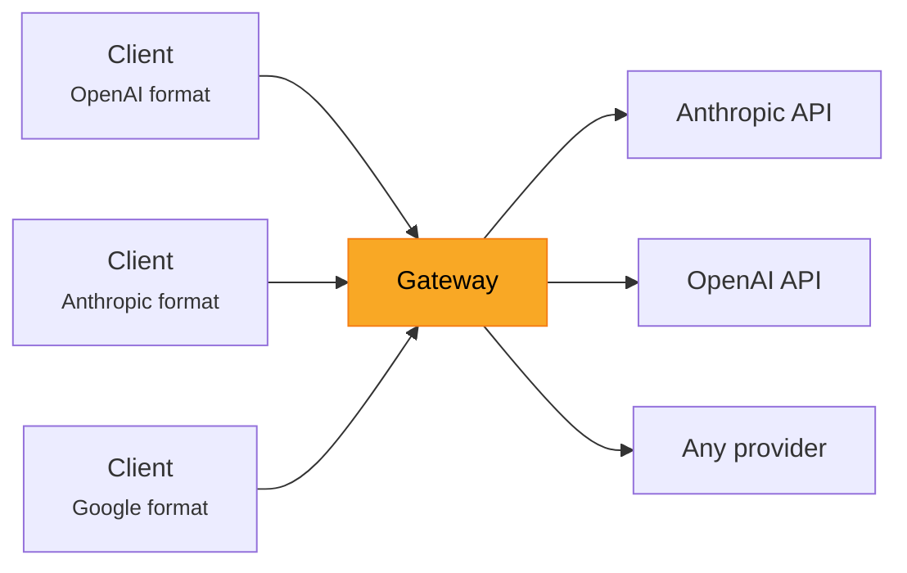
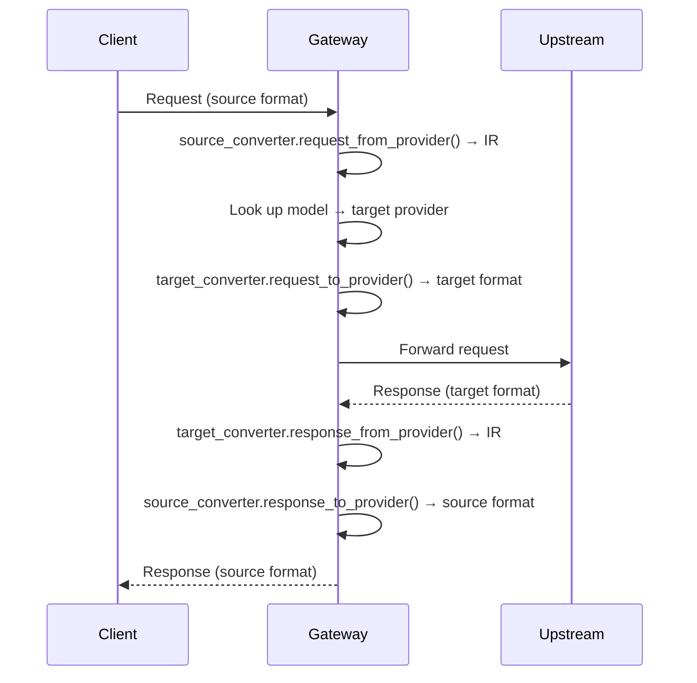

# Gateway

The LLM-Rosetta Gateway is an HTTP proxy that translates between LLM provider API formats in real time. Send requests in any supported format — the gateway converts and forwards them to the configured upstream provider.



New here? Start with the [Gateway Quick Start](../getting-started/gateway-quickstart.md).

## Endpoints

| Path | Source Format | Description |
|------|-------------|-------------|
| `POST /v1/chat/completions` | OpenAI Chat | Drop-in for OpenAI SDK |
| `POST /v1/messages` | Anthropic | Drop-in for Anthropic SDK |
| `POST /v1/responses` | OpenAI Responses | Drop-in for OpenAI Responses SDK |
| `POST /v1/embeddings` | OpenAI Embeddings | Cross-format conversion via IR (OpenAI, Cohere, Jina, Voyage) |
| `POST /v1/rerank` | Rerank (Jina default) | Cross-format conversion via IR (Jina, Cohere, Voyage) |
| `POST /v2/rerank` | Rerank (Cohere) | Auto-detected Cohere format; same handler as `/v1/rerank` |
| `POST /v1beta/models/{model}:generateContent` | Google GenAI | Drop-in for Google REST API |
| `POST /v1beta/models/{model}:streamGenerateContent` | Google GenAI (streaming) | Drop-in for Google streaming |
| `GET /v1/models` | OpenAI / Anthropic | List configured models with `api_standard` and `capabilities` |
| `GET /v1beta/models` | Google GenAI | List configured models (Google SDK format) |
| `GET /health` | — | Health check |
| `GET /admin/` | — | [Admin panel](admin-panel.md) (web UI) |

The endpoint path determines the source format — no auto-detection needed.

## Streaming

Streaming is supported for all provider combinations. Request streaming the same way you would with the native API:

```bash
curl http://localhost:8765/v1/chat/completions \
  -H "Content-Type: application/json" \
  -d '{
    "model": "claude-sonnet-4-20250514",
    "messages": [{"role": "user", "content": "Hello!"}],
    "stream": true
  }'
```

The gateway converts SSE chunks in real time between provider formats.

## Authentication

Protect AI endpoints with a gateway API key in the `server` config:

```jsonc
"server": { "api_key": "my-secret-key" }
```

Requests must provide the key in the format native to each API standard (Bearer token, `x-api-key` header, etc.). See [Configuration — Gateway API Key](configuration.md#gateway-api-key) for details.

## How It Works

The gateway uses LLM-Rosetta's converter pipeline:



For streaming, the same pipeline operates at the SSE chunk level using `stream_response_from_provider()` and `stream_response_to_provider()` with `StreamContext` for stateful conversion.
