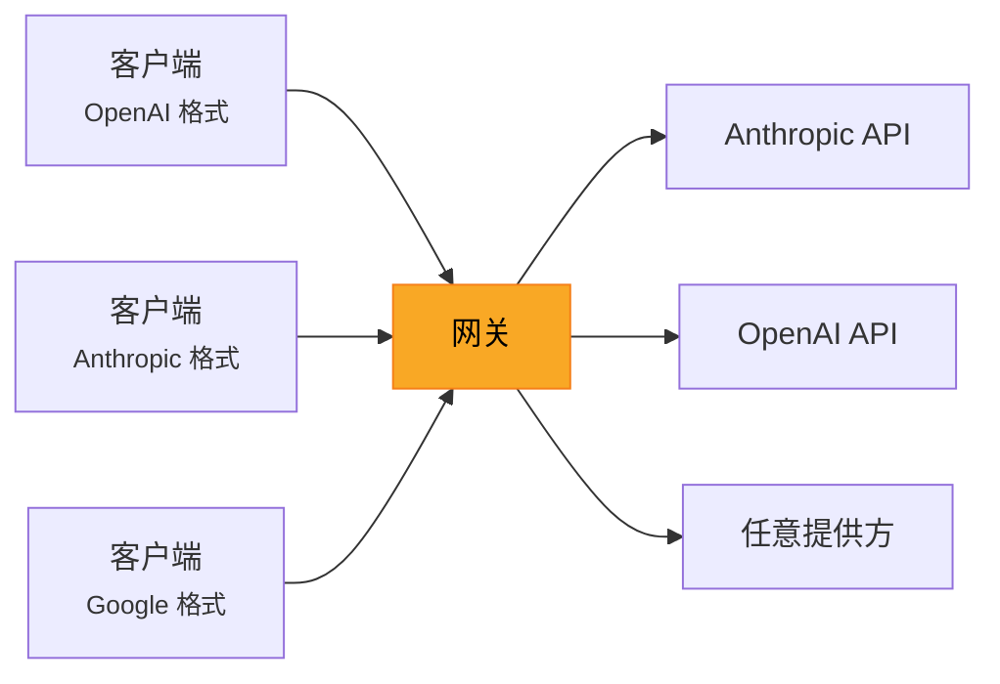
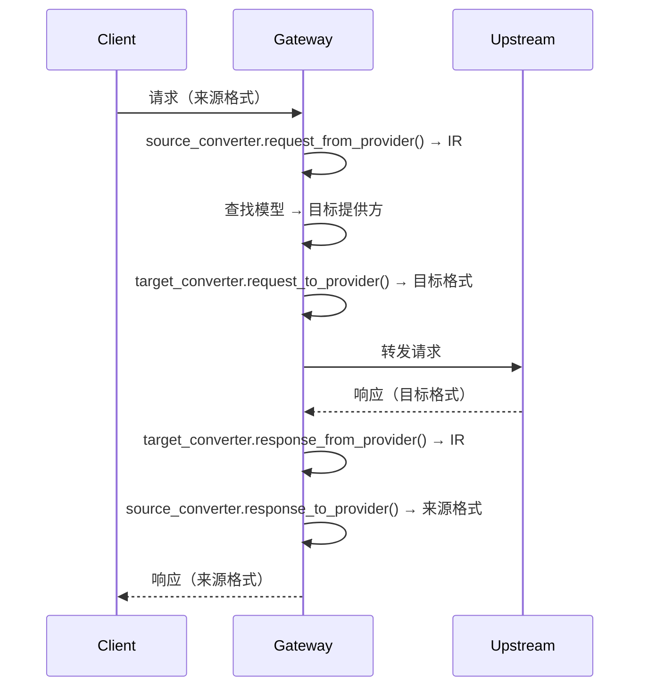

# 网关（Gateway）

LLM-Rosetta 网关是一个 HTTP 代理——你用任意支持的 API 格式发请求过来，它自动转成上游提供方的格式再转发。



初次使用？从[网关快速开始](../getting-started/gateway-quickstart.md)入手。

## 端点

| 路径 | 来源格式 | 说明 |
|------|---------|------|
| `POST /v1/chat/completions` | OpenAI Chat | 兼容 OpenAI SDK |
| `POST /v1/messages` | Anthropic | 兼容 Anthropic SDK |
| `POST /v1/responses` | OpenAI Responses | 兼容 OpenAI Responses SDK |
| `POST /v1/embeddings` | OpenAI Embeddings | 通过 IR 跨格式转换（OpenAI、Cohere、Jina、Voyage） |
| `POST /v1/rerank` | Rerank（默认 Jina） | 通过 IR 跨格式转换（Jina、Cohere、Voyage） |
| `POST /v2/rerank` | Rerank（Cohere） | 自动检测 Cohere 格式；与 `/v1/rerank` 共用处理器 |
| `POST /v1beta/models/{model}:generateContent` | Google GenAI | 兼容 Google REST API |
| `POST /v1beta/models/{model}:streamGenerateContent` | Google GenAI（流式） | 兼容 Google 流式 API |
| `GET /v1/models` | OpenAI / Anthropic | 列出已配置模型，含 `api_standard` 和 `capabilities` |
| `GET /v1beta/models` | Google GenAI | 列出已配置模型（Google SDK 格式） |
| `GET /health` | — | 健康检查 |
| `GET /admin/` | — | [管理面板](admin-panel.md)（Web UI） |

来源格式由端点路径决定，不需要做自动检测。

## 流式传输

所有提供方组合都支持流式。用法和原生 API 一样：

```bash
curl http://localhost:8765/v1/chat/completions \
  -H "Content-Type: application/json" \
  -d '{
    "model": "claude-sonnet-4-20250514",
    "messages": [{"role": "user", "content": "Hello!"}],
    "stream": true
  }'
```

网关会实时转换 SSE 数据块。

## 认证

在 `server` 配置里设一个网关 API Key 来保护端点：

```jsonc
"server": { "api_key": "my-secret-key" }
```

请求时按各 API 标准的原生方式传 Key（Bearer token、`x-api-key` 头等）。详见[配置 — 网关 API Key](configuration.md#网关-api-key)。

## 工作原理

网关内部走 LLM-Rosetta 的转换器管道：



流式传输走同样的管道，只是在 SSE chunk 级别运作，用 `stream_response_from_provider()` 和 `stream_response_to_provider()` 配合 `StreamContext` 做有状态转换。
