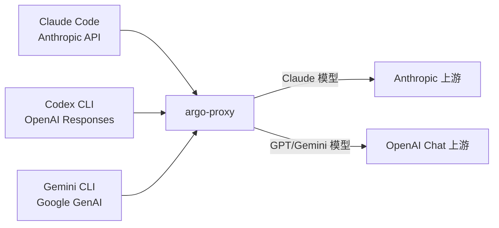

# CLI 跨格式测试

本页提供可复现的命令，用于验证通过 argo-proxy 网关的所有 9 种客户端 × 模型组合。每个 CLI 工具使用不同的 API 格式，网关自动转换。



## 前置条件

### 1. 启动 argo-proxy

```bash
# 安装并在 44511 端口启动 argo-proxy
pip install argo-proxy
python -m argoproxy.cli serve --port 44511
# 验证
curl -s http://localhost:44511/health
# 预期输出：{"status": "healthy"}
```

### 2. CLI 工具配置

=== "Claude Code"

    ```bash
    # 通过环境变量设置基础 URL
    export ANTHROPIC_BASE_URL=http://127.0.0.1:44511
    ```

=== "Codex CLI"

    添加到 `~/.codex/config.toml`：
    ```toml
    [model_providers.argo]
    name = "Argo Proxy"
    base_url = "http://localhost:44511/v1"
    env_key = "ARGO_API_KEY"
    wire_api = "responses"
    ```
    ```bash
    export ARGO_API_KEY=your_api_key
    ```

=== "Gemini CLI"

    ```bash
    export GOOGLE_GEMINI_BASE_URL=http://localhost:44511
    export GEMINI_API_KEY=your_api_key
    ```

---

## 文本生成测试

### 快速验证脚本

保存为 `test_matrix.sh` 并运行：

```bash
#!/usr/bin/env bash
# 跨格式路由矩阵测试
# 用法：./test_matrix.sh
set -euo pipefail

PROXY="http://localhost:44511"
PROMPT="What is 7*8? Reply with just the number."

echo "=== Claude Code (Anthropic API) ==="
for model in claude-sonnet-4-20250514 gpt-4.1-nano gemini-2.5-flash; do
    printf "  %-30s → " "$model"
    result=$(ANTHROPIC_BASE_URL="$PROXY" claude -p "$PROMPT" --model "$model" 2>/dev/null | tail -1)
    echo "$result"
done

echo ""
echo "=== Codex CLI (OpenAI Responses API) ==="
for model in claude-sonnet-4-20250514 gpt-4.1-nano gemini-2.5-flash; do
    printf "  %-30s → " "$model"
    result=$(ARGO_API_KEY="${ARGO_API_KEY:-dummy}" codex exec "$PROMPT" -m "argo:$model" 2>/dev/null | tail -1)
    echo "$result"
done

echo ""
echo "=== Gemini CLI (Google GenAI API) ==="
for model in claude-sonnet-4-20250514 gpt-4.1-nano gemini-2.5-flash; do
    printf "  %-30s → " "$model"
    result=$(GEMINI_API_KEY="${GEMINI_API_KEY:-dummy}" \
        GOOGLE_GEMINI_BASE_URL="$PROXY" \
        gemini -m "$model" -p "$PROMPT" 2>/dev/null | tail -1)
    echo "$result"
done
```

预期输出（全部应打印 `56`）：

```
=== Claude Code (Anthropic API) ===
  claude-sonnet-4-20250514       → 56
  gpt-4.1-nano                   → 56
  gemini-2.5-flash               → 56

=== Codex CLI (OpenAI Responses API) ===
  claude-sonnet-4-20250514       → 56
  gpt-4.1-nano                   → 56
  gemini-2.5-flash               → 56

=== Gemini CLI (Google GenAI API) ===
  claude-sonnet-4-20250514       → 56
  gpt-4.1-nano                   → 56
  gemini-2.5-flash               → 56
```

### 单独命令

??? example "Claude Code"

    ```bash
    # Claude Code + Claude（透传）
    ANTHROPIC_BASE_URL=http://127.0.0.1:44511 \
        claude -p "What is 7*8? Reply with just the number." \
        --model claude-sonnet-4-20250514

    # Claude Code + GPT（anthropic → openai_chat）
    ANTHROPIC_BASE_URL=http://127.0.0.1:44511 \
        claude -p "What is 7*8? Reply with just the number." \
        --model gpt-4.1-nano

    # Claude Code + Gemini（anthropic → openai_chat）
    ANTHROPIC_BASE_URL=http://127.0.0.1:44511 \
        claude -p "What is 7*8? Reply with just the number." \
        --model gemini-2.5-flash
    ```

??? example "Codex CLI"

    ```bash
    # Codex + Claude（openai_responses → anthropic）
    ARGO_API_KEY=your_key codex exec \
        "What is 7*8? Reply with just the number." \
        -m argo:claude-sonnet-4-20250514

    # Codex + GPT（透传）
    ARGO_API_KEY=your_key codex exec \
        "What is 7*8? Reply with just the number." \
        -m argo:gpt-4.1-nano

    # Codex + Gemini（透传）
    ARGO_API_KEY=your_key codex exec \
        "What is 7*8? Reply with just the number." \
        -m argo:gemini-2.5-flash
    ```

??? example "Gemini CLI"

    ```bash
    # Gemini CLI + Claude（google → anthropic）
    GEMINI_API_KEY=your_key GOOGLE_GEMINI_BASE_URL=http://localhost:44511 \
        gemini -m claude-sonnet-4-20250514 \
        -p "What is 7*8? Reply with just the number."

    # Gemini CLI + GPT（google → openai_chat）
    GEMINI_API_KEY=your_key GOOGLE_GEMINI_BASE_URL=http://localhost:44511 \
        gemini -m gpt-4.1-nano \
        -p "What is 7*8? Reply with just the number."

    # Gemini CLI + Gemini（google → openai_chat）
    GEMINI_API_KEY=your_key GOOGLE_GEMINI_BASE_URL=http://localhost:44511 \
        gemini -m gemini-2.5-flash \
        -p "What is 7*8? Reply with just the number."
    ```

---

## 图像理解测试

各 CLI 的图像附加方式不同：

| CLI 工具 | 图像方式 | 备注 |
|---------|---------|------|
| Codex CLI | `-i path/to/image.png` | 直接编码到请求体 |
| Claude Code | Read 工具（自动） | 模型通过内置工具读取文件 |
| Gemini CLI | `read_file` 工具 + `-y` 参数 | 模型通过内置工具读取；需要 `-y` 自动批准，文件必须在工作区内 |

### Codex CLI 图像测试

```bash
# 准备测试图片
cp /path/to/any/image.png /tmp/test_image.png

# Codex + Claude + 图像
ARGO_API_KEY=your_key codex exec \
    "Describe this image in 5 words or less." \
    -m argo:claude-sonnet-4-20250514 -i /tmp/test_image.png

# Codex + GPT + 图像
ARGO_API_KEY=your_key codex exec \
    "Describe this image in 5 words or less." \
    -m argo:gpt-4.1-nano -i /tmp/test_image.png

# Codex + Gemini + 图像
ARGO_API_KEY=your_key codex exec \
    "Describe this image in 5 words or less." \
    -m argo:gemini-2.5-flash -i /tmp/test_image.png
```

### Claude Code 图像测试

```bash
# Claude Code + Claude + 图像
echo "Read the image at /tmp/test_image.png and describe it in 5 words." | \
    ANTHROPIC_BASE_URL=http://127.0.0.1:44511 \
    claude -p --model claude-sonnet-4-20250514 --allowedTools "Read"

# Claude Code + GPT + 图像（建议使用 GPT-5.4+）
echo "Read the image at /tmp/test_image.png and describe it in 5 words." | \
    ANTHROPIC_BASE_URL=http://127.0.0.1:44511 \
    claude -p --model gpt-5.4 --allowedTools "Read"

# Claude Code + Gemini + 图像
echo "Read the image at /tmp/test_image.png and describe it in 5 words." | \
    ANTHROPIC_BASE_URL=http://127.0.0.1:44511 \
    claude -p --model gemini-2.5-flash --allowedTools "Read"
```

### Gemini CLI 图像测试

!!! note "工作区限制"
    Gemini CLI 只能读取工作区目录内的文件。需先将测试图片复制到项目目录中。使用 `-y`（YOLO 模式）在无头模式下自动批准工具调用。

```bash
# 将图片复制到工作区
cp /tmp/test_image.png /path/to/your/project/test_image.png

# Gemini CLI + Claude + 图像
GEMINI_API_KEY=your_key GOOGLE_GEMINI_BASE_URL=http://localhost:44511 \
    gemini -m claude-sonnet-4-20250514 -y \
    -p "Read the image file at $(pwd)/test_image.png and describe what you see in 5 words."

# Gemini CLI + GPT + 图像
GEMINI_API_KEY=your_key GOOGLE_GEMINI_BASE_URL=http://localhost:44511 \
    gemini -m gpt-4.1-nano -y \
    -p "Read the image file at $(pwd)/test_image.png and describe what you see in 5 words."

# Gemini CLI + Gemini + 图像
GEMINI_API_KEY=your_key GOOGLE_GEMINI_BASE_URL=http://localhost:44511 \
    gemini -m gemini-2.5-flash -y \
    -p "Read the image file at $(pwd)/test_image.png and describe what you see in 5 words."

# 清理
rm test_image.png
```

---

## 转换路径参考

| 客户端格式 | Claude 模型目标 | GPT/Gemini 模型目标 |
|-----------|---------------|-------------------|
| Anthropic Messages | 透传 | anthropic → IR → openai_chat |
| OpenAI Responses | responses → IR → anthropic | 透传（上游 responses → openai_chat） |
| Google GenAI | google → IR → anthropic | google → IR → openai_chat |
