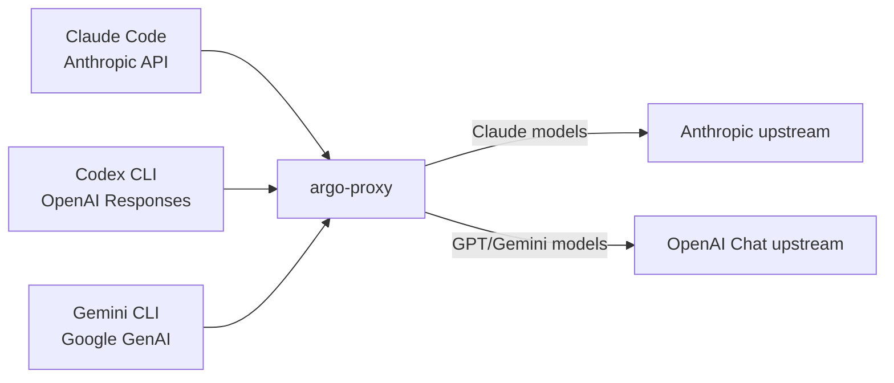

# CLI Cross-Format Testing

This page provides reproducible commands for validating all 9 client × model combinations through the argo-proxy gateway. Each CLI tool speaks a different API format; the gateway converts automatically.



## Prerequisites

### 1. Start argo-proxy

```bash
# Install and start argo-proxy on port 44511
pip install argo-proxy
python -m argoproxy.cli serve --port 44511
# Verify
curl -s http://localhost:44511/health
# Expected: {"status": "healthy"}
```

### 2. CLI Tool Configuration

=== "Claude Code"

    ```bash
    # Set base URL via environment variable
    export ANTHROPIC_BASE_URL=http://127.0.0.1:44511
    ```

=== "Codex CLI"

    Add to `~/.codex/config.toml`:
    ```toml
    [model_providers.argo]
    name = "Argo Proxy"
    base_url = "http://localhost:44511/v1"
    env_key = "ARGO_API_KEY"
    wire_api = "responses"
    ```
    ```bash
    export ARGO_API_KEY=your_api_key
    ```

=== "Gemini CLI"

    ```bash
    export GOOGLE_GEMINI_BASE_URL=http://localhost:44511
    export GEMINI_API_KEY=your_api_key
    ```

---

## Text Generation Tests

### Quick validation script

Save as `test_matrix.sh` and run:

```bash
#!/usr/bin/env bash
# Cross-format routing matrix test
# Usage: ./test_matrix.sh
set -euo pipefail

PROXY="http://localhost:44511"
PROMPT="What is 7*8? Reply with just the number."

echo "=== Claude Code (Anthropic API) ==="
for model in claude-sonnet-4-20250514 gpt-4.1-nano gemini-2.5-flash; do
    printf "  %-30s → " "$model"
    result=$(ANTHROPIC_BASE_URL="$PROXY" claude -p "$PROMPT" --model "$model" 2>/dev/null | tail -1)
    echo "$result"
done

echo ""
echo "=== Codex CLI (OpenAI Responses API) ==="
for model in claude-sonnet-4-20250514 gpt-4.1-nano gemini-2.5-flash; do
    printf "  %-30s → " "$model"
    result=$(ARGO_API_KEY="${ARGO_API_KEY:-dummy}" codex exec "$PROMPT" -m "argo:$model" 2>/dev/null | tail -1)
    echo "$result"
done

echo ""
echo "=== Gemini CLI (Google GenAI API) ==="
for model in claude-sonnet-4-20250514 gpt-4.1-nano gemini-2.5-flash; do
    printf "  %-30s → " "$model"
    result=$(GEMINI_API_KEY="${GEMINI_API_KEY:-dummy}" \
        GOOGLE_GEMINI_BASE_URL="$PROXY" \
        gemini -m "$model" -p "$PROMPT" 2>/dev/null | tail -1)
    echo "$result"
done
```

Expected output (all should print `56`):

```
=== Claude Code (Anthropic API) ===
  claude-sonnet-4-20250514       → 56
  gpt-4.1-nano                   → 56
  gemini-2.5-flash               → 56

=== Codex CLI (OpenAI Responses API) ===
  claude-sonnet-4-20250514       → 56
  gpt-4.1-nano                   → 56
  gemini-2.5-flash               → 56

=== Gemini CLI (Google GenAI API) ===
  claude-sonnet-4-20250514       → 56
  gpt-4.1-nano                   → 56
  gemini-2.5-flash               → 56
```

### Individual commands

??? example "Claude Code"

    ```bash
    # Claude Code + Claude (passthrough)
    ANTHROPIC_BASE_URL=http://127.0.0.1:44511 \
        claude -p "What is 7*8? Reply with just the number." \
        --model claude-sonnet-4-20250514

    # Claude Code + GPT (anthropic → openai_chat)
    ANTHROPIC_BASE_URL=http://127.0.0.1:44511 \
        claude -p "What is 7*8? Reply with just the number." \
        --model gpt-4.1-nano

    # Claude Code + Gemini (anthropic → openai_chat)
    ANTHROPIC_BASE_URL=http://127.0.0.1:44511 \
        claude -p "What is 7*8? Reply with just the number." \
        --model gemini-2.5-flash
    ```

??? example "Codex CLI"

    ```bash
    # Codex + Claude (openai_responses → anthropic)
    ARGO_API_KEY=your_key codex exec \
        "What is 7*8? Reply with just the number." \
        -m argo:claude-sonnet-4-20250514

    # Codex + GPT (passthrough)
    ARGO_API_KEY=your_key codex exec \
        "What is 7*8? Reply with just the number." \
        -m argo:gpt-4.1-nano

    # Codex + Gemini (passthrough)
    ARGO_API_KEY=your_key codex exec \
        "What is 7*8? Reply with just the number." \
        -m argo:gemini-2.5-flash
    ```

??? example "Gemini CLI"

    ```bash
    # Gemini CLI + Claude (google → anthropic)
    GEMINI_API_KEY=your_key GOOGLE_GEMINI_BASE_URL=http://localhost:44511 \
        gemini -m claude-sonnet-4-20250514 \
        -p "What is 7*8? Reply with just the number."

    # Gemini CLI + GPT (google → openai_chat)
    GEMINI_API_KEY=your_key GOOGLE_GEMINI_BASE_URL=http://localhost:44511 \
        gemini -m gpt-4.1-nano \
        -p "What is 7*8? Reply with just the number."

    # Gemini CLI + Gemini (google → openai_chat)
    GEMINI_API_KEY=your_key GOOGLE_GEMINI_BASE_URL=http://localhost:44511 \
        gemini -m gemini-2.5-flash \
        -p "What is 7*8? Reply with just the number."
    ```

---

## Image Understanding Tests

Each CLI has a different method for attaching images:

| CLI Tool | Image Method | Notes |
|----------|-------------|-------|
| Codex CLI | `-i path/to/image.png` | Encodes image directly into request body |
| Claude Code | Read tool (automatic) | Model reads the file via built-in tool |
| Gemini CLI | `read_file` tool + `-y` flag | Model reads file via built-in tool; requires `-y` for auto-approval and file must be in workspace |

### Codex CLI image tests

```bash
# Prepare a test image
cp /path/to/any/image.png /tmp/test_image.png

# Codex + Claude + image
ARGO_API_KEY=your_key codex exec \
    "Describe this image in 5 words or less." \
    -m argo:claude-sonnet-4-20250514 -i /tmp/test_image.png

# Codex + GPT + image
ARGO_API_KEY=your_key codex exec \
    "Describe this image in 5 words or less." \
    -m argo:gpt-4.1-nano -i /tmp/test_image.png

# Codex + Gemini + image
ARGO_API_KEY=your_key codex exec \
    "Describe this image in 5 words or less." \
    -m argo:gemini-2.5-flash -i /tmp/test_image.png
```

### Claude Code image tests

```bash
# Claude Code + Claude + image
echo "Read the image at /tmp/test_image.png and describe it in 5 words." | \
    ANTHROPIC_BASE_URL=http://127.0.0.1:44511 \
    claude -p --model claude-sonnet-4-20250514 --allowedTools "Read"

# Claude Code + GPT + image (use GPT-5.4+ for reliable results)
echo "Read the image at /tmp/test_image.png and describe it in 5 words." | \
    ANTHROPIC_BASE_URL=http://127.0.0.1:44511 \
    claude -p --model gpt-5.4 --allowedTools "Read"

# Claude Code + Gemini + image
echo "Read the image at /tmp/test_image.png and describe it in 5 words." | \
    ANTHROPIC_BASE_URL=http://127.0.0.1:44511 \
    claude -p --model gemini-2.5-flash --allowedTools "Read"
```

### Gemini CLI image tests

!!! note "Workspace restriction"
    Gemini CLI can only read files within its workspace directories. Copy the test image into the project directory first. Use `-y` (YOLO mode) to auto-approve tool calls in headless mode.

```bash
# Copy image into workspace
cp /tmp/test_image.png /path/to/your/project/test_image.png

# Gemini CLI + Claude + image
GEMINI_API_KEY=your_key GOOGLE_GEMINI_BASE_URL=http://localhost:44511 \
    gemini -m claude-sonnet-4-20250514 -y \
    -p "Read the image file at $(pwd)/test_image.png and describe what you see in 5 words."

# Gemini CLI + GPT + image
GEMINI_API_KEY=your_key GOOGLE_GEMINI_BASE_URL=http://localhost:44511 \
    gemini -m gpt-4.1-nano -y \
    -p "Read the image file at $(pwd)/test_image.png and describe what you see in 5 words."

# Gemini CLI + Gemini + image
GEMINI_API_KEY=your_key GOOGLE_GEMINI_BASE_URL=http://localhost:44511 \
    gemini -m gemini-2.5-flash -y \
    -p "Read the image file at $(pwd)/test_image.png and describe what you see in 5 words."

# Clean up
rm test_image.png
```

---

## Conversion Path Reference

| Client Format | Claude Model Target | GPT/Gemini Model Target |
|--------------|-------------------|------------------------|
| Anthropic Messages | passthrough | anthropic → IR → openai_chat |
| OpenAI Responses | responses → IR → anthropic | passthrough (responses → openai_chat at upstream) |
| Google GenAI | google → IR → anthropic | google → IR → openai_chat |
