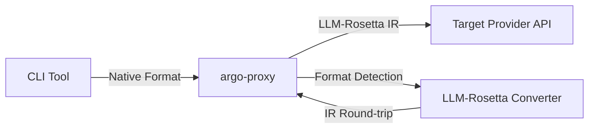

# Provider & CLI Compatibility Matrix

This page documents **real-world compatibility issues** discovered during live integration testing of LLM CLI tools routed through format conversion proxies (e.g. [argo-proxy](https://github.com/Oaklight/argo-proxy) + LLM-Rosetta). Each issue was found by routing a CLI tool's native API format through LLM-Rosetta's IR layer to a different provider backend, observing failures, and fixing them in the converter stack.

!!! info "Methodology"
    All issues below were discovered empirically — not by reading specs, but by running real CLI sessions and observing 400 errors, silent data loss, or incorrect behavior. This makes them a reliable reference for anyone building cross-provider LLM proxies or format translators.

## CLI Tools Tested

| CLI Tool | Native API Format | Test Configuration | Versions Tested |
|----------|-------------------|-------------------|-----------------|
| **Gemini CLI** | Google GenAI (REST, camelCase) | Gemini CLI → argo-proxy (LLM-Rosetta) → OpenAI Chat backend | v0.1.x (March 2026) |
| **Claude Code** | Anthropic Messages | Claude Code → argo-proxy (LLM-Rosetta) → OpenAI Chat backend | v1.x (March 2026) |
| **OpenCode** | OpenAI Chat Completions | OpenCode → argo-proxy → OpenAI Chat backend (passthrough) | v0.1.x (March 2026) |

## Issue Categories

### 1. Field Naming Conventions (camelCase vs snake_case)

!!! bug "Severity: Critical — causes silent data loss"

**Affected CLI**: Gemini CLI
**Provider pair**: Google GenAI → any target

Google's REST API and Gemini CLI use **camelCase** field names (`inlineData`, `mimeType`, `fileUri`, `functionCall`, `functionResponse`), while the Python SDK conventions use **snake_case** (`inline_data`, `mime_type`, `file_uri`). LLM-Rosetta's Google converter initially only accepted snake_case, causing binary content to be silently dropped.

**Scope of camelCase fields** (all now handled bidirectionally):

| Layer | camelCase (REST/CLI) | snake_case (SDK) |
|-------|---------------------|-----------------|
| Content | `inlineData`, `mimeType`, `fileData`, `fileUri` | `inline_data`, `mime_type`, `file_data`, `file_uri` |
| Tools | `functionCall`, `functionResponse`, `functionDeclarations`, `functionCallingConfig`, `allowedFunctionNames` | `function_call`, `function_response`, `function_declarations`, `function_calling_config`, `allowed_function_names` |
| Config | `responseMimeType`, `responseSchema`, `thinkingConfig`, `thinkingBudget`, `maxOutputTokens`, `stopSequences`, `candidateCount`, `frequencyPenalty`, `presencePenalty` | `response_mime_type`, `response_schema`, `thinking_config`, `thinking_budget`, `max_output_tokens`, `stop_sequences`, `candidate_count`, `frequency_penalty`, `presence_penalty` |
| Response | `finishReason`, `usageMetadata`, `promptTokenCount`, `candidatesTokenCount`, `thoughtSignature` | `finish_reason`, `usage_metadata`, `prompt_token_count`, `candidates_token_count`, `thought_signature` |

**Symptom**: Images pasted in Gemini CLI (Ctrl+V) were silently discarded. The converter emitted `不支持的Part类型` warnings and produced empty text-only messages.

**Root cause**: `p_part_to_ir()` checked for `inline_data` key but Gemini CLI sent `inlineData`. The binary data was never extracted.

**Fix**: Normalize camelCase keys at the dispatch entry point in `content_ops.py`, `config_ops.py`, `tool_ops.py`, `message_ops.py`, and `converter.py`. All IR→P methods output camelCase for REST API compatibility.

**Version**: v0.2.5 ([content_ops](https://github.com/Oaklight/llm-rosetta/blob/main/src/llm_rosetta/converters/google_genai/content_ops.py), [config_ops](https://github.com/Oaklight/llm-rosetta/blob/main/src/llm_rosetta/converters/google_genai/config_ops.py))

---

### 2. Cross-Format Image Data Passthrough

!!! bug "Severity: Critical — causes ValueError crash"

**Affected CLI**: Gemini CLI
**Provider pair**: Google GenAI → OpenAI Chat / Anthropic / OpenAI Responses

Google's `p_image_to_ir()` produces an `ImagePart` with top-level `data` and `media_type` fields. However, the target converters' `ir_image_to_p()` methods only checked for `image_url` (URL string) or nested `image_data` (dict with `data` + `media_type` keys) — the top-level field layout was not recognized.

**Symptom**: `ValueError: Image part must have either image_url or image_data` when converting Google image content to any other provider format.

**Fix**: Added fallback handling in `ir_image_to_p()` for all three target converters (OpenAI Chat, Anthropic, OpenAI Responses) to check top-level `data` + `media_type` fields.

**Version**: v0.2.5 (#68)

---

### 3. Tool Call ID Management

#### 3a. ID Generation and Reconciliation

!!! warning "Severity: High — causes orphaned tool call errors"

**Affected CLI**: Gemini CLI
**Provider pair**: Google GenAI → OpenAI Chat

Google's `functionCall` does not carry an ID field. During P→IR conversion, LLM-Rosetta generates a UUID-based `tool_call_id`. When Gemini CLI sends back `functionResponse`, it assigns its **own** ID (format: `{name}_{timestamp}_{index}`), creating an ID mismatch.

**Symptom**: `fix_orphaned_tool_calls_ir()` detects "orphaned" tool calls because no tool result has a matching `tool_call_id`, and injects synthetic placeholder results — breaking the actual tool response flow.

**Fix**: Added `_reconcile_tool_call_ids()` in `message_ops.py` that matches tool results to tool calls by **function name** (FIFO pairing for parallel calls to the same function).

**Version**: v0.2.5

#### 3b. ID Length Limit

!!! warning "Severity: High — causes 400 errors from OpenAI"

**Affected CLI**: Gemini CLI (with long MCP tool names)
**Provider pair**: Google GenAI → OpenAI Chat

The previous ID format `call_{name}_{8hex}` could exceed OpenAI's 40-character limit. MCP tool names like `mcp_toolregistry-hub-server_datetime-now` produced 54-character IDs.

**Symptom**: OpenAI API returns 400: `tool_call_id exceeds maximum length of 40 characters`.

**Fix**: Changed format to `call_{24hex}` (fixed 29 characters).

**Version**: v0.2.5

---

### 4. Role Mapping and Message Splitting

#### 4a. Tool Result Role Normalization

!!! warning "Severity: High — breaks orphaned tool call detection"

**Affected CLI**: Gemini CLI, Claude Code
**Provider pair**: Google GenAI → OpenAI Chat, Anthropic → OpenAI Chat

Different providers represent tool results differently:

| Provider | Tool Result Location | Role |
|----------|---------------------|------|
| Google GenAI | `functionResponse` part in `role: "user"` Content | `user` |
| Anthropic | `tool_result` block in `role: "user"` message | `user` |
| OpenAI Chat | Separate message with `role: "tool"` | `tool` |
| OpenAI Responses | `function_call_output` item | (implicit) |

The IR uses `role: "tool"` (OpenAI convention). When source converters preserved the original `role: "user"`, the `fix_orphaned_tool_calls_ir()` function (which checks for `role: "tool"`) couldn't find the tool results.

**Fix**:

- Google: `functionResponse` parts are separated into `role: "tool"` IR messages; `_IR_TO_GOOGLE_ROLE` maps `"tool" → "user"` for the reverse direction
- Anthropic: Pure `tool_result` user messages normalized to `role: "tool"`; mixed `tool_result` + text messages split into separate `"tool"` and `"user"` IR messages
- OpenAI Responses: `function_call_output` and `mcp_call_output` items placed in `role: "tool"` messages

**Version**: v0.2.4–v0.2.5

#### 4b. Mixed Content Message Ordering

!!! bug "Severity: Critical — causes 400 errors"

**Affected CLI**: Gemini CLI
**Provider pair**: Google GenAI → OpenAI Chat

When a Google Content message contains both `functionResponse` and `inlineData` parts, the natural part order puts content before tool results. But OpenAI Chat strictly requires `assistant(tool_calls)` to be immediately followed by `tool(response)` — any `user` message between them triggers a 400 error.

**Symptom**: `An assistant message with 'tool_calls' must be followed by tool messages responding to each 'tool_call_id'` (400 error from OpenAI).

**Fix**: When splitting mixed Content into separate IR messages, tool result messages are emitted **before** content messages.

**Version**: v0.2.5

---

### 5. Tool Schema Validation

#### 5a. Schema Sanitization

!!! warning "Severity: High — causes upstream rejections"

**Affected CLI**: OpenCode, Gemini CLI
**Provider pair**: Any → Google Vertex AI, Any → OpenAI

Strict endpoints (Vertex AI, OpenAI) reject tool parameter schemas containing non-standard JSON Schema keywords. Common offenders:

| Keyword | Source | Issue |
|---------|--------|-------|
| `$ref` / `$defs` | Standard JSON Schema | Not supported by Vertex AI |
| `ref` (no `$` prefix) | OpenCode built-in tools | Non-standard |
| `$schema` | OpenCode built-in tools | Not expected in nested schemas |
| `additionalProperties` | Various | Rejected by some endpoints |

**Fix**: `sanitize_schema()` extracted to `converters/base/tools.py` as a shared utility. Resolves `$ref`/`$defs` by inlining referenced definitions; strips unsupported keywords. Applied in all 4 converters.

**Version**: v0.2.3 (#80)

#### 5b. Built-in Tool Definitions

!!! note "Severity: Low — causes empty function name"

**Affected CLI**: Gemini CLI
**Provider pair**: Google GenAI → any target

Google built-in tools (`googleSearch`, `codeExecution`) appear as tool entries without a `name` field. The converter tried to create `ToolDefinition` objects with an empty name.

**Fix**: `p_tool_definition_to_ir()` returns `None` for tools without a `name` field; the converter skips these entries.

**Version**: v0.2.5

---

### 6. Streaming Issues

#### 6a. Tool Call Argument Accumulation

!!! bug "Severity: Critical — causes empty tool arguments"

**Affected CLI**: Gemini CLI, Claude Code
**Provider pair**: Any source → any target (streaming mode)

OpenAI Chat, Anthropic, and Google GenAI converters registered tool calls in `StreamContext` but never called `append_tool_call_args()` to accumulate argument deltas during streaming. Only the OpenAI Responses converter handled this correctly.

**Symptom**: MCP tools receive empty arguments: `'query' is a required property`.

**Fix**: All converters now call `append_tool_call_args()` during streaming.

**Version**: v0.2.3 (#81)

#### 6b. Anthropic SSE Content Block Lifecycle

!!! bug "Severity: Critical — causes silent response loss"

**Affected CLI**: Claude Code
**Provider pair**: OpenAI Chat → Anthropic (SSE output)

When converting OpenAI Chat streaming responses to Anthropic SSE format, the `content_block_stop` event was not emitted before `message_delta`. Claude Code requires proper content block lifecycle events.

**Symptom**: Claude Code silently discards the entire response content.

**Fix**: Anthropic converter now emits `content_block_stop` for any open content block when processing `FinishEvent`.

**Version**: v0.2.2 (#77)

#### 6c. Upstream Preflight Chunks

!!! note "Severity: Medium — causes premature stream termination"

**Affected CLI**: All (via Argo API)
**Provider pair**: Argo backend → any target

Argo API sends a preflight chunk with `choices: []` and empty `id`/`model` before actual content. The OpenAI Chat converter treated this as stream end.

**Fix**: Only treat empty-choices chunks as stream end when `context.is_started` is true.

**Version**: v0.2.2 (#77)

---

### 7. Tool Call/Result Pairing

!!! warning "Severity: High — causes 400 errors from strict providers"

**Affected CLI**: Gemini CLI, Claude Code
**Provider pair**: Any → OpenAI Chat, Any → Anthropic, Any → OpenAI Responses

OpenAI (Chat and Responses) and Anthropic strictly require every `tool_call` to have a matching `tool_result`, and vice versa. Google GenAI is the only provider that tolerates mismatches. During cross-format conversion, ID mismatches, role normalization issues, or incomplete conversation history can produce orphaned tool calls or results.

**Fix**: `fix_orphaned_tool_calls()` (per-converter) and `fix_orphaned_tool_calls_ir()` (IR-level) automatically detect and repair pairing issues:

- Orphaned tool calls → inject synthetic placeholder results
- Orphaned tool results → remove from the message list

Applied automatically in `request_to_provider()` for all strict-pairing converters.

**Version**: v0.2.4 (#82, #84)

---

## Provider Comparison Matrix

Summary of which issue categories affect which provider combinations:

| Issue | Google→OpenAI | Google→Anthropic | Google→Responses | Anthropic→OpenAI | Anthropic→Responses | OpenAI→Anthropic |
|-------|:---:|:---:|:---:|:---:|:---:|:---:|
| camelCase fields | :material-alert: | :material-alert: | :material-alert: | — | — | — |
| Image passthrough | :material-alert: | :material-alert: | :material-alert: | — | — | — |
| Tool call ID reconciliation | :material-alert: | :material-alert: | :material-alert: | — | — | — |
| Tool call ID length | :material-alert: | — | — | — | — | — |
| Role normalization | :material-alert: | :material-alert: | :material-alert: | :material-alert: | :material-alert: | — |
| Mixed content ordering | :material-alert: | — | — | — | — | — |
| Schema sanitization | :material-alert: | — | :material-alert: | — | — | — |
| Built-in tools | :material-alert: | :material-alert: | :material-alert: | — | — | — |
| Streaming args | :material-alert: | :material-alert: | — | :material-alert: | — | :material-alert: |
| SSE lifecycle | — | — | — | — | — | :material-alert: |
| Tool pairing | :material-alert: | :material-alert: | :material-alert: | :material-alert: | :material-alert: | — |

**Legend**: :material-alert: = affected, — = not affected or not applicable

## Lessons Learned

1. **Specs lie; implementations differ.** The same conceptual field (`inline_data` vs `inlineData`) can use different naming conventions depending on whether you're using the SDK, REST API, or CLI tool. Always accept both.

2. **Cross-format conversion is not symmetric.** Converting A→IR→B works, but B→IR→A may fail because different converters produce different IR field layouts for the same content type. IR consumers must be defensively coded.

3. **Streaming multiplies edge cases.** Every issue that exists in non-streaming mode also exists in streaming — plus additional ones around delta accumulation, event lifecycle, and chunk ordering.

4. **Tool call pairing is the #1 source of 400 errors.** Strict providers reject entire requests when a single tool call/result pair is mismatched. This requires both preventive (correct ID generation) and corrective (orphan detection) measures.

5. **Google GenAI is the most "forgiving" provider.** It tolerates missing tool results, mismatched IDs, and mixed content ordering. This makes it a poor test target — issues only surface when converting _from_ Google _to_ stricter providers.

6. **Built-in tools need special handling.** Provider-specific tools (Google Search, Code Execution) don't map to the universal tool definition schema and must be filtered out during conversion.
