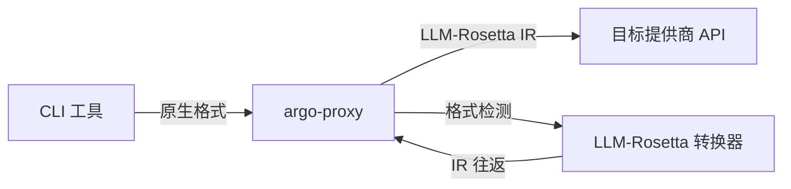

# 提供商与 CLI 兼容性矩阵

本页面记录了在将 LLM CLI 工具通过格式转换代理（如 [argo-proxy](https://github.com/Oaklight/argo-proxy) + LLM-Rosetta）进行路由时，发现的**真实兼容性问题**。每个问题都是通过将 CLI 工具的原生 API 格式经 LLM-Rosetta IR 层转换到不同提供商后端，观察到失败后修复的。

!!! info "方法论"
    以下所有问题均为经验性发现——不是通过阅读规范，而是通过运行真实 CLI 会话并观察 400 错误、静默数据丢失或错误行为发现的。这使其成为构建跨提供商 LLM 代理或格式转换器的可靠参考。

## 测试的 CLI 工具

| CLI 工具 | 原生 API 格式 | 测试配置 | 测试版本 |
|----------|-------------|---------|---------|
| **Gemini CLI** | Google GenAI（REST，camelCase） | Gemini CLI → argo-proxy（LLM-Rosetta）→ OpenAI Chat 后端 | v0.1.x（2026年3月） |
| **Claude Code** | Anthropic Messages | Claude Code → argo-proxy（LLM-Rosetta）→ OpenAI Chat 后端 | v1.x（2026年3月） |
| **OpenCode** | OpenAI Chat Completions | OpenCode → argo-proxy → OpenAI Chat 后端（透传） | v0.1.x（2026年3月） |

## 问题分类

### 1. 字段命名约定（camelCase vs snake_case）

!!! bug "严重性：严重 — 导致静默数据丢失"

**受影响 CLI**：Gemini CLI
**提供商组合**：Google GenAI → 任意目标

Google 的 REST API 和 Gemini CLI 使用 **camelCase** 字段名（`inlineData`、`mimeType`、`fileUri`、`functionCall`、`functionResponse`），而 Python SDK 约定使用 **snake_case**（`inline_data`、`mime_type`、`file_uri`）。LLM-Rosetta 的 Google 转换器最初只接受 snake_case，导致二进制内容被静默丢弃。

**camelCase 字段范围**（现已双向处理）：

| 层级 | camelCase（REST/CLI） | snake_case（SDK） |
|------|---------------------|-----------------|
| 内容 | `inlineData`、`mimeType`、`fileData`、`fileUri` | `inline_data`、`mime_type`、`file_data`、`file_uri` |
| 工具 | `functionCall`、`functionResponse`、`functionDeclarations`、`functionCallingConfig`、`allowedFunctionNames` | `function_call`、`function_response`、`function_declarations`、`function_calling_config`、`allowed_function_names` |
| 配置 | `responseMimeType`、`responseSchema`、`thinkingConfig`、`thinkingBudget`、`maxOutputTokens`、`stopSequences`、`candidateCount`、`frequencyPenalty`、`presencePenalty` | `response_mime_type`、`response_schema`、`thinking_config`、`thinking_budget`、`max_output_tokens`、`stop_sequences`、`candidate_count`、`frequency_penalty`、`presence_penalty` |
| 响应 | `finishReason`、`usageMetadata`、`promptTokenCount`、`candidatesTokenCount`、`thoughtSignature` | `finish_reason`、`usage_metadata`、`prompt_token_count`、`candidates_token_count`、`thought_signature` |

**症状**：在 Gemini CLI 中粘贴的图片（Ctrl+V）被静默丢弃。转换器发出 `不支持的Part类型` 警告并生成纯文本消息。

**根因**：`p_part_to_ir()` 检查 `inline_data` 键，但 Gemini CLI 发送的是 `inlineData`。二进制数据从未被提取。

**修复**：在 `content_ops.py`、`config_ops.py`、`tool_ops.py`、`message_ops.py` 和 `converter.py` 的分发入口处规范化 camelCase 键名。所有 IR→P 方法统一输出 camelCase 以兼容 REST API。

**版本**：v0.2.5（[content_ops](https://github.com/Oaklight/llm-rosetta/blob/main/src/llm_rosetta/converters/google_genai/content_ops.py)、[config_ops](https://github.com/Oaklight/llm-rosetta/blob/main/src/llm_rosetta/converters/google_genai/config_ops.py)）

---

### 2. 跨格式图片数据传递

!!! bug "严重性：严重 — 导致 ValueError 崩溃"

**受影响 CLI**：Gemini CLI
**提供商组合**：Google GenAI → OpenAI Chat / Anthropic / OpenAI Responses

Google 的 `p_image_to_ir()` 生成的 `ImagePart` 使用顶层 `data` 和 `media_type` 字段。但目标转换器的 `ir_image_to_p()` 方法仅检查 `image_url`（URL 字符串）或嵌套的 `image_data`（包含 `data` + `media_type` 的字典）——顶层字段布局未被识别。

**症状**：将 Google 图片内容转换为其他提供商格式时出现 `ValueError: Image part must have either image_url or image_data`。

**修复**：为三个目标转换器（OpenAI Chat、Anthropic、OpenAI Responses）的 `ir_image_to_p()` 添加了对顶层 `data` + `media_type` 字段的兜底处理。

**版本**：v0.2.5（#68）

---

### 3. 工具调用 ID 管理

#### 3a. ID 生成与对账

!!! warning "严重性：高 — 导致孤立工具调用错误"

**受影响 CLI**：Gemini CLI
**提供商组合**：Google GenAI → OpenAI Chat

Google 的 `functionCall` 不携带 ID 字段。P→IR 转换时，LLM-Rosetta 生成基于 UUID 的 `tool_call_id`。当 Gemini CLI 发回 `functionResponse` 时，它使用**自己的** ID（格式：`{name}_{timestamp}_{index}`），造成 ID 不匹配。

**症状**：`fix_orphaned_tool_calls_ir()` 检测到"孤立"工具调用（因为没有工具结果的 `tool_call_id` 与之匹配），注入合成占位结果——破坏了实际的工具响应流程。

**修复**：在 `message_ops.py` 中新增 `_reconcile_tool_call_ids()`，按**函数名称**匹配工具结果与工具调用（对同一函数的并行调用使用 FIFO 配对）。

**版本**：v0.2.5

#### 3b. ID 长度限制

!!! warning "严重性：高 — 导致 OpenAI 返回 400 错误"

**受影响 CLI**：Gemini CLI（使用长 MCP 工具名时）
**提供商组合**：Google GenAI → OpenAI Chat

之前的 ID 格式 `call_{name}_{8hex}` 可能超过 OpenAI 的 40 字符限制。MCP 工具名如 `mcp_toolregistry-hub-server_datetime-now` 会产生 54 字符的 ID。

**症状**：OpenAI API 返回 400：`tool_call_id exceeds maximum length of 40 characters`。

**修复**：将格式改为 `call_{24hex}`（固定 29 字符）。

**版本**：v0.2.5

---

### 4. 角色映射与消息拆分

#### 4a. 工具结果角色规范化

!!! warning "严重性：高 — 破坏孤立工具调用检测"

**受影响 CLI**：Gemini CLI、Claude Code
**提供商组合**：Google GenAI → OpenAI Chat、Anthropic → OpenAI Chat

不同提供商以不同方式表示工具结果：

| 提供商 | 工具结果位置 | 角色 |
|--------|------------|------|
| Google GenAI | `role: "user"` Content 中的 `functionResponse` 部分 | `user` |
| Anthropic | `role: "user"` 消息中的 `tool_result` 块 | `user` |
| OpenAI Chat | 独立消息，`role: "tool"` | `tool` |
| OpenAI Responses | `function_call_output` 项 | （隐式） |

IR 使用 `role: "tool"`（OpenAI 约定）。当源转换器保留原始 `role: "user"` 时，`fix_orphaned_tool_calls_ir()`（检查 `role: "tool"`）无法找到工具结果。

**修复**：

- Google：`functionResponse` 部分分离为 `role: "tool"` 的 IR 消息；`_IR_TO_GOOGLE_ROLE` 中添加 `"tool" → "user"` 反向映射
- Anthropic：纯 `tool_result` 的 user 消息规范化为 `role: "tool"`；混合 `tool_result` + text 的消息拆分为独立的 `"tool"` 和 `"user"` IR 消息
- OpenAI Responses：`function_call_output` 和 `mcp_call_output` 项归入 `role: "tool"` 消息

**版本**：v0.2.4–v0.2.5

#### 4b. 混合内容消息排序

!!! bug "严重性：严重 — 导致 400 错误"

**受影响 CLI**：Gemini CLI
**提供商组合**：Google GenAI → OpenAI Chat

当 Google Content 消息同时包含 `functionResponse` 和 `inlineData` 部分时，自然的部分顺序会将内容部分排在工具结果之前。但 OpenAI Chat 严格要求 `assistant(tool_calls)` 之后紧跟 `tool(response)` —— 中间插入任何 `user` 消息都会触发 400 错误。

**症状**：`An assistant message with 'tool_calls' must be followed by tool messages responding to each 'tool_call_id'`（OpenAI 返回 400）。

**修复**：拆分混合 Content 为独立 IR 消息时，工具结果消息排在内容消息**之前**。

**版本**：v0.2.5

---

### 5. 工具 Schema 验证

#### 5a. Schema 清洗

!!! warning "严重性：高 — 导致上游拒绝请求"

**受影响 CLI**：OpenCode、Gemini CLI
**提供商组合**：任意 → Google Vertex AI、任意 → OpenAI

严格的端点（Vertex AI、OpenAI）拒绝包含非标准 JSON Schema 关键字的工具参数 schema。常见违规项：

| 关键字 | 来源 | 问题 |
|--------|------|------|
| `$ref` / `$defs` | 标准 JSON Schema | Vertex AI 不支持 |
| `ref`（无 `$` 前缀） | OpenCode 内置工具 | 非标准 |
| `$schema` | OpenCode 内置工具 | 嵌套 schema 中不应出现 |
| `additionalProperties` | 多种来源 | 部分端点拒绝 |

**修复**：`sanitize_schema()` 提取至 `converters/base/tools.py` 作为共享工具函数。通过内联引用定义解析 `$ref`/`$defs`；剥离不支持的关键字。在全部 4 个转换器中应用。

**版本**：v0.2.3（#80）

#### 5b. 内建工具定义

!!! note "严重性：低 — 导致空函数名"

**受影响 CLI**：Gemini CLI
**提供商组合**：Google GenAI → 任意目标

Google 内建工具（`googleSearch`、`codeExecution`）作为没有 `name` 字段的工具条目出现。转换器试图创建空名称的 `ToolDefinition` 对象。

**修复**：`p_tool_definition_to_ir()` 对没有 `name` 字段的工具返回 `None`；转换器跳过这些条目。

**版本**：v0.2.5

---

### 6. 流式传输问题

#### 6a. 工具调用参数累积

!!! bug "严重性：严重 — 导致工具参数为空"

**受影响 CLI**：Gemini CLI、Claude Code
**提供商组合**：任意来源 → 任意目标（流式模式）

OpenAI Chat、Anthropic 和 Google GenAI 转换器在 `StreamContext` 中注册了工具调用，但在流式传输期间从未调用 `append_tool_call_args()` 累积参数增量。仅 OpenAI Responses 转换器正确处理。

**症状**：MCP 工具收到空参数：`'query' is a required property`。

**修复**：所有转换器现在都在流式传输期间调用 `append_tool_call_args()`。

**版本**：v0.2.3（#81）

#### 6b. Anthropic SSE 内容块生命周期

!!! bug "严重性：严重 — 导致响应内容静默丢失"

**受影响 CLI**：Claude Code
**提供商组合**：OpenAI Chat → Anthropic（SSE 输出）

将 OpenAI Chat 流式响应转换为 Anthropic SSE 格式时，`content_block_stop` 事件未在 `message_delta` 之前发送。Claude Code 要求完整的内容块生命周期事件。

**症状**：Claude Code 静默丢弃整个响应内容。

**修复**：Anthropic 转换器现在在处理 `FinishEvent` 时为任何打开的内容块发送 `content_block_stop`。

**版本**：v0.2.2（#77）

#### 6c. 上游预检 Chunk

!!! note "严重性：中等 — 导致流过早终止"

**受影响 CLI**：全部（通过 Argo API）
**提供商组合**：Argo 后端 → 任意目标

Argo API 在实际内容之前发送一个 `choices: []` 且 `id`/`model` 为空的预检 chunk。OpenAI Chat 转换器将其视为流结束。

**修复**：仅在 `context.is_started` 为 true 时，才将空 choices chunk 视为流结束。

**版本**：v0.2.2（#77）

---

### 7. 工具调用/结果配对

!!! warning "严重性：高 — 导致严格提供商返回 400 错误"

**受影响 CLI**：Gemini CLI、Claude Code
**提供商组合**：任意 → OpenAI Chat、任意 → Anthropic、任意 → OpenAI Responses

OpenAI（Chat 和 Responses）和 Anthropic 严格要求每个 `tool_call` 都有匹配的 `tool_result`，反之亦然。Google GenAI 是唯一容忍不匹配的提供商。在跨格式转换中，ID 不匹配、角色规范化问题或不完整的对话历史可能产生孤立的工具调用或结果。

**修复**：`fix_orphaned_tool_calls()`（逐转换器）和 `fix_orphaned_tool_calls_ir()`（IR 层级）自动检测和修复配对问题：

- 孤立工具调用 → 注入合成占位结果
- 孤立工具结果 → 从消息列表中移除

在所有严格配对转换器的 `request_to_provider()` 中自动应用。

**版本**：v0.2.4（#82、#84）

---

## 提供商比较矩阵

各问题类别对不同提供商组合的影响总结：

| 问题 | Google→OpenAI | Google→Anthropic | Google→Responses | Anthropic→OpenAI | Anthropic→Responses | OpenAI→Anthropic |
|------|:---:|:---:|:---:|:---:|:---:|:---:|
| camelCase 字段 | :material-alert: | :material-alert: | :material-alert: | — | — | — |
| 图片传递 | :material-alert: | :material-alert: | :material-alert: | — | — | — |
| 工具调用 ID 对账 | :material-alert: | :material-alert: | :material-alert: | — | — | — |
| 工具调用 ID 长度 | :material-alert: | — | — | — | — | — |
| 角色规范化 | :material-alert: | :material-alert: | :material-alert: | :material-alert: | :material-alert: | — |
| 混合内容排序 | :material-alert: | — | — | — | — | — |
| Schema 清洗 | :material-alert: | — | :material-alert: | — | — | — |
| 内建工具 | :material-alert: | :material-alert: | :material-alert: | — | — | — |
| 流式参数 | :material-alert: | :material-alert: | — | :material-alert: | — | :material-alert: |
| SSE 生命周期 | — | — | — | — | — | :material-alert: |
| 工具配对 | :material-alert: | :material-alert: | :material-alert: | :material-alert: | :material-alert: | — |

**图例**：:material-alert: = 受影响，— = 不受影响或不适用

## 经验总结

1. **规范会骗人；实现各不同。** 同一概念性字段（`inline_data` vs `inlineData`）可能因使用 SDK、REST API 还是 CLI 工具而采用不同命名约定。必须同时接受两种形式。

2. **跨格式转换不对称。** A→IR→B 可行，但 B→IR→A 可能失败，因为不同转换器为同一内容类型生成不同的 IR 字段布局。IR 消费者必须防御性编码。

3. **流式传输倍增边缘用例。** 非流式模式中存在的每个问题在流式模式中同样存在——加上增量累积、事件生命周期和 chunk 排序等额外问题。

4. **工具调用配对是 400 错误的头号来源。** 严格的提供商在单个工具调用/结果对不匹配时就会拒绝整个请求。这需要预防性（正确的 ID 生成）和纠正性（孤立检测）双重措施。

5. **Google GenAI 是最"宽容"的提供商。** 它容忍缺失的工具结果、不匹配的 ID 和混合内容排序。这使其成为较差的测试目标——问题只在将 Google 转换_到_更严格的提供商时才会暴露。

6. **内建工具需要特殊处理。** 提供商特有的工具（Google Search、Code Execution）不映射到通用工具定义 schema，必须在转换过程中过滤掉。
