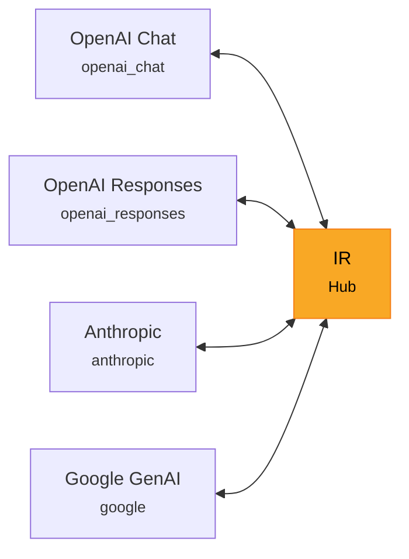

# 核心概念

## N² 问题

假设有 N 家 LLM 提供方，两两之间直接转换需要 N×(N-1) 个转换器。4 家就要写 12 个。

## 中枢辐射方案

LLM-Rosetta 在中间放一套**中间表示（IR）**。每家提供方只需要一个到 IR 的转换器，总数从 N² 降到 2×N（4 家只要 8 个）。

## 转换器架构

每个转换器（如 `OpenAIChatConverter`）内部由四个 ops 类组合：

| 组件 | 负责什么 |
|------|----------|
| `ContentOps` | 内容块的转换（文本、图片、工具调用等） |
| `MessageOps` | 整条消息的转换（角色 + 内容） |
| `ToolOps` | 工具定义和 tool_choice 的转换 |
| `ConfigOps` | 生成参数的转换（temperature、max_tokens 等） |

它们组合出 6 个主要接口：

- `request_to_provider()` / `request_from_provider()`
- `response_to_provider()` / `response_from_provider()`
- `messages_to_provider()` / `messages_from_provider()`

以及 2 个流式接口：

- `stream_response_from_provider()` / `stream_response_to_provider()`

## 转换上下文

转换器方法都可以接一个可选的 `ConversionContext`（非流式）或 `StreamContext`（流式），在整条管线中传递共享状态：

- **`warnings`** — 转换过程中的注意事项（比如某个特性目标格式不支持，被丢弃了）
- **`options`** — 转换选项（如 `output_format`、`metadata_mode`）
- **`metadata`** — 提供方特有状态的存放处

`metadata_mode`（`"strip"` 或 `"preserve"`）决定提供方特有字段在往返转换中是否保留。详见[使用转换器 — 元数据保留](converters.md#元数据保留无损往返)。

`StreamContext` 在 `ConversionContext` 基础上增加了会话元数据、工具调用追踪和生命周期标志，用于流式转换。详见[流式处理](streaming.md)。

!!! tip "深入了解"
    Passthrough 数据模型（`ProviderPassthroughEvent`、`ProviderPassthroughItem`）、三层保留架构、转换器分派机制等内部细节，见[架构指南](../contributing/architecture.md)。

## IR 消息类型

IR 定义了四种消息角色：

- **SystemMessage** — 系统指令
- **UserMessage** — 用户输入（文本、图片、文件）
- **AssistantMessage** — 模型响应（文本、工具调用、推理）
- **ToolMessage** — 工具执行结果

每条消息里是一组带类型的**内容块**（TextPart、ImagePart、ToolCallPart 等）。
