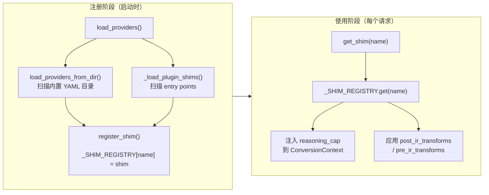

# 提供商 Shim

LLM-Rosetta 仅使用四个**转换器** —— 每种 API 标准一个（OpenAI Chat、OpenAI Responses、Anthropic、Google）。但 LLM 生态中有更多*提供商*（DeepSeek、xAI、Qwen、Moonshot 等）遵循其中某一标准，只有细微差异。

**Shim 层**弥合了这一差距。Shim 是一张轻量级的身份卡，声明提供商使用哪个转换器，同时携带连接默认值和可选的**转换规则（transforms）**，用于适配提供商特有的请求/响应字段差异。

## 架构

```text
ProviderShim ("deepseek")
├── name: "deepseek"
├── base: "openai_chat"              → 选择转换器
├── default_base_url: "https://api.deepseek.com"
├── default_api_key_env: "DEEPSEEK_API_KEY"
├── logo: "https://cdn.jsdelivr.net/..."
├── post_ir_transforms: (strip_fields("n", "logit_bias", "seed"),)
└── pre_ir_transforms: ()
```

- **ProviderShim** —— 提供商身份：名称、基础转换器类型、默认 URL、默认 API 密钥环境变量、Logo URL，以及可选的转换规则。
- **Transforms** —— 纯 `dict → dict` 函数，围绕转换器应用。`post_ir_transforms` 将输出请求适配为提供商方言；`pre_ir_transforms` 标准化输入响应。

!!! note "向后兼容别名"
    旧字段名 `to_transforms` 和 `from_transforms` 仍作为别名被接受 —— 在 `ProviderShim` 构造函数参数和 `transforms.py` 导出中均可使用。

### 声明式提供商目录

内置 shim 以目录结构定义在 `shims/providers/` 下：

```text
src/llm_rosetta/shims/providers/
├── __init__.py              # 自动发现：扫描子目录
├── openai/
│   └── provider.yaml        # 提供商身份（YAML）
├── deepseek/
│   ├── provider.yaml        # 提供商身份
│   └── transforms.py        # 字段级转换规则
├── volcengine/
│   ├── provider.yaml
│   └── transforms.py
└── ...
```

每个提供商子目录包含：

- **`provider.yaml`**（必需）—— 声明 `name`、`base`、`default_base_url`、`default_api_key_env` 和 `logo`
- **`transforms.py`**（可选）—— 导出 `post_ir_transforms` 和/或 `pre_ir_transforms` 元组（旧名 `to_transforms` / `from_transforms` 也可用）

`provider.yaml` 示例：

```yaml
name: deepseek
base: openai_chat
default_base_url: https://api.deepseek.com
default_api_key_env: DEEPSEEK_API_KEY
logo: https://cdn.jsdelivr.net/npm/@lobehub/icons-static-svg@latest/icons/deepseek.svg
```

`transforms.py` 示例：

```python
from llm_rosetta.shims.transforms import strip_fields

# DeepSeek 不支持 n、logit_bias 和 seed
post_ir_transforms = (strip_fields("n", "logit_bias", "seed"),)
pre_ir_transforms = ()
```

导入时，`shims/__init__.py` 自动扫描所有提供商目录并注册，然后发现通过 entry point 声明的插件 shim。

## Shim 生命周期



- **注册阶段**在导入时执行一次。`load_providers()` 扫描内置 `providers/` 目录，然后发现 `llm_rosetta.shim_providers` entry point 以加载插件 shim。
- **使用阶段**在每个请求中执行。`get_shim(name)` 查询注册表；gateway 注入推理配置并在转换器前后应用 transforms。

## 插件 Shim

下游包可以在不修改 llm-rosetta 的情况下注册自己的 shim。两种方式：

### Entry Point（推荐）

在 `pyproject.toml` 中声明 entry point：

```toml
[project.entry-points."llm_rosetta.shim_providers"]
my_provider = "my_package.shims:register_shims"
```

callable 扫描本地 YAML 目录并返回注册的 shim：

```python
# my_package/shims/__init__.py
from pathlib import Path
from llm_rosetta.shims import load_providers_from_dir

def register_shims():
    return load_providers_from_dir(Path(__file__).parent / "providers")
```

### 条件注册

高级场景（按环境注册、动态配置）可以直接调用 `register_shim()`：

```python
import os
from llm_rosetta.shims import register_shim, ProviderShim

def register_shims():
    if os.getenv("MY_INTERNAL_PROVIDER"):
        register_shim(ProviderShim(
            name="my-internal",
            base="openai_chat",
            default_base_url="http://internal:8080/v1",
        ))
```

!!! note
    当插件注册了与内置同名的 shim 时，内置 shim 会被静默覆盖（输出 INFO 日志）。这是有意设计——允许插件定制内置提供商的行为。

## 内置 Shim

LLM-Rosetta 内置 16 个提供商 shim：

| 名称 | 基础类型 | 默认 Base URL | API Key 环境变量 | 转换规则 |
|------|---------|--------------|-----------------|---------|
| `openai` | `openai_chat` | `https://api.openai.com/v1` | `OPENAI_API_KEY` | — |
| `openai_responses` | `openai_responses` | `https://api.openai.com/v1` | `OPENAI_API_KEY` | — |
| `anthropic` | `anthropic` | `https://api.anthropic.com` | `ANTHROPIC_API_KEY` | — |
| `google` | `google` | `https://generativelanguage.googleapis.com` | `GOOGLE_API_KEY` | — |
| `deepseek` | `openai_chat` | `https://api.deepseek.com` | `DEEPSEEK_API_KEY` | 剥离 `n`、`logit_bias`、`seed` |
| `volcengine--openai_chat` | `openai_chat` | `https://ark.cn-beijing.volces.com/api/v3` | `VOLCENGINE_API_KEY` | 剥离 `logprobs`、`top_logprobs` |
| `volcengine--openai_responses` | `openai_responses` | `https://ark.cn-beijing.volces.com/api/v3` | `VOLCENGINE_API_KEY` | — |
| `xai` | `openai_chat` | `https://api.x.ai/v1` | `XAI_API_KEY` | 剥离 `logit_bias` |
| `qwen` | `openai_chat` | `https://dashscope.aliyuncs.com/compatible-mode/v1` | `DASHSCOPE_API_KEY` | 剥离 `frequency_penalty`、`logit_bias` |
| `moonshot` | `openai_chat` | `https://api.moonshot.cn/v1` | `MOONSHOT_API_KEY` | 剥离 `logprobs`、`top_logprobs`、`logit_bias`、`seed` |
| `minimax--openai_chat` | `openai_chat` | `https://api.minimaxi.com/v1` | `MINIMAX_API_KEY` | 剥离 + reasoning_split 注入 |
| `minimax--anthropic` | `anthropic` | `https://api.minimaxi.com/v1` | `MINIMAX_API_KEY` | — |
| `zhipu` | `openai_chat` | `https://open.bigmodel.cn/api/paas/v4` | `ZHIPU_API_KEY` | 剥离 `n`、penalties、`logprobs`、`logit_bias`、`seed` |
| `openrouter` | `openai_chat` | `https://openrouter.ai/api/v1` | `OPENROUTER_API_KEY` | 重命名 `reasoning` → `reasoning_content` |
| `argo--openai_chat` | `openai_chat` | `https://apps.inside.anl.gov/argoapi/v1` | `ARGO_API_KEY` | `max_tokens` → `max_completion_tokens` |
| `argo--anthropic` | `anthropic` | `https://apps.inside.anl.gov/argoapi` | `ARGO_API_KEY` | OpenAI 响应格式归一化 |

## 推理配置

从 v0.6.8 起，shim 可以通过 `provider.yaml` 中的 `reasoning` 段声明推理能力配置。运行时由 `apply_reasoning_config()` 读取该配置，替代了之前硬编码在各转换器中的 effort 降级逻辑。

### ReasoningCapability 字段

| 字段 | 类型 | 说明 |
|------|------|------|
| `disabled` | `"omit"` \| `"thinking_disabled"` \| `"thinking_budget_zero"` | `mode: disabled` 时的序列化策略：`omit` 不发送任何参数，`thinking_disabled` 发送 `{"thinking": {"type": "disabled"}}`，`thinking_budget_zero` 发送 `{"thinking_config": {"thinking_budget": 0}}` |
| `effort_field` | `"reasoning_effort"` \| `"reasoning.effort"` \| `"output_config.effort"` \| `"thinking_level"` \| `"none"` | effort 值在提供商请求中的序列化位置；`"none"` 表示提供商不支持 effort |
| `max_effort` | `EffortLevel` \| `null` | 最高允许的归一化 effort 级别；超过此值的 effort 会被截断到该级别 |
| `thinking_type` | `"enabled"` \| `"adaptive"` \| `null` | 强制 `thinking.type` 为该值；`null` 表示不覆盖 |
| `effort_map` | `dict[str, str]` | 从归一化 IR effort 到提供商特定 effort 字符串的映射 |

### 配置示例

=== "Anthropic"

    ```yaml
    # provider.yaml
    reasoning:
      disabled: thinking_disabled
      effort_field: output_config.effort
      effort_map:
        minimal: low
        low: low
        medium: medium
        high: high
        xhigh: xhigh
        max: max
    ```

=== "OpenAI"

    ```yaml
    # provider.yaml
    reasoning:
      disabled: omit
      effort_field: reasoning_effort
      max_effort: high
      effort_map:
        minimal: minimal
        low: low
        medium: medium
        high: high
        xhigh: high
        max: high
    ```

### 按模型覆盖（`model_overrides`）

当同一提供商下不同模型有不同推理能力时，使用 `model_overrides` 声明按模型的配置。每个覆盖项继承提供商级默认值，按**上游模型 ID**（别名解析后）为键：

```yaml
name: argo--anthropic
base: anthropic
reasoning:
  thinking_type: enabled       # 大多数模型的默认值
  effort_map: { ... }
  model_overrides:
    claudeopus47:
      thinking_type: adaptive  # Vertex AI 要求 adaptive
```

网关在别名解析后确定上游模型 ID（如 `argo:claude-opus-4.7` → `claudeopus47`），并应用匹配的覆盖配置。

### 运行机制

当网关代理处理请求时：

1. `_inject_shim_reasoning()` 从目标提供商的 shim 中提取 `ReasoningCapability`，注入转换上下文的 `ctx.options["reasoning_cap"]`。如果上游模型有 `model_overrides` 条目，则使用该覆盖配置
2. 各转换器的 `request_to_provider` 将 `reasoning_cap` 传给 `ir_reasoning_config_to_p`
3. `ir_reasoning_config_to_p` 委托给 `apply_reasoning_config()`，按 shim 配置执行：
    - 输入归一化（`none` → disabled）
    - disabled 序列化（按 `cap.disabled` 策略）
    - effort 截断（按 `cap.max_effort`）
    - effort 映射（按 `cap.effort_map`）
    - `thinking_type` 覆盖（如强制 `enabled` → `adaptive`，用于 Vertex AI 模型）
    - 结构化传透（mode、budget_tokens 等提供商特定字段）

没有声明 `reasoning` 段的 shim 使用基础转换器类型的内置默认配置。

!!! note "安全机制：`thinking_type: enabled` 但缺少 `budget_tokens`"
    Anthropic 要求 `thinking.type = "enabled"` 时必须提供 `budget_tokens`。如果 `thinking_type: enabled` 覆盖生效但请求中没有 `budget_tokens`，helper 会自动回退到 `"adaptive"` 以避免产出不合法的请求。

## Argo Shim

`argo--openai_chat` 和 `argo--anthropic` 面向 **Argo 网关** —— 这是某些机构（如 Argonne 国家实验室）使用的代理层，将多个上游 LLM 提供商统一暴露在单一端点之后。

两个 shim 都使用 `model_id_field: internal_id` —— 模型标识符通过 `internal_id` 而非 `model` 字段传递。

### `argo--openai_chat`

OpenAI 兼容 shim，附带一个 transform：`max_tokens` → `max_completion_tokens`（新版 OpenAI 模型拒绝旧字段名）。

### `argo--anthropic`

- **模型级 `thinking_type` 覆盖**：默认 `thinking_type: enabled`，通过 `model_overrides` 为 `claudeopus47` 设置 `thinking_type: adaptive`（Vertex AI 后端）。声明式处理。
- **`unsigned_reasoning_blocks: preserve`**：历史消息中没有有效签名的 thinking block 保存在 metadata 中而非转发（避免 Argo 400 错误）。
- **`pre_ir_transforms` —— OpenAI 响应格式归一化**：Argo 可能从 `/v1/messages` 返回 OpenAI Chat 格式响应，该 transform 在转换器处理前将其归一化为 Anthropic 格式。

### 配置

在网关配置中覆盖 `default_base_url`：

```jsonc
{
  "providers": {
    "argo": {
      "shim": "argo--anthropic",
      "base_url": "https://your-argo-instance.example.com/",
      "api_key": "${ARGO_API_KEY}"
    }
  }
}
```

!!! note
    默认 URL（`https://apps.inside.anl.gov/argoapi/`）仅在 ANL 内网可达。Argo shim 将在未来版本中作为插件移至 [argo-proxy](https://github.com/Oaklight/argo-proxy) 包。

## 能力标志

除推理配置外，shim 还可以声明影响转换器行为的提供商级能力标志：

| 字段 | 类型 | 默认值 | 描述 |
|------|------|--------|------|
| `supports_custom_tools` | `bool` | `False` | 提供商 API 是否原生支持 `{type: "custom"}` 工具定义。`False` 时，自定义工具降级为函数包装并合成 JSON schema。 |
| `hoist_system_messages` | `bool` | `True` | 将对话中间的 system/developer 消息改写为 user 角色 `[System: ...]` 信封，保持 prompt cache 前缀稳定。 |
| `multimodal_tool_result` | `bool \| None` | `None` | 提供商是否原生支持工具结果中的多模态内容（图片、文件）。`None` 使用转换器的类级默认值。`True` 强制原生透传；`False` 强制双重编码（文本回退 + 合成 user 消息）。 |

`provider.yaml` 示例：

```yaml
name: my-provider
base: openai_chat
supports_custom_tools: true
hoist_system_messages: true
multimodal_tool_result: false
```

这些标志在转换时注入 `ConversionContext.options`，转换器无需知道当前使用的是哪个 shim 即可查询。

## 转换规则（Transforms）

转换规则是纯 `dict → dict` 函数，用于弥合提供商实际 API 方言与对应基础转换器所期望的"标准"格式之间的差异。它们处理字段级差异（剥离不支持的字段、重命名参数、注入默认值）—— **不**处理语义级 API 标准转换，那是转换器的职责。

### 内置转换原语

| 原语 | 描述 | 示例 |
|------|------|------|
| `strip_fields(*keys)` | 从请求体中移除不支持的字段 | `strip_fields("logprobs", "top_logprobs")` |
| `rename_field(old, new)` | 重命名顶层字段 | `rename_field("max_tokens", "max_length")` |
| `set_defaults(**kv)` | 仅在字段不存在时设置（幂等） | `set_defaults(temperature=0.7)` |

### 应用方式

转换规则在两个层面应用：

**1. `convert()` 公共 API** —— 通过 `resolve_transforms()` 自动应用：

```python
from llm_rosetta import convert

# 当 source/target 是 shim 名称时，转换规则自动应用
result = convert(request_body, source="openai_chat", target="volcengine")
# → logprobs 和 top_logprobs 从输出中剥离
```

**2. 网关代理管线** —— 围绕转换器应用：

```text
请求:  客户端请求体 → source.from_provider() → IR → target.to_provider()
       → [post_ir_transforms] → 上游 API

响应:  上游响应 → [pre_ir_transforms] → target.response_from_provider()
       → IR → source.response_to_provider() → 客户端

流式:  chunk → [pre_ir_transforms] → target.stream_from_provider()
       → IR → source.stream_to_provider() → 客户端
```

### 设计原则

- **幂等**：重复应用同一转换规则无副作用
- **不重叠**：按约定，不同转换规则应操作不同字段
- **可组合**：多个转换规则通过 `apply_transforms()` 顺序应用

## 使用 Shim

### 通过 Shim 名称解析转换器

`get_converter_for_provider()` 同时接受基础转换器类型字符串和 shim 名称：

```python
from llm_rosetta import get_converter_for_provider

# 基础类型 —— 与之前一样
converter = get_converter_for_provider("openai_chat")

# Shim 名称 —— 通过注册表解析为 "openai_chat"
converter = get_converter_for_provider("deepseek")
```

### 解析基础类型

使用 `resolve_base()` 将 shim 名称映射到基础转换器类型：

```python
from llm_rosetta import resolve_base

resolve_base("deepseek")       # → "openai_chat"
resolve_base("openai_chat")    # → "openai_chat"（直接透传）
resolve_base("unknown")        # → "unknown"（直接透传）
```

## 注册自定义 Shim

### 编程式注册

为任何 OpenAI 兼容服务注册自定义提供商 shim：

```python
from llm_rosetta import ProviderShim, register_shim
from llm_rosetta.shims.transforms import strip_fields

my_shim = ProviderShim(
    name="my-provider",
    base="openai_chat",
    default_base_url="https://api.my-provider.com/v1",
    default_api_key_env="MY_PROVIDER_API_KEY",
    post_ir_transforms=(strip_fields("logprobs", "seed"),),
)
register_shim(my_shim)
```

注册后，shim 名称可在所有地方使用 —— `get_converter_for_provider()`、`resolve_base()`、`convert()` 和网关配置。

### 添加 YAML 提供商

要向内置注册表添加新提供商：

1. 在 `src/llm_rosetta/shims/providers/<name>/` 下创建目录
2. 添加 `provider.yaml`，包含必填字段：

    ```yaml
    name: my-provider
    base: openai_chat
    default_base_url: https://api.my-provider.com/v1
    default_api_key_env: MY_PROVIDER_API_KEY
    logo: https://example.com/logo.svg
    ```

3. 如果提供商有字段级差异，可选添加 `transforms.py`：

    ```python
    from llm_rosetta.shims.transforms import strip_fields

    post_ir_transforms = (strip_fields("unsupported_field"),)
    pre_ir_transforms = ()
    ```

提供商在导入时自动发现并注册。

### 列出和移除 Shim

```python
from llm_rosetta import list_shims, unregister_shim

# 列出所有已注册的 shim
for shim in list_shims():
    print(f"{shim.name} → {shim.base}")

# 移除 shim
unregister_shim("my-provider")
```

## 网关集成

在网关配置文件中，使用 `"shim"` 字段引用已注册的 shim，而非直接指定 `"type"`：

```jsonc
{
  "providers": {
    "my-deepseek": {
      "shim": "deepseek",
      "api_key": "${DEEPSEEK_API_KEY}"
      // base_url 默认使用 shim 的 default_base_url
    }
  },
  "models": {
    "deepseek-chat": "my-deepseek"
  }
}
```

提供商类型的解析顺序：

1. `"shim"` 字段 —— 通过 shim 注册表解析为基础转换器类型
2. `"type"` 字段 —— 直接用作转换器类型
3. 提供商配置键名 —— 作为后备

当找到 shim 时：

- `default_base_url` 和 `default_api_key_env` 在配置未明确指定时作为后备值使用
- `post_ir_transforms` 应用于发送给上游提供商的请求
- `pre_ir_transforms` 应用于接收到的响应/流式 chunk，在转换之前执行
