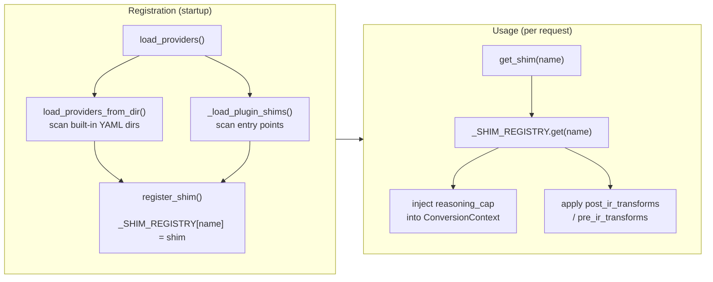

# Provider Shims

LLM-Rosetta uses only four **converters** — one per API standard (OpenAI Chat, OpenAI Responses, Anthropic, Google). But the LLM ecosystem has many more *providers* (DeepSeek, xAI, Qwen, Moonshot, …) that follow one of those standards with minor variations.

The **shim layer** bridges this gap. A shim is a lightweight identity card that declares which converter a provider uses, along with connection defaults and optional **transforms** that adapt request/response fields to match the provider's dialect.

## Architecture

```text
ProviderShim ("deepseek")
├── name: "deepseek"
├── base: "openai_chat"              → selects the converter
├── default_base_url: "https://api.deepseek.com"
├── default_api_key_env: "DEEPSEEK_API_KEY"
├── logo: "https://cdn.jsdelivr.net/..."
├── post_ir_transforms: (strip_fields("n", "logit_bias", "seed"),)
└── pre_ir_transforms: ()
```

- **ProviderShim** — provider identity: name, base converter type, default URL, default API key env var, logo URL, and optional transforms.
- **Transforms** — pure `dict → dict` functions applied around converters. `post_ir_transforms` adapt outgoing requests to the provider's dialect; `pre_ir_transforms` normalize incoming responses.

!!! note "Backward-compatible aliases"
    The old field names `to_transforms` and `from_transforms` are still accepted as aliases — both in `ProviderShim` constructor kwargs and in `transforms.py` exports.

### Declarative Provider Directory

Built-in shims are defined as a directory structure under `shims/providers/`:

```text
src/llm_rosetta/shims/providers/
├── __init__.py              # Auto-discovery: scans subdirectories
├── openai/
│   └── provider.yaml        # Provider identity (YAML)
├── deepseek/
│   ├── provider.yaml        # Provider identity
│   └── transforms.py        # Field-level transforms
├── volcengine/
│   ├── provider.yaml
│   └── transforms.py
└── ...
```

Each provider subdirectory contains:

- **`provider.yaml`** (required) — declares `name`, `base`, `default_base_url`, `default_api_key_env`, and `logo`
- **`transforms.py`** (optional) — exports `post_ir_transforms` and/or `pre_ir_transforms` tuples (the old names `to_transforms` / `from_transforms` also work)

Example `provider.yaml`:

```yaml
name: deepseek
base: openai_chat
default_base_url: https://api.deepseek.com
default_api_key_env: DEEPSEEK_API_KEY
logo: https://cdn.jsdelivr.net/npm/@lobehub/icons-static-svg@latest/icons/deepseek.svg
```

Example `transforms.py`:

```python
from llm_rosetta.shims.transforms import strip_fields

# DeepSeek does not support n, logit_bias, or seed
post_ir_transforms = (strip_fields("n", "logit_bias", "seed"),)
pre_ir_transforms = ()
```

At import time, `shims/__init__.py` scans all provider directories and registers them automatically, then discovers any plugin shims via entry points.

## Shim Lifecycle



- **Registration** happens once at import time. `load_providers()` scans the built-in `providers/` directory, then discovers `llm_rosetta.shim_providers` entry points to load plugin shims.
- **Usage** happens per request. `get_shim(name)` looks up the registry; the gateway injects reasoning config and applies transforms around the converter.

## Plugin Shims

Downstream packages can register their own shims without modifying llm-rosetta. Two approaches:

### Entry Point (recommended)

Declare an entry point in your `pyproject.toml`:

```toml
[project.entry-points."llm_rosetta.shim_providers"]
my_provider = "my_package.shims:register_shims"
```

The callable scans a local YAML directory and returns the registered shims:

```python
# my_package/shims/__init__.py
from pathlib import Path
from llm_rosetta.shims import load_providers_from_dir

def register_shims():
    return load_providers_from_dir(Path(__file__).parent / "providers")
```

### Conditional Registration

For advanced use cases (environment-specific shims, dynamic config), call `register_shim()` directly:

```python
import os
from llm_rosetta.shims import register_shim, ProviderShim

def register_shims():
    if os.getenv("MY_INTERNAL_PROVIDER"):
        register_shim(ProviderShim(
            name="my-internal",
            base="openai_chat",
            default_base_url="http://internal:8080/v1",
        ))
```

!!! note
    When a plugin registers a shim with the same name as a built-in, the built-in is silently overridden (INFO log emitted). This is intentional — it allows plugins to customize built-in provider behavior.

## Built-in Shims

LLM-Rosetta ships with 16 built-in provider shims:

| Name | Base | Default Base URL | API Key Env | Transforms |
|------|------|-----------------|-------------|------------|
| `openai` | `openai_chat` | `https://api.openai.com/v1` | `OPENAI_API_KEY` | — |
| `openai_responses` | `openai_responses` | `https://api.openai.com/v1` | `OPENAI_API_KEY` | — |
| `anthropic` | `anthropic` | `https://api.anthropic.com` | `ANTHROPIC_API_KEY` | — |
| `google` | `google` | `https://generativelanguage.googleapis.com` | `GOOGLE_API_KEY` | — |
| `deepseek` | `openai_chat` | `https://api.deepseek.com` | `DEEPSEEK_API_KEY` | strips `n`, `logit_bias`, `seed` |
| `volcengine--openai_chat` | `openai_chat` | `https://ark.cn-beijing.volces.com/api/v3` | `VOLCENGINE_API_KEY` | strips `logprobs`, `top_logprobs` |
| `volcengine--openai_responses` | `openai_responses` | `https://ark.cn-beijing.volces.com/api/v3` | `VOLCENGINE_API_KEY` | — |
| `xai` | `openai_chat` | `https://api.x.ai/v1` | `XAI_API_KEY` | strips `logit_bias` |
| `qwen` | `openai_chat` | `https://dashscope.aliyuncs.com/compatible-mode/v1` | `DASHSCOPE_API_KEY` | strips `frequency_penalty`, `logit_bias` |
| `moonshot` | `openai_chat` | `https://api.moonshot.cn/v1` | `MOONSHOT_API_KEY` | strips `logprobs`, `top_logprobs`, `logit_bias`, `seed` |
| `minimax--openai_chat` | `openai_chat` | `https://api.minimaxi.com/v1` | `MINIMAX_API_KEY` | strips + reasoning_split injection |
| `minimax--anthropic` | `anthropic` | `https://api.minimaxi.com/v1` | `MINIMAX_API_KEY` | — |
| `zhipu` | `openai_chat` | `https://open.bigmodel.cn/api/paas/v4` | `ZHIPU_API_KEY` | strips `n`, penalties, `logprobs`, `logit_bias`, `seed` |
| `openrouter` | `openai_chat` | `https://openrouter.ai/api/v1` | `OPENROUTER_API_KEY` | renames `reasoning` → `reasoning_content` |
| `argo--openai_chat` | `openai_chat` | `https://apps.inside.anl.gov/argoapi/v1` | `ARGO_API_KEY` | `max_tokens` → `max_completion_tokens` |
| `argo--anthropic` | `anthropic` | `https://apps.inside.anl.gov/argoapi` | `ARGO_API_KEY` | OpenAI response normalization |

## Argo Shims

`argo--openai_chat` and `argo--anthropic` target the **Argo gateway** — a proxy layer used at certain institutions (such as Argonne National Laboratory) that fronts multiple upstream LLM providers behind a single endpoint.

Both shims use `model_id_field: internal_id` — the model identifier is sent as `internal_id` instead of `model`.

### `argo--openai_chat`

OpenAI-compatible shim with one transform: `max_tokens` → `max_completion_tokens` (newer OpenAI models reject the deprecated name).

### `argo--anthropic`

- **Model-level `thinking_type` override**: `thinking_type: enabled` by default, with `model_overrides` for `claudeopus47: thinking_type: adaptive` (Vertex AI backend). Handled declaratively via reasoning config.
- **`unsigned_reasoning_blocks: preserve`**: Prior thinking blocks without valid signatures are preserved in metadata instead of being forwarded (avoids Argo 400 errors).
- **`pre_ir_transforms` — OpenAI response normalization**: Argo may return OpenAI Chat format from `/v1/messages`. The transform converts it to Anthropic format before the converter sees it.

### Configuration

Override the `default_base_url` in your gateway config:

```jsonc
{
  "providers": {
    "argo": {
      "shim": "argo--anthropic",
      "base_url": "https://your-argo-instance.example.com/",
      "api_key": "${ARGO_API_KEY}"
    }
  }
}
```

!!! note
    The default URL (`https://apps.inside.anl.gov/argoapi/`) is only reachable from within the ANL network. Argo shims will be moved to the [argo-proxy](https://github.com/Oaklight/argo-proxy) package as a plugin in a future release.

## Reasoning Configuration

Since v0.6.8, provider shims can declare how they handle reasoning effort and disabled state via the `reasoning` section in `provider.yaml`. This replaces the previously hardcoded effort mapping branches in each converter.

### `ReasoningCapability` Fields

| Field | Type | Default | Description |
|-------|------|---------|-------------|
| `disabled` | `"omit"` \| `"thinking_disabled"` | `"omit"` | How to serialize `mode: "disabled"` — omit the field entirely, or emit a provider-specific disabled marker |
| `effort_field` | `"reasoning_effort"` \| `"output_config.effort"` \| ... | `"reasoning_effort"` | Where the provider expects the effort value in the request body |
| `thinking_type` | `"enabled"` \| `"adaptive"` \| `null` | `null` | Force `thinking.type` to this value; `null` means no override |
| `max_effort` | effort level or `null` | `null` | Highest effort level this shim should emit; higher values are clamped |
| `effort_map` | `{IR_level: provider_string}` | identity | Mapping from IR effort levels to provider-specific effort strings |

### Example: Declaring Reasoning in `provider.yaml`

```yaml
name: anthropic
base: anthropic
default_base_url: https://api.anthropic.com
default_api_key_env: ANTHROPIC_API_KEY
reasoning:
  disabled: thinking_disabled
  effort_field: output_config.effort
  effort_map:
    minimal: low
    low: low
    medium: medium
    high: high
    xhigh: xhigh
    max: max
```

```yaml
name: openai
base: openai_chat
default_base_url: https://api.openai.com/v1
default_api_key_env: OPENAI_API_KEY
reasoning:
  disabled: omit
  effort_field: reasoning_effort
  max_effort: high
  effort_map:
    minimal: low
    low: low
    medium: medium
    high: high
    xhigh: high
    max: high
```

### Per-Model Overrides (`model_overrides`)

When models under the same provider have different reasoning capabilities, use `model_overrides` to declare per-model config. Each override inherits provider-level defaults for unset fields, keyed by **upstream model ID** (post-alias):

```yaml
name: argo--anthropic
base: anthropic
reasoning:
  thinking_type: enabled       # default for most models
  effort_map: { ... }
  model_overrides:
    claudeopus47:
      thinking_type: adaptive  # Vertex AI requires adaptive
```

The gateway resolves the upstream model ID after alias resolution (e.g. `argo:claude-opus-4.7` → `claudeopus47`) and applies the matching override if found.

### How It Works

1. The gateway injects the shim's `ReasoningCapability` into `ConversionContext` before conversion. If the upstream model has a `model_overrides` entry, that override takes precedence
2. All four converters call the shared `apply_reasoning_config()` helper, which:
    - Looks up the IR effort in the shim's `effort_map`
    - Clamps to `max_effort` if set
    - Serializes `mode: "disabled"` according to the `disabled` strategy
    - Places the effort value in the correct field via `effort_field`
    - Applies `thinking_type` override if set (e.g. forces `enabled` → `adaptive` for Vertex AI models)
3. Input normalization (`normalize_reasoning_input()`) converts provider-native values like `"none"`, `"xhigh"`, `"max"` to IR-canonical form before conversion begins

!!! note "Safety: `thinking_type: enabled` without `budget_tokens`"
    Anthropic requires `budget_tokens` when `thinking.type = "enabled"`. If a `thinking_type: enabled` override is applied but the request has no `budget_tokens`, the helper automatically falls back to `"adaptive"` to avoid an invalid payload.

If a shim does not declare a `reasoning` section, default behavior is used (effort passed through as-is, disabled → omitted).

For full details on the IR effort ladder and per-provider mapping tables, see [Reasoning / Thinking Parameters](reasoning.md).

## Capability Flags

Beyond reasoning, shims can declare provider-level capability flags that control converter behavior:

| Field | Type | Default | Description |
|-------|------|---------|-------------|
| `supports_custom_tools` | `bool` | `False` | Whether the provider's API natively accepts `{type: "custom"}` tool definitions. When `False`, custom tools are downgraded to function wrappers with a synthesized JSON schema. |
| `hoist_system_messages` | `bool` | `True` | Rewrite mid-conversation system/developer messages as user-role `[System: ...]` envelopes to preserve prompt cache prefix stability. |
| `multimodal_tool_result` | `bool \| None` | `None` | Whether the provider supports multimodal content (images, files) in tool results natively. `None` defers to the converter's class-level default. `True` forces native pass-through; `False` forces dual-encoding (text fallback + synthetic user message). |

Example in `provider.yaml`:

```yaml
name: my-provider
base: openai_chat
supports_custom_tools: true
hoist_system_messages: true
multimodal_tool_result: false
```

These flags are injected into `ConversionContext.options` at conversion time, so converters can query them without knowing which shim is active.

## Transforms

Transforms are pure `dict → dict` functions that bridge the gap between a provider's actual API dialect and the "ideal" standard that the corresponding base converter expects. They handle field-level quirks (strip unsupported fields, rename parameters, inject defaults) — **not** semantic API-standard translation, which is the converter's job.

### Built-in Transform Primitives

| Primitive | Description | Example |
|-----------|-------------|---------|
| `strip_fields(*keys)` | Remove unsupported fields from the body | `strip_fields("logprobs", "top_logprobs")` |
| `rename_field(old, new)` | Rename a top-level field | `rename_field("max_tokens", "max_length")` |
| `set_defaults(**kv)` | Set fields only when absent (idempotent) | `set_defaults(temperature=0.7)` |

### How Transforms Apply

Transforms are applied at two levels:

**1. `convert()` public API** — automatically via `resolve_transforms()`:

```python
from llm_rosetta import convert

# Transforms are applied automatically when source/target is a shim name
result = convert(request_body, source="openai_chat", target="volcengine")
# → logprobs and top_logprobs stripped from the output
```

**2. Gateway proxy pipeline** — applied around the converter:

```text
Request:  client body → source.from_provider() → IR → target.to_provider()
          → [post_ir_transforms] → upstream API

Response: upstream → [pre_ir_transforms] → target.response_from_provider()
          → IR → source.response_to_provider() → client

Stream:   chunk → [pre_ir_transforms] → target.stream_from_provider()
          → IR → source.stream_to_provider() → client
```

### Design Principles

- **Idempotent**: applying the same transform twice is harmless
- **Non-overlapping**: transforms should operate on different fields by convention
- **Composable**: multiple transforms are applied sequentially via `apply_transforms()`

## Using Shims

### Resolving a Converter by Shim Name

`get_converter_for_provider()` accepts both base converter type strings and shim names:

```python
from llm_rosetta import get_converter_for_provider

# Base type — works as before
converter = get_converter_for_provider("openai_chat")

# Shim name — resolved to "openai_chat" via the registry
converter = get_converter_for_provider("deepseek")
```

### Resolving a Base Type

Use `resolve_base()` to map a shim name to its base converter type:

```python
from llm_rosetta import resolve_base

resolve_base("deepseek")       # → "openai_chat"
resolve_base("openai_chat")    # → "openai_chat" (pass-through)
resolve_base("unknown")        # → "unknown" (pass-through)
```

## Registering Custom Shims

### Programmatic Registration

Register a custom provider shim for any OpenAI-compatible service:

```python
from llm_rosetta import ProviderShim, register_shim
from llm_rosetta.shims.transforms import strip_fields

my_shim = ProviderShim(
    name="my-provider",
    base="openai_chat",
    default_base_url="https://api.my-provider.com/v1",
    default_api_key_env="MY_PROVIDER_API_KEY",
    post_ir_transforms=(strip_fields("logprobs", "seed"),),
)
register_shim(my_shim)
```

After registration the shim name works everywhere — `get_converter_for_provider()`, `resolve_base()`, `convert()`, and gateway config.

### Adding a YAML-based Provider

To add a new provider to the built-in registry:

1. Create a directory under `src/llm_rosetta/shims/providers/<name>/`
2. Add a `provider.yaml` with required fields:

    ```yaml
    name: my-provider
    base: openai_chat
    default_base_url: https://api.my-provider.com/v1
    default_api_key_env: MY_PROVIDER_API_KEY
    logo: https://example.com/logo.svg
    ```

3. Optionally add a `transforms.py` if the provider has field-level quirks:

    ```python
    from llm_rosetta.shims.transforms import strip_fields

    post_ir_transforms = (strip_fields("unsupported_field"),)
    pre_ir_transforms = ()
    ```

The provider is automatically discovered and registered at import time.

### Listing and Removing Shims

```python
from llm_rosetta import list_shims, unregister_shim

# List all registered shims
for shim in list_shims():
    print(f"{shim.name} → {shim.base}")

# Remove a shim
unregister_shim("my-provider")
```

## Gateway Integration

In a gateway configuration file, use the `"shim"` field to reference a registered shim instead of specifying `"type"` directly:

```jsonc
{
  "providers": {
    "my-deepseek": {
      "shim": "deepseek",
      "api_key": "${DEEPSEEK_API_KEY}"
      // base_url defaults to shim's default_base_url
    }
  },
  "models": {
    "deepseek-chat": "my-deepseek"
  }
}
```

Resolution order for provider type:

1. `"shim"` field — resolved via the shim registry to a base converter type
2. `"type"` field — used directly as the converter type
3. Provider config key name — used as fallback

When a shim is found:

- `default_base_url` and `default_api_key_env` serve as fallbacks if not set in config
- `post_ir_transforms` are applied to outgoing requests before sending to the upstream provider
- `pre_ir_transforms` are applied to incoming responses/stream chunks before conversion
