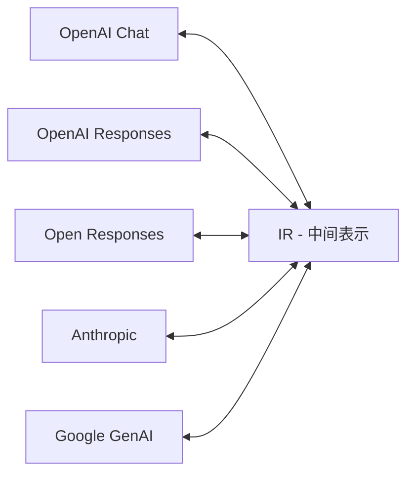

<div style="text-align: center; margin-bottom: 1em;">
  
</div>

# LLM-Rosetta

[](https://pypi.org/project/llm-rosetta/)
[](https://github.com/Oaklight/llm-rosetta/releases/latest)
[](https://github.com/Oaklight/llm-rosetta/blob/master/LICENSE)

**LLM-Rosetta** — 用于 LLM 提供商 API 之间的统一消息格式转换库。

正如罗塞塔石碑使古代文字之间的翻译成为可能，LLM-Rosetta 弥合了不兼容的 LLM 提供商 API 之间的鸿沟——让你使用任意格式发送请求，并被任意提供商理解。

## 问题

不同的 LLM 提供商使用互不兼容的 API 格式。适用于 OpenAI 的请求无法直接发送给 Anthropic 或 Google。切换提供商意味着重写 API 集成代码。同时支持多个提供商则需要维护 N² 个格式转换器。

## 解决方案

LLM-Rosetta 引入了中央**中间表示（IR）**作为枢纽。每个提供商只需与 IR 之间进行转换，将转换器总数从 N² 降为 2N。



## 两种使用方式

### 作为库使用

在代码中直接转换提供商格式——无需启动服务器：

```python
from llm_rosetta import OpenAIChatConverter, AnthropicConverter

openai_conv = OpenAIChatConverter()
anthropic_conv = AnthropicConverter()

# OpenAI 格式 → IR → Anthropic 格式
ir_request = openai_conv.request_from_provider(openai_request)
anthropic_request, warnings = anthropic_conv.request_to_provider(ir_request)
```

```bash
pip install llm-rosetta
```

### 作为网关使用

运行本地 HTTP 代理，实时在格式之间转换。发送任意格式的请求——网关自动路由到正确的上游提供商：

```text
客户端（OpenAI 格式）──→ 网关 ──→ Anthropic API
客户端（Anthropic 格式）──→ 网关 ──→ Google API
客户端（Google 格式）──→ 网关 ──→ 任意提供商
```

```bash
pip install "llm-rosetta[gateway]"
llm-rosetta-gateway
```

网关可以作为 **Claude Code**、**Gemini CLI**、**OpenAI Codex CLI**、**Kilo Code** 和 **Ollama** 等 AI 编程工具的后端。详见 [CLI 工具集成](gateway/cli-integrations.md)。

## 支持的 API 标准

| 提供商 | API 标准 | ProviderType |
|--------|---------|:------------:|
| OpenAI | Chat Completions | `openai_chat` |
| OpenAI | Responses | `openai_responses` |
| Open Responses | 厂商中立标准 | `open_responses` |
| Anthropic | Messages | `anthropic` |
| Google | GenAI | `google` |

详见 [API 标准](guide/api-standards.md)了解各格式的详细对比。

## 核心特性

- **中枢辐射架构** — 中央 IR 格式消除 N² 转换问题
- **双向转换** — 请求、响应和消息均支持双向转换
- **流式支持** — 通过有状态上下文管理转换流式数据块
- **工具调用** — 跨提供商的统一工具定义和调用处理
- **自动检测** — 从请求结构自动识别提供商格式
- **网关 + 管理面板** — HTTP 代理，内置 Web UI 管理配置、指标和日志
- **类型安全** — 所有类型均有完整的 TypedDict 注解
- **零运行时开销** — 纯字典转换，无验证成本

## 使用场景

**多提供商应用** — 构建可在 LLM 提供商之间无缝切换的应用，无需更改 API 集成代码。生产环境用 OpenAI，测试用 Claude，或让用户自选提供商。

**AI 编程工具代理** — 运行单个网关，同时服务 Claude Code、Gemini CLI、Codex CLI 等工具，将每个请求路由到正确的上游提供商。

**本地模型访问** — 将网关指向 Ollama 或 LM Studio，让基于云 SDK 的工具通过自动格式转换访问本地模型。

**API 迁移** — 从一个 LLM 提供商迁移到另一个？转换现有的请求/响应处理，无需重写业务逻辑。

## 文档目录

- **[快速上手](getting-started/installation.md)** — 安装和入门
- **[指南](guide/concepts.md)** — 核心概念、转换器、IR 类型、流式处理
- **[API 标准](guide/api-standards.md)** — 支持格式的详细对比
- **[网关](gateway/index.md)** — HTTP 代理设置、配置、CLI 工具集成
- **[示例](examples/)** — 跨提供商对话、工具调用
- **[API 参考](api/)** — 完整 API 文档
- **[更新日志](changelog.md)** — 版本历史

## 引用

如果您在研究中使用了 LLM-Rosetta，请引用我们的论文：

```bibtex
@article{ding2025llmrosetta,
  title={LLM-Rosetta: A Hub-and-Spoke Intermediate Representation for Cross-Provider LLM API Translation},
  author={Ding, Peng},
  journal={arXiv preprint arXiv:XXXX.XXXXX},
  year={2025}
}
```

## 许可证

MIT 许可证
