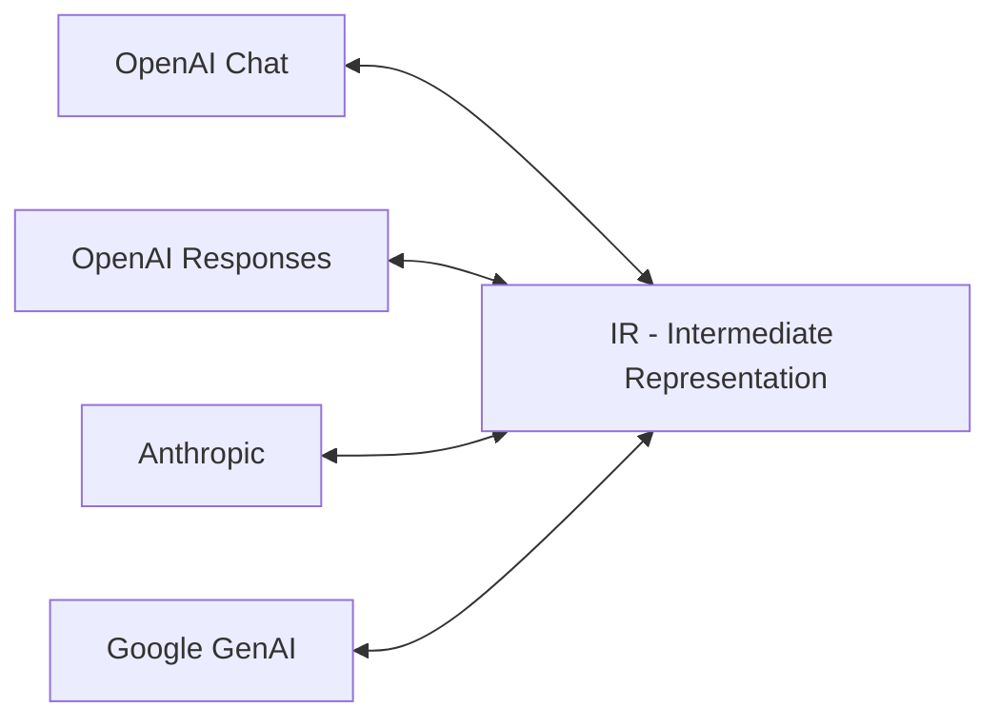

# LLM-Rosetta

[](https://pypi.org/project/llm-rosetta/)
[](https://github.com/Oaklight/llm-rosetta/releases/latest)

**LLM-Rosetta** — a unified message format conversion library for LLM provider APIs.

## Overview

Different LLM providers (OpenAI, Anthropic, Google) use incompatible API formats. LLM-Rosetta solves this with a hub-and-spoke architecture: each provider converts to/from a central Intermediate Representation (IR), requiring only N converters instead of N².

## Quick Start

```bash
pip install llm-rosetta
```

```python
from llm_rosetta import OpenAIChatConverter, AnthropicConverter

openai_conv = OpenAIChatConverter()
anthropic_conv = AnthropicConverter()

# OpenAI format → IR → Anthropic format
ir_request = openai_conv.request_from_provider(openai_request)
anthropic_request, warnings = anthropic_conv.request_to_provider(ir_request)
```

## Supported Providers

| Provider | API | Converter |
|----------|-----|-----------|
| OpenAI | Chat Completions | `OpenAIChatConverter` |
| OpenAI | Responses | `OpenAIResponsesConverter` |
| Anthropic | Messages | `AnthropicConverter` |
| Google | GenAI | `GoogleGenAIConverter` |

## Key Features

- **Hub-and-Spoke Architecture** — central IR eliminates N² conversion problem
- **Bidirectional Conversion** — requests, responses, and messages in both directions
- **Streaming Support** — convert streaming chunks with stateful context management
- **Tool Calling** — unified tool definition and tool call handling across providers
- **Auto Detection** — automatically detect provider format from request structure
- **Type Safe** — full TypedDict annotations for all types
- **Zero Runtime Overhead** — pure dict transformations, no validation cost

## Architecture



## Documentation

- **[Getting Started](getting-started/installation.md)** — Installation and first steps
- **[Guide](guide/concepts.md)** — Core concepts, converters, IR types, streaming
- **[Examples](examples/)** — Cross-provider conversations, tool calling
- **[API Reference](api/)** — Complete API documentation
- **[Changelog](changelog.md)** — Version history

## Citation

If you use LLM-Rosetta in your research, please cite our paper:

```bibtex
@article{ding2025llmrosetta,
  title={LLM-Rosetta: A Hub-and-Spoke Intermediate Representation for Cross-Provider LLM API Translation},
  author={Ding, Peng},
  journal={arXiv preprint arXiv:XXXX.XXXXX},
  year={2025}
}
```

## License

MIT License
