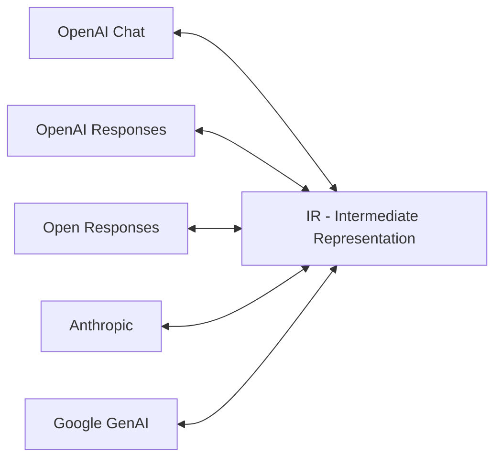

<div style="text-align: center; margin-bottom: 1em;">
  
</div>

# LLM-Rosetta

[](https://pypi.org/project/llm-rosetta/)
[](https://github.com/Oaklight/llm-rosetta/releases/latest)
[](https://github.com/Oaklight/llm-rosetta/blob/master/LICENSE)

**LLM-Rosetta** — a unified message format conversion library for LLM provider APIs.

Just as the Rosetta Stone enabled translation between ancient scripts, LLM-Rosetta bridges the gap between incompatible LLM provider APIs — letting you speak any format and be understood by any provider.

## The Problem

Different LLM providers use incompatible API formats. A request that works with OpenAI won't work with Anthropic or Google. Switching providers means rewriting API integration code. Supporting multiple providers means maintaining N² format converters.

## The Solution

LLM-Rosetta introduces a central **Intermediate Representation (IR)** as a hub. Each provider only needs one converter to/from the IR, reducing the total from N² to 2N.



## Two Ways to Use

### As a Library

Convert between provider formats in your own code — no server needed:

```python
from llm_rosetta import OpenAIChatConverter, AnthropicConverter

openai_conv = OpenAIChatConverter()
anthropic_conv = AnthropicConverter()

# OpenAI format → IR → Anthropic format
ir_request = openai_conv.request_from_provider(openai_request)
anthropic_request, warnings = anthropic_conv.request_to_provider(ir_request)
```

```bash
pip install llm-rosetta
```

### As a Gateway

Run a local HTTP proxy that translates between formats in real time. Send requests in any format — the gateway routes to the right upstream provider automatically:

```text
Client (OpenAI format) ──→ Gateway ──→ Anthropic API
Client (Anthropic format) ──→ Gateway ──→ Google API
Client (Google format) ──→ Gateway ──→ Any provider
```

```bash
pip install "llm-rosetta[gateway]"
llm-rosetta-gateway
```

The gateway is a drop-in backend for AI coding tools like **Claude Code**, **Gemini CLI**, **OpenAI Codex CLI**, **Kilo Code**, and **Ollama**. See [CLI Integrations](gateway/cli-integrations.md) for setup guides.

## Supported API Standards

| Provider | API Standard | ProviderType |
|----------|-------------|:------------:|
| OpenAI | Chat Completions | `openai_chat` |
| OpenAI | Responses | `openai_responses` |
| Open Responses | Vendor-neutral standard | `open_responses` |
| Anthropic | Messages | `anthropic` |
| Google | GenAI | `google` |

See [API Standards](guide/api-standards.md) for detailed format comparisons.

## Key Features

- **Hub-and-Spoke Architecture** — central IR eliminates N² conversion problem
- **Bidirectional Conversion** — requests, responses, and messages in both directions
- **Streaming Support** — convert streaming chunks with stateful context management
- **Tool Calling** — unified tool definition and tool call handling across providers
- **Auto Detection** — automatically detect provider format from request structure
- **Gateway with Admin Panel** — HTTP proxy with built-in web UI for config, metrics, and logs
- **Type Safe** — full TypedDict annotations for all types
- **Zero Runtime Overhead** — pure dict transformations, no validation cost

## Use Cases

**Multi-provider applications** — Build apps that can switch between LLM providers without changing API integration code. Use OpenAI in production and Claude for testing, or let users choose their preferred provider.

**AI coding tool proxy** — Run a single gateway that serves Claude Code, Gemini CLI, Codex CLI, and other tools simultaneously, routing each to the right upstream provider.

**Local model access** — Point the gateway at Ollama or LM Studio to let cloud-SDK-based tools talk to local models with automatic format conversion.

**API migration** — Migrating from one LLM provider to another? Convert your existing request/response handling without rewriting business logic.

## Documentation

- **[Getting Started](getting-started/installation.md)** — Installation and first steps
- **[Guide](guide/concepts.md)** — Core concepts, converters, IR types, streaming
- **[API Standards](guide/api-standards.md)** — Detailed comparison of supported formats
- **[Gateway](gateway/index.md)** — HTTP proxy setup, configuration, CLI integrations
- **[Examples](examples/)** — Cross-provider conversations, tool calling
- **[API Reference](api/)** — Complete API documentation
- **[Changelog](changelog.md)** — Version history

## Citation

If you use LLM-Rosetta in your research, please cite our paper:

```bibtex
@article{ding2025llmrosetta,
  title={LLM-Rosetta: A Hub-and-Spoke Intermediate Representation for Cross-Provider LLM API Translation},
  author={Ding, Peng},
  journal={arXiv preprint arXiv:XXXX.XXXXX},
  year={2025}
}
```

## License

MIT License
