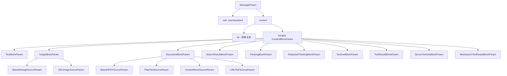

# Anthropic MessageParam 类型定义

## 概述

Anthropic 的消息类型系统基于`MessageParam`，这是一个简化的设计，只支持两种角色（user 和 assistant），但通过丰富的内容块（Content Block）系统支持多种内容类型。

## 类型层次结构



## 主类型定义

### MessageParam

**类型**: `TypedDict`  
**特点**: 极简设计，只有两个必需字段

```python
class MessageParam(TypedDict, total=False):
    content: Required[
        Union[
            str,
            Iterable[
                Union[
                    TextBlockParam,
                    ImageBlockParam,
                    DocumentBlockParam,
                    SearchResultBlockParam,
                    ThinkingBlockParam,
                    RedactedThinkingBlockParam,
                    ToolUseBlockParam,
                    ToolResultBlockParam,
                    ServerToolUseBlockParam,
                    WebSearchToolResultBlockParam,
                    ContentBlock,
                ]
            ],
        ]
    ]
    role: Required[Literal["user", "assistant"]]
```

| 字段      | 类型                                      | 必需 | 说明                               |
| --------- | ----------------------------------------- | ---- | ---------------------------------- |
| `role`    | `Literal["user", "assistant"]`            | ✓    | 消息角色，仅支持 user 和 assistant |
| `content` | `Union[str, Iterable[ContentBlockParam]]` | ✓    | 消息内容，支持简单文本或内容块数组 |

**关键特性**:

1. **仅两种角色**: 不像 OpenAI 有 6 种角色，Anthropic 只有 user 和 assistant
2. **无 system 角色**: 系统提示通过 API 的单独参数传递，不在 messages 中
3. **内容块设计**: 通过丰富的内容块类型支持多模态和复杂交互

## 内容块类型详解

### 1. TextBlockParam

**用途**: 文本内容块

```python
class TextBlockParam(TypedDict, total=False):
    text: Required[str]
    type: Required[Literal["text"]]
    cache_control: Optional[CacheControlEphemeralParam]
    citations: Optional[Iterable[TextCitationParam]]
```

| 字段            | 类型                                    | 必需 | 说明           |
| --------------- | --------------------------------------- | ---- | -------------- |
| `text`          | `str`                                   | ✓    | 文本内容       |
| `type`          | `Literal["text"]`                       | ✓    | 内容块类型标识 |
| `cache_control` | `Optional[CacheControlEphemeralParam]`  | ✗    | 缓存控制断点   |
| `citations`     | `Optional[Iterable[TextCitationParam]]` | ✗    | 文本引用       |

### 2. ImageBlockParam

**用途**: 图片内容块，支持 base64 和 URL 两种来源

```python
Source: TypeAlias = Union[Base64ImageSourceParam, URLImageSourceParam]

class ImageBlockParam(TypedDict, total=False):
    source: Required[Source]
    type: Required[Literal["image"]]
    cache_control: Optional[CacheControlEphemeralParam]
```

| 字段            | 类型                                                 | 必需 | 说明           |
| --------------- | ---------------------------------------------------- | ---- | -------------- |
| `source`        | `Union[Base64ImageSourceParam, URLImageSourceParam]` | ✓    | 图片来源       |
| `type`          | `Literal["image"]`                                   | ✓    | 内容块类型标识 |
| `cache_control` | `Optional[CacheControlEphemeralParam]`               | ✗    | 缓存控制断点   |

#### Base64ImageSourceParam

```python
class Base64ImageSourceParam(TypedDict, total=False):
    data: Required[Annotated[Union[str, Base64FileInput], PropertyInfo(format="base64")]]
    media_type: Required[Literal["image/jpeg", "image/png", "image/gif", "image/webp"]]
    type: Required[Literal["base64"]]
```

**支持的图片格式**: JPEG, PNG, GIF, WebP

#### URLImageSourceParam

```python
class URLImageSourceParam(TypedDict, total=False):
    type: Required[Literal["url"]]
    url: Required[str]
```

### 3. DocumentBlockParam

**用途**: 文档内容块，支持 PDF 和纯文本

```python
Source: TypeAlias = Union[
    Base64PDFSourceParam,
    PlainTextSourceParam,
    ContentBlockSourceParam,
    URLPDFSourceParam
]

class DocumentBlockParam(TypedDict, total=False):
    source: Required[Source]
    type: Required[Literal["document"]]
    cache_control: Optional[CacheControlEphemeralParam]
    citations: Optional[CitationsConfigParam]
    context: Optional[str]
    title: Optional[str]
```

| 字段            | 类型                                                     | 必需 | 说明           |
| --------------- | -------------------------------------------------------- | ---- | -------------- |
| `source`        | `Union[Base64PDFSourceParam, PlainTextSourceParam, ...]` | ✓    | 文档来源       |
| `type`          | `Literal["document"]`                                    | ✓    | 内容块类型标识 |
| `cache_control` | `Optional[CacheControlEphemeralParam]`                   | ✗    | 缓存控制断点   |
| `citations`     | `Optional[CitationsConfigParam]`                         | ✗    | 引用配置       |
| `context`       | `Optional[str]`                                          | ✗    | 文档上下文     |
| `title`         | `Optional[str]`                                          | ✗    | 文档标题       |

### 4. SearchResultBlockParam

**用途**: 搜索结果内容块

```python
class SearchResultBlockParam(TypedDict, total=False):
    content: Required[Iterable[TextBlockParam]]
    source: Required[str]
    title: Required[str]
    type: Required[Literal["search_result"]]
    cache_control: Optional[CacheControlEphemeralParam]
    citations: CitationsConfigParam
```

| 字段            | 类型                                   | 必需 | 说明           |
| --------------- | -------------------------------------- | ---- | -------------- |
| `content`       | `Iterable[TextBlockParam]`             | ✓    | 搜索结果内容   |
| `source`        | `str`                                  | ✓    | 来源           |
| `title`         | `str`                                  | ✓    | 标题           |
| `type`          | `Literal["search_result"]`             | ✓    | 内容块类型标识 |
| `cache_control` | `Optional[CacheControlEphemeralParam]` | ✗    | 缓存控制断点   |
| `citations`     | `CitationsConfigParam`                 | ✗    | 引用配置       |

### 5. ThinkingBlockParam

**用途**: 思考过程内容块（用于推理模型）

```python
class ThinkingBlockParam(TypedDict, total=False):
    signature: Required[str]
    thinking: Required[str]
    type: Required[Literal["thinking"]]
```

| 字段        | 类型                  | 必需 | 说明           |
| ----------- | --------------------- | ---- | -------------- |
| `signature` | `str`                 | ✓    | 签名           |
| `thinking`  | `str`                 | ✓    | 思考内容       |
| `type`      | `Literal["thinking"]` | ✓    | 内容块类型标识 |

### 6. RedactedThinkingBlockParam

**用途**: 已编辑的思考内容块

```python
class RedactedThinkingBlockParam(TypedDict, total=False):
    data: Required[str]
    type: Required[Literal["redacted_thinking"]]
```

| 字段   | 类型                           | 必需 | 说明           |
| ------ | ------------------------------ | ---- | -------------- |
| `data` | `str`                          | ✓    | 编辑后的数据   |
| `type` | `Literal["redacted_thinking"]` | ✓    | 内容块类型标识 |

### 7. ToolUseBlockParam

**用途**: 工具使用内容块（assistant 发起工具调用）

```python
class ToolUseBlockParam(TypedDict, total=False):
    id: Required[str]
    input: Required[Dict[str, object]]
    name: Required[str]
    type: Required[Literal["tool_use"]]
    cache_control: Optional[CacheControlEphemeralParam]
```

| 字段            | 类型                                   | 必需 | 说明           |
| --------------- | -------------------------------------- | ---- | -------------- |
| `id`            | `str`                                  | ✓    | 工具调用 ID    |
| `input`         | `Dict[str, object]`                    | ✓    | 工具输入参数   |
| `name`          | `str`                                  | ✓    | 工具名称       |
| `type`          | `Literal["tool_use"]`                  | ✓    | 内容块类型标识 |
| `cache_control` | `Optional[CacheControlEphemeralParam]` | ✗    | 缓存控制断点   |

### 8. ToolResultBlockParam

**用途**: 工具结果内容块（user 返回工具执行结果）

```python
Content: TypeAlias = Union[
    TextBlockParam,
    ImageBlockParam,
    SearchResultBlockParam,
    DocumentBlockParam
]

class ToolResultBlockParam(TypedDict, total=False):
    tool_use_id: Required[str]
    type: Required[Literal["tool_result"]]
    cache_control: Optional[CacheControlEphemeralParam]
    content: Union[str, Iterable[Content]]
    is_error: bool
```

| 字段            | 类型                                   | 必需 | 说明              |
| --------------- | -------------------------------------- | ---- | ----------------- |
| `tool_use_id`   | `str`                                  | ✓    | 对应的工具调用 ID |
| `type`          | `Literal["tool_result"]`               | ✓    | 内容块类型标识    |
| `cache_control` | `Optional[CacheControlEphemeralParam]` | ✗    | 缓存控制断点      |
| `content`       | `Union[str, Iterable[Content]]`        | ✗    | 工具结果内容      |
| `is_error`      | `bool`                                 | ✗    | 是否为错误结果    |

### 9. ServerToolUseBlockParam

**用途**: 服务器端工具使用内容块（特定于 web_search）

```python
class ServerToolUseBlockParam(TypedDict, total=False):
    id: Required[str]
    input: Required[Dict[str, object]]
    name: Required[Literal["web_search"]]
    type: Required[Literal["server_tool_use"]]
    cache_control: Optional[CacheControlEphemeralParam]
```

| 字段            | 类型                                   | 必需 | 说明                          |
| --------------- | -------------------------------------- | ---- | ----------------------------- |
| `id`            | `str`                                  | ✓    | 工具调用 ID                   |
| `input`         | `Dict[str, object]`                    | ✓    | 工具输入参数                  |
| `name`          | `Literal["web_search"]`                | ✓    | 工具名称（固定为 web_search） |
| `type`          | `Literal["server_tool_use"]`           | ✓    | 内容块类型标识                |
| `cache_control` | `Optional[CacheControlEphemeralParam]` | ✗    | 缓存控制断点                  |

### 10. WebSearchToolResultBlockParam

**用途**: Web 搜索工具结果内容块

```python
class WebSearchToolResultBlockParam(TypedDict, total=False):
    content: Required[WebSearchToolResultBlockParamContentParam]
    tool_use_id: Required[str]
    type: Required[Literal["web_search_tool_result"]]
    cache_control: Optional[CacheControlEphemeralParam]
```

| 字段            | 类型                                        | 必需 | 说明              |
| --------------- | ------------------------------------------- | ---- | ----------------- |
| `content`       | `WebSearchToolResultBlockParamContentParam` | ✓    | 搜索结果内容      |
| `tool_use_id`   | `str`                                       | ✓    | 对应的工具调用 ID |
| `type`          | `Literal["web_search_tool_result"]`         | ✓    | 内容块类型标识    |
| `cache_control` | `Optional[CacheControlEphemeralParam]`      | ✗    | 缓存控制断点      |

## 辅助类型

### CacheControlEphemeralParam

**用途**: 缓存控制配置（Anthropic 特有功能）

```python
class CacheControlEphemeralParam(TypedDict, total=False):
    type: Required[Literal["ephemeral"]]
    ttl: Literal["5m", "1h"]
```

| 字段   | 类型                   | 必需 | 说明                      |
| ------ | ---------------------- | ---- | ------------------------- |
| `type` | `Literal["ephemeral"]` | ✓    | 缓存类型                  |
| `ttl`  | `Literal["5m", "1h"]`  | ✗    | 缓存生存时间，默认 5 分钟 |

**说明**: 这是 Anthropic 的 Prompt Caching 功能，可以在内容块上设置缓存断点以减少重复处理成本。

## 工具选择类型详解

### ToolChoiceParam

**用途**: 控制模型是否和如何使用工具

```python
ToolChoiceParam: TypeAlias = Union[
    ToolChoiceAnyParam,
    ToolChoiceAutoParam,
    ToolChoiceNoneParam,
    ToolChoiceToolParam
]
```

**可能的值**:

1. `ToolChoiceAnyParam` - 允许使用任何工具
2. `ToolChoiceAutoParam` - 自动选择是否使用工具
3. `ToolChoiceNoneParam` - 不使用任何工具
4. `ToolChoiceToolParam` - 指定使用特定工具

### ToolChoiceAnyParam

**用途**: 允许使用任何工具

```python
class ToolChoiceAnyParam(TypedDict, total=False):
    type: Required[Literal["any"]]
    disable_parallel_tool_use: bool
```

| 字段                        | 类型                       | 必需 | 说明                 |
| --------------------------- | -------------------------- | ---- | -------------------- |
| `type`                      | `Required[Literal["any"]]` | ✓    | 选择类型标识         |
| `disable_parallel_tool_use` | `bool`                     | ✗    | 是否禁用并行工具使用 |

### ToolChoiceAutoParam

**用途**: 自动选择是否使用工具

```python
class ToolChoiceAutoParam(TypedDict, total=False):
    type: Required[Literal["auto"]]
    disable_parallel_tool_use: bool
```

| 字段                        | 类型                        | 必需 | 说明                 |
| --------------------------- | --------------------------- | ---- | -------------------- |
| `type`                      | `Required[Literal["auto"]]` | ✓    | 选择类型标识         |
| `disable_parallel_tool_use` | `bool`                      | ✗    | 是否禁用并行工具使用 |

### ToolChoiceNoneParam

**用途**: 不使用任何工具

```python
class ToolChoiceNoneParam(TypedDict, total=False):
    type: Required[Literal["none"]]
```

| 字段   | 类型                        | 必需 | 说明         |
| ------ | --------------------------- | ---- | ------------ |
| `type` | `Required[Literal["none"]]` | ✓    | 选择类型标识 |

### ToolChoiceToolParam

**用途**: 指定使用特定工具

```python
class ToolChoiceToolParam(TypedDict, total=False):
    name: Required[str]
    type: Required[Literal["tool"]]
    disable_parallel_tool_use: bool
```

| 字段                        | 类型                        | 必需 | 说明                 |
| --------------------------- | --------------------------- | ---- | -------------------- |
| `name`                      | `Required[str]`             | ✓    | 工具名称             |
| `type`                      | `Required[Literal["tool"]]` | ✓    | 选择类型标识         |
| `disable_parallel_tool_use` | `bool`                      | ✗    | 是否禁用并行工具使用 |

## 关键特性总结

### 1. 角色系统

- **仅 2 种角色**: user, assistant
- **无 system 角色**: 系统提示通过 API 的`system`参数单独传递
- **无 tool/function 角色**: 工具交互通过内容块实现

### 2. 内容块架构

- **统一的内容块接口**: 所有内容类型都是内容块
- **类型标识**: 每个内容块都有`type`字段
- **可组合**: 一条消息可以包含多个不同类型的内容块

### 3. 多模态支持

- **文本**: TextBlockParam
- **图片**: ImageBlockParam（支持 JPEG, PNG, GIF, WebP）
- **文档**: DocumentBlockParam（支持 PDF 和纯文本）
- **搜索结果**: SearchResultBlockParam

### 4. 工具调用机制

- **工具使用**: ToolUseBlockParam（assistant 消息中）
- **工具结果**: ToolResultBlockParam（user 消息中）
- **服务器工具**: ServerToolUseBlockParam（特定于 web_search）
- **双向流程**: assistant 发起 → user 响应

### 5. 工具选择机制

- **四种模式**: any（任何工具）、auto（自动选择）、none（不使用工具）、tool（指定工具）
- **并行工具使用控制**: 可以通过`disable_parallel_tool_use`字段控制是否允许并行使用工具
- **指定工具**: 可以通过`name`字段指定特定的工具

### 6. 高级特性

- **Prompt Caching**: 通过`cache_control`字段实现
- **思考过程**: ThinkingBlockParam 和 RedactedThinkingBlockParam
- **引用系统**: citations 字段支持内容引用
- **搜索集成**: 内置搜索结果和 web 搜索工具支持

### 6. 与 OpenAI 的主要差异

| 特性        | Anthropic               | OpenAI                                                     |
| ----------- | ----------------------- | ---------------------------------------------------------- |
| 角色数量    | 2 种（user, assistant） | 6 种（developer, system, user, assistant, tool, function） |
| System 消息 | API 参数                | 消息角色                                                   |
| 工具调用    | 内容块                  | 消息字段                                                   |
| 多模态      | 内容块                  | 内容部分                                                   |
| 缓存        | 内置支持                | 无                                                         |
| 思考过程    | 内置支持                | 无                                                         |

## 使用示例

### 简单文本消息

```python
# User消息
user_msg: MessageParam = {
    "role": "user",
    "content": "Hello, how are you?"
}

# Assistant消息
assistant_msg: MessageParam = {
    "role": "assistant",
    "content": "I'm doing well, thank you!"
}
```

### 多模态用户消息

```python
user_msg: MessageParam = {
    "role": "user",
    "content": [
        {
            "type": "text",
            "text": "What's in this image?"
        },
        {
            "type": "image",
            "source": {
                "type": "base64",
                "media_type": "image/jpeg",
                "data": "base64_encoded_image_data..."
            }
        }
    ]
}
```

### 工具调用和响应

```python
# Assistant发起工具调用
assistant_msg: MessageParam = {
    "role": "assistant",
    "content": [
        {
            "type": "text",
            "text": "Let me check the weather for you."
        },
        {
            "type": "tool_use",
            "id": "toolu_123",
            "name": "get_weather",
            "input": {"location": "San Francisco"}
        }
    ]
}

# User返回工具结果
user_msg: MessageParam = {
    "role": "user",
    "content": [
        {
            "type": "tool_result",
            "tool_use_id": "toolu_123",
            "content": "The weather in San Francisco is sunny, 72°F"
        }
    ]
}
```

### 使用缓存控制

```python
user_msg: MessageParam = {
    "role": "user",
    "content": [
        {
            "type": "text",
            "text": "Long context that should be cached...",
            "cache_control": {"type": "ephemeral", "ttl": "1h"}
        },
        {
            "type": "text",
            "text": "New question about the cached content"
        }
    ]
}
```

### 文档分析

```python
user_msg: MessageParam = {
    "role": "user",
    "content": [
        {
            "type": "document",
            "source": {
                "type": "base64",
                "media_type": "application/pdf",
                "data": "base64_encoded_pdf_data..."
            },
            "title": "Research Paper",
            "context": "This is a scientific paper about AI"
        },
        {
            "type": "text",
            "text": "Please summarize the key findings"
        }
    ]
}
```

## 注意事项

1. **角色限制**: 只能使用 user 和 assistant 角色，system 提示需通过 API 的 system 参数传递
2. **内容块顺序**: 内容块的顺序很重要，会影响模型的理解
3. **工具调用流程**:
   - Assistant 在 content 中包含 tool_use 块
   - User 必须在下一条消息中提供 tool_result 块
   - tool_result 的 tool_use_id 必须匹配 tool_use 的 id
4. **缓存控制**:
   - 只在长上下文场景下使用
   - 缓存断点会影响计费
   - TTL 默认为 5 分钟
5. **类型标识**: 每个内容块都必须有正确的 type 字段
6. **图片格式**: 仅支持 JPEG, PNG, GIF, WebP
7. **文档支持**: 支持 PDF 和纯文本文档

## 版本信息

- **来源**: Anthropic Python SDK
- **生成方式**: 从 OpenAPI 规范自动生成
- **包路径**: `anthropic.types`
