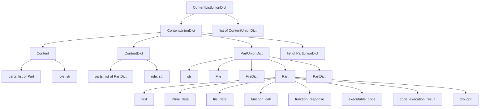

# Google GenAI ContentListUnionDict 类型定义

## 概述

Google GenAI 的消息类型系统基于`ContentListUnionDict`，这是一个非常灵活的 Union 类型，支持多种不同的内容表示方式。

## 类型层次结构



## 主要类型别名

### ContentListUnionDict

**定义**: `ContentListUnionDict = typing.Union[google.genai.types.Content, google.genai.types.ContentDict, str, google.genai.types.File, google.genai.types.FileDict, google.genai.types.Part, google.genai.types.PartDict, list[typing.Union[str, google.genai.types.File, google.genai.types.FileDict, google.genai.types.Part, google.genai.types.PartDict]], list[typing.Union[google.genai.types.Content, google.genai.types.ContentDict, str, google.genai.types.File, google.genai.types.FileDict, google.genai.types.Part, google.genai.types.PartDict, list[typing.Union[str, google.genai.types.File, google.genai.types.FileDict, google.genai.types.Part, google.genai.types.PartDict]]]]]`

**组成**:

- `<class 'google.genai.types.Content'>`
- `<class 'google.genai.types.ContentDict'>`
- `<class 'str'>`
- `<class 'google.genai.types.File'>`
- `<class 'google.genai.types.FileDict'>`
- `<class 'google.genai.types.Part'>`
- `<class 'google.genai.types.PartDict'>`
- `list[typing.Union[str, google.genai.types.File, google.genai.types.FileDict, google.genai.types.Part, google.genai.types.PartDict]]`
- `list[typing.Union[google.genai.types.Content, google.genai.types.ContentDict, str, google.genai.types.File, google.genai.types.FileDict, google.genai.types.Part, google.genai.types.PartDict, list[typing.Union[str, google.genai.types.File, google.genai.types.FileDict, google.genai.types.Part, google.genai.types.PartDict]]]]`

### ContentUnionDict

**定义**: `ContentUnionDict = typing.Union[google.genai.types.Content, google.genai.types.ContentDict, str, google.genai.types.File, google.genai.types.FileDict, google.genai.types.Part, google.genai.types.PartDict, list[typing.Union[str, google.genai.types.File, google.genai.types.FileDict, google.genai.types.Part, google.genai.types.PartDict]]]`

**组成**:

- `<class 'google.genai.types.Content'>`
- `<class 'google.genai.types.ContentDict'>`
- `<class 'str'>`
- `<class 'google.genai.types.File'>`
- `<class 'google.genai.types.FileDict'>`
- `<class 'google.genai.types.Part'>`
- `<class 'google.genai.types.PartDict'>`
- `list[typing.Union[str, google.genai.types.File, google.genai.types.FileDict, google.genai.types.Part, google.genai.types.PartDict]]`

### PartUnionDict

**定义**: `PartUnionDict = typing.Union[str, google.genai.types.File, google.genai.types.FileDict, google.genai.types.Part, google.genai.types.PartDict]`

**组成**:

- `<class 'str'>`
- `<class 'google.genai.types.File'>`
- `<class 'google.genai.types.FileDict'>`
- `<class 'google.genai.types.Part'>`
- `<class 'google.genai.types.PartDict'>`

## 主要类定义

### Content

Contains the multi-part content of a message.

**继承**: BaseModel

**字段**:

| 字段    | 类型                                             | 说明 |
| ------- | ------------------------------------------------ | ---- |
| `parts` | `typing.Optional[list[google.genai.types.Part]]` |      |
| `role`  | `typing.Optional[str]`                           |      |

### ContentDict

Contains the multi-part content of a message.

**继承**: dict

**字段**:

| 字段    | 类型                                                 | 说明 |
| ------- | ---------------------------------------------------- | ---- |
| `parts` | `typing.Optional[list[google.genai.types.PartDict]]` |      |
| `role`  | `typing.Optional[str]`                               |      |

### File

A file uploaded to the API.

**继承**: BaseModel

**字段**:

| 字段              | 类型                                             | 说明 |
| ----------------- | ------------------------------------------------ | ---- |
| `name`            | `typing.Optional[str]`                           |      |
| `display_name`    | `typing.Optional[str]`                           |      |
| `mime_type`       | `typing.Optional[str]`                           |      |
| `size_bytes`      | `typing.Optional[int]`                           |      |
| `create_time`     | `typing.Optional[datetime.datetime]`             |      |
| `expiration_time` | `typing.Optional[datetime.datetime]`             |      |
| `update_time`     | `typing.Optional[datetime.datetime]`             |      |
| `sha256_hash`     | `typing.Optional[str]`                           |      |
| `uri`             | `typing.Optional[str]`                           |      |
| `download_uri`    | `typing.Optional[str]`                           |      |
| `state`           | `typing.Optional[google.genai.types.FileState]`  |      |
| `source`          | `typing.Optional[google.genai.types.FileSource]` |      |
| `video_metadata`  | `typing.Optional[dict[str, typing.Any]]`         |      |
| `error`           | `typing.Optional[google.genai.types.FileStatus]` |      |

### FileDict

A file uploaded to the API.

**继承**: dict

**字段**:

| 字段              | 类型                                                 | 说明 |
| ----------------- | ---------------------------------------------------- | ---- |
| `name`            | `typing.Optional[str]`                               |      |
| `display_name`    | `typing.Optional[str]`                               |      |
| `mime_type`       | `typing.Optional[str]`                               |      |
| `size_bytes`      | `typing.Optional[int]`                               |      |
| `create_time`     | `typing.Optional[datetime.datetime]`                 |      |
| `expiration_time` | `typing.Optional[datetime.datetime]`                 |      |
| `update_time`     | `typing.Optional[datetime.datetime]`                 |      |
| `sha256_hash`     | `typing.Optional[str]`                               |      |
| `uri`             | `typing.Optional[str]`                               |      |
| `download_uri`    | `typing.Optional[str]`                               |      |
| `state`           | `typing.Optional[google.genai.types.FileState]`      |      |
| `source`          | `typing.Optional[google.genai.types.FileSource]`     |      |
| `video_metadata`  | `typing.Optional[dict[str, typing.Any]]`             |      |
| `error`           | `typing.Optional[google.genai.types.FileStatusDict]` |      |

### Part

A datatype containing media content.

Exactly one field within a Part should be set, representing the specific type
of content being conveyed. Using multiple fields within the same `Part`
instance is considered invalid.

**继承**: BaseModel

**字段**:

| 字段                    | 类型                                                      | 说明 |
| ----------------------- | --------------------------------------------------------- | ---- |
| `media_resolution`      | `typing.Optional[google.genai.types.PartMediaResolution]` |      |
| `code_execution_result` | `typing.Optional[google.genai.types.CodeExecutionResult]` |      |
| `executable_code`       | `typing.Optional[google.genai.types.ExecutableCode]`      |      |
| `file_data`             | `typing.Optional[google.genai.types.FileData]`            |      |
| `function_call`         | `typing.Optional[google.genai.types.FunctionCall]`        |      |
| `function_response`     | `typing.Optional[google.genai.types.FunctionResponse]`    |      |
| `inline_data`           | `typing.Optional[google.genai.types.Blob]`                |      |
| `text`                  | `typing.Optional[str]`                                    |      |
| `thought`               | `typing.Optional[bool]`                                   |      |
| `thought_signature`     | `typing.Optional[bytes]`                                  |      |
| `video_metadata`        | `typing.Optional[google.genai.types.VideoMetadata]`       |      |

### PartDict

A datatype containing media content.

Exactly one field within a Part should be set, representing the specific type
of content being conveyed. Using multiple fields within the same `Part`
instance is considered invalid.

**继承**: dict

**字段**:

| 字段                    | 类型                                                          | 说明 |
| ----------------------- | ------------------------------------------------------------- | ---- |
| `media_resolution`      | `typing.Optional[google.genai.types.PartMediaResolutionDict]` |      |
| `code_execution_result` | `typing.Optional[google.genai.types.CodeExecutionResultDict]` |      |
| `executable_code`       | `typing.Optional[google.genai.types.ExecutableCodeDict]`      |      |
| `file_data`             | `typing.Optional[google.genai.types.FileDataDict]`            |      |
| `function_call`         | `typing.Optional[google.genai.types.FunctionCallDict]`        |      |
| `function_response`     | `typing.Optional[google.genai.types.FunctionResponseDict]`    |      |
| `inline_data`           | `typing.Optional[google.genai.types.BlobDict]`                |      |
| `text`                  | `typing.Optional[str]`                                        |      |
| `thought`               | `typing.Optional[bool]`                                       |      |
| `thought_signature`     | `typing.Optional[bytes]`                                      |      |
| `video_metadata`        | `typing.Optional[google.genai.types.VideoMetadataDict]`       |      |

## 使用示例

### 简单文本消息

```python
# 使用字符串
content = "Hello, how are you?"

# 使用Content对象
content = types.Content(parts=[types.Part(text="Hello, how are you?")])

# 使用字典
content = {"parts": [{"text": "Hello, how are you?"}]}
```

### 多模态消息

```python
# 使用Content对象
content = types.Content(
    parts=[
        types.Part(text="What's in this image?"),
        types.Part(inline_data=types.Blob(
            mime_type="image/jpeg",
            data=base64.b64encode(image_bytes).decode()
        ))
    ]
)

# 使用字典
content = {
    "parts": [
        {"text": "What's in this image?"},
        {"inline_data": {
            "mime_type": "image/jpeg",
            "data": base64.b64encode(image_bytes).decode()
        }}
    ]
}
```

### 对话历史

```python
# 使用Content对象列表
contents = [
    types.Content(role="user", parts=[types.Part(text="Hello, how are you?")]),
    types.Content(role="model", parts=[types.Part(text="I'm doing well, thank you!")]),
    types.Content(role="user", parts=[types.Part(text="Tell me about yourself.")])
]

# 使用字典列表
contents = [
    {"role": "user", "parts": [{"text": "Hello, how are you?"}]},
    {"role": "model", "parts": [{"text": "I'm doing well, thank you!"}]},
    {"role": "user", "parts": [{"text": "Tell me about yourself."}]}
]
```

## 关键特性总结

### 1. 灵活的类型系统

- **多种表示方式**: 同一内容可以用字符串、对象或字典表示
- **嵌套结构**: 支持复杂的嵌套内容结构
- **类型转换**: 自动在不同表示之间转换

### 2. 角色系统

- **用户和模型**: 主要使用`user`和`model`角色
- **系统消息**: 可以使用`system`角色设置上下文

### 3. 多模态支持

- **文本**: 通过`text`字段
- **图片**: 通过`inline_data`字段
- **混合内容**: 一条消息可以包含多种媒体类型

### 4. 与其他提供商的主要差异

| 特性       | Google GenAI                | OpenAI         | Anthropic      |
| ---------- | --------------------------- | -------------- | -------------- |
| 类型灵活性 | 高（多种表示方式）          | 中（固定结构） | 中（固定结构） |
| 角色数量   | 3 种（user, model, system） | 6 种           | 2 种           |
| 多模态支持 | 内联数据                    | 内容部分       | 内容块         |
| 工具调用   | 函数调用                    | 工具调用       | 工具使用块     |

## 注意事项

1. **类型灵活性**: Google GenAI 的类型系统非常灵活，同一内容可以有多种表示方式
2. **自动转换**: API 会自动在不同表示之间转换，但显式使用正确的类型可以避免潜在问题
3. **字典表示**: 在大多数情况下，使用字典表示是最简单的方式
4. **对象表示**: 使用对象表示可以获得更好的类型检查和 IDE 支持
5. **字符串限制**: 简单字符串只适用于纯文本内容，不支持角色或多模态

## 版本信息

- **来源**: Google GenAI Python SDK
- **包路径**: `google.genai.types`
