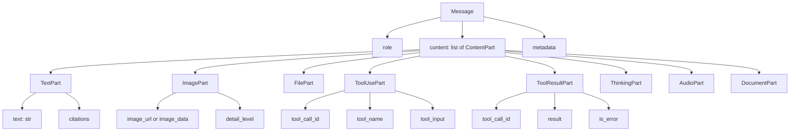
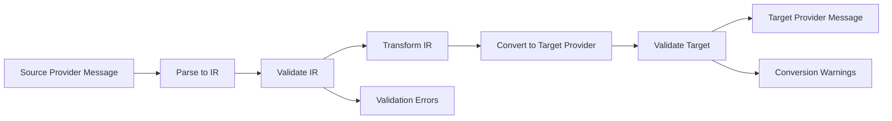

# 中间表示（IR）设计文档

## 概述

本文档定义了一个统一的中间表示（Intermediate Representation, IR），用于在 OpenAI、Anthropic 和 Google GenAI 三家 LLM provider 之间转换消息格式。

## 设计原则

1. **完整性**: 能够表示所有 provider 的核心功能
2. **可扩展性**: 支持 provider 特有的功能
3. **类型安全**: 使用 TypedDict 提供类型检查
4. **明确性**: 清晰的字段命名和结构
5. **可转换性**: 能够无损或有损地转换到各个 provider

## IR 类型层次结构



## 核心类型定义

### Message

消息的顶层类型，表示一条完整的消息。

```python
from typing import TypedDict, Optional, Literal, Union, Any
from typing_extensions import Required, NotRequired

class Message(TypedDict, total=False):
    """统一的消息表示"""

    # 必需字段
    role: Required[Literal["system", "user", "assistant", "tool"]]
    """消息角色"""

    content: Required[list["ContentPart"]]
    """消息内容，由多个内容部分组成"""

    # 可选字段
    name: NotRequired[str]
    """可选的参与者名称"""

    metadata: NotRequired["MessageMetadata"]
    """消息元数据，包含provider特有信息"""
```

### MessageMetadata

存储 provider 特有的元数据和扩展信息。

```python
class MessageMetadata(TypedDict, total=False):
    """消息元数据"""

    # 缓存控制（Anthropic特有）
    cache_control: NotRequired["CacheControl"]

    # 音频响应引用（OpenAI特有）
    audio_reference: NotRequired[str]

    # 拒绝消息（OpenAI特有）
    refusal: NotRequired[str]

    # 原始provider信息
    source_provider: NotRequired[Literal["openai", "anthropic", "google"]]

    # 扩展字段，用于存储无法映射的特有功能
    extensions: NotRequired[dict[str, Any]]
```

### ContentPart

内容部分的 Union 类型，支持多种内容类型。

```python
ContentPart = Union[
    "TextPart",
    "ImagePart",
    "AudioPart",
    "FilePart",
    "DocumentPart",
    "ToolUsePart",
    "ToolResultPart",
    "ThinkingPart",
    "CodeExecutionPart",
    "SearchResultPart",
]
```

## 内容部分类型详解

### 1. TextPart

文本内容部分。

```python
class TextPart(TypedDict, total=False):
    """文本内容"""

    type: Required[Literal["text"]]
    text: Required[str]

    # Anthropic特有：引用
    citations: NotRequired[list["Citation"]]
```

### 2. ImagePart

图片内容部分。

```python
class ImageSource(TypedDict, total=False):
    """图片来源"""

    # URL方式
    url: NotRequired[str]

    # Base64方式
    data: NotRequired[str]
    media_type: NotRequired[str]  # e.g., "image/jpeg"

class ImagePart(TypedDict, total=False):
    """图片内容"""

    type: Required[Literal["image"]]
    source: Required[ImageSource]

    # OpenAI特有：细节级别
    detail: NotRequired[Literal["auto", "low", "high"]]
```

### 3. AudioPart

音频内容部分（OpenAI 特有）。

```python
class AudioPart(TypedDict, total=False):
    """音频内容"""

    type: Required[Literal["audio"]]

    # 输入音频
    audio_data: NotRequired[str]  # Base64
    audio_format: NotRequired[Literal["wav", "mp3"]]

    # 输出音频引用
    audio_id: NotRequired[str]
```

### 4. FilePart

文件内容部分。

```python
class FilePart(TypedDict, total=False):
    """文件内容"""

    type: Required[Literal["file"]]

    # 文件引用（Google/OpenAI）
    file_id: NotRequired[str]
    file_uri: NotRequired[str]

    # 文件数据（OpenAI）
    file_data: NotRequired[str]  # Base64
    filename: NotRequired[str]
    mime_type: NotRequired[str]
```

### 5. DocumentPart

文档内容部分（Anthropic 特有）。

```python
class DocumentSource(TypedDict, total=False):
    """文档来源"""

    # PDF
    pdf_data: NotRequired[str]  # Base64
    pdf_url: NotRequired[str]

    # 纯文本
    text: NotRequired[str]

class DocumentPart(TypedDict, total=False):
    """文档内容"""

    type: Required[Literal["document"]]
    source: Required[DocumentSource]

    title: NotRequired[str]
    context: NotRequired[str]
    citations: NotRequired["CitationsConfig"]
```

### 6. ToolUsePart

工具使用部分（assistant 发起的工具调用）。

```python
class ToolUsePart(TypedDict, total=False):
    """工具使用"""

    type: Required[Literal["tool_use"]]

    # 统一字段
    tool_call_id: Required[str]
    """工具调用ID"""

    tool_name: Required[str]
    """工具名称"""

    tool_input: Required[dict[str, Any]]
    """工具输入参数"""

    # Provider特定
    tool_type: NotRequired[Literal["function", "custom", "server"]]
    """工具类型（OpenAI: function/custom, Anthropic: server）"""
```

### 7. ToolResultPart

工具结果部分（user 返回的工具执行结果）。

```python
class ToolResultPart(TypedDict, total=False):
    """工具结果"""

    type: Required[Literal["tool_result"]]

    tool_call_id: Required[str]
    """对应的工具调用ID"""

    result: Required[Union[str, list[ContentPart]]]
    """工具执行结果"""

    is_error: NotRequired[bool]
    """是否为错误结果"""
```

### 8. ThinkingPart

思考过程部分。

```python
class ThinkingPart(TypedDict, total=False):
    """思考过程"""

    type: Required[Literal["thinking"]]

    # Anthropic风格
    thinking: NotRequired[str]
    signature: NotRequired[str]

    # Google风格
    thought: NotRequired[bool]
    thought_signature: NotRequired[bytes]

    # 是否已编辑
    redacted: NotRequired[bool]
    redacted_data: NotRequired[str]
```

### 9. CodeExecutionPart

代码执行部分（Google 特有）。

```python
class CodeExecutionPart(TypedDict, total=False):
    """代码执行"""

    type: Required[Literal["code_execution"]]

    # 可执行代码
    code: NotRequired[str]
    language: NotRequired[str]

    # 执行结果
    output: NotRequired[str]
    outcome: NotRequired[Literal["success", "error"]]
```

### 10. SearchResultPart

搜索结果部分（Anthropic 特有）。

```python
class SearchResultPart(TypedDict, total=False):
    """搜索结果"""

    type: Required[Literal["search_result"]]

    title: Required[str]
    source: Required[str]
    content: Required[list[TextPart]]

    citations: NotRequired["CitationsConfig"]
```

## 辅助类型

### CacheControl

缓存控制（Anthropic 特有）。

```python
class CacheControl(TypedDict, total=False):
    """缓存控制"""

    type: Required[Literal["ephemeral"]]
    ttl: NotRequired[Literal["5m", "1h"]]
```

### Citation

引用信息（Anthropic 特有）。

```python
class Citation(TypedDict, total=False):
    """引用"""

    type: Required[Literal["char_location", "content_block_location", "page_location"]]

    # 字符位置
    start_char: NotRequired[int]
    end_char: NotRequired[int]

    # 内容块位置
    content_block_index: NotRequired[int]

    # 页面位置
    page_number: NotRequired[int]
```

### CitationsConfig

引用配置（Anthropic 特有）。

```python
class CitationsConfig(TypedDict, total=False):
    """引用配置"""

    enabled: Required[bool]
```

## 转换策略

### 角色映射

#### OpenAI → IR

| OpenAI 角色 | IR 角色   | 处理方式                                  |
| ----------- | --------- | ----------------------------------------- |
| developer   | system    | 映射为 system，在 metadata 中标记原始角色 |
| system      | system    | 直接映射                                  |
| user        | user      | 直接映射                                  |
| assistant   | assistant | 直接映射                                  |
| tool        | tool      | 直接映射，转换为 ToolResultPart           |
| function    | tool      | 映射为 tool，标记为已弃用                 |

#### Anthropic → IR

| Anthropic 角色 | IR 角色   | 处理方式                           |
| -------------- | --------- | ---------------------------------- |
| user           | user      | 直接映射，内容块转换为 ContentPart |
| assistant      | assistant | 直接映射，内容块转换为 ContentPart |

**注意**: Anthropic 的 system 消息通过 API 参数传递，需要在转换时创建单独的 system 消息。

#### Google → IR

| Google 角色 | IR 角色   | 处理方式                          |
| ----------- | --------- | --------------------------------- |
| user        | user      | 直接映射，Part 转换为 ContentPart |
| model       | assistant | 映射为 assistant                  |
| system      | system    | 直接映射                          |

### 内容转换

#### 文本内容

所有 provider 都支持文本，直接转换为 TextPart。

```python
# OpenAI
{"role": "user", "content": "Hello"}
# IR
{"role": "user", "content": [{"type": "text", "text": "Hello"}]}

# Anthropic
{"role": "user", "content": "Hello"}
# IR
{"role": "user", "content": [{"type": "text", "text": "Hello"}]}

# Google
{"role": "user", "parts": [{"text": "Hello"}]}
# IR
{"role": "user", "content": [{"type": "text", "text": "Hello"}]}
```

#### 图片内容

```python
# OpenAI
{
    "type": "image_url",
    "image_url": {"url": "https://...", "detail": "high"}
}
# IR
{
    "type": "image",
    "source": {"url": "https://..."},
    "detail": "high"
}

# Anthropic
{
    "type": "image",
    "source": {"type": "url", "url": "https://..."}
}
# IR
{
    "type": "image",
    "source": {"url": "https://..."}
}

# Google
{
    "inline_data": {"mime_type": "image/jpeg", "data": "base64..."}
}
# IR
{
    "type": "image",
    "source": {"data": "base64...", "media_type": "image/jpeg"}
}
```

#### 工具调用

```python
# OpenAI
{
    "role": "assistant",
    "tool_calls": [{
        "id": "call_123",
        "type": "function",
        "function": {"name": "get_weather", "arguments": "{}"}
    }]
}
# IR
{
    "role": "assistant",
    "content": [{
        "type": "tool_use",
        "tool_call_id": "call_123",
        "tool_name": "get_weather",
        "tool_input": {},
        "tool_type": "function"
    }]
}

# Anthropic
{
    "role": "assistant",
    "content": [{
        "type": "tool_use",
        "id": "toolu_123",
        "name": "get_weather",
        "input": {}
    }]
}
# IR
{
    "role": "assistant",
    "content": [{
        "type": "tool_use",
        "tool_call_id": "toolu_123",
        "tool_name": "get_weather",
        "tool_input": {}
    }]
}

# Google
{
    "role": "model",
    "parts": [{
        "function_call": {"name": "get_weather", "args": {}}
    }]
}
# IR
{
    "role": "assistant",
    "content": [{
        "type": "tool_use",
        "tool_call_id": "generated_id",  # Google不提供ID，需要生成
        "tool_name": "get_weather",
        "tool_input": {}
    }]
}
```

### 降级策略

当目标 provider 不支持某些功能时，采用以下降级策略：

#### 1. 不支持的内容类型

| 内容类型      | OpenAI | Anthropic | Google | 降级策略             |
| ------------- | ------ | --------- | ------ | -------------------- |
| Audio         | ✓      | ✗         | ✗      | 转换为文本说明或跳过 |
| Document      | ✗      | ✓         | ✗      | 提取文本内容         |
| SearchResult  | ✗      | ✓         | ✗      | 转换为文本           |
| CodeExecution | ✗      | ✗         | ✓      | 转换为文本           |
| Thinking      | ✗      | ✓         | ✓      | 转换为文本或跳过     |

#### 2. 不支持的角色

| 角色                                  | 降级策略                                |
| ------------------------------------- | --------------------------------------- |
| developer (OpenAI) → Anthropic/Google | 转换为 system                           |
| tool → Anthropic                      | 转换为 user 消息中的 tool_result 内容块 |
| tool → Google                         | 转换为 user 消息中的 function_response  |

#### 3. 不支持的功能

| 功能                               | 降级策略             |
| ---------------------------------- | -------------------- |
| Cache Control → OpenAI/Google      | 忽略，记录警告       |
| Citations → OpenAI/Google          | 忽略或转换为文本注释 |
| Audio Reference → Anthropic/Google | 忽略，记录警告       |

## 转换流程

### 通用转换流程



### 转换步骤

1. **解析**: 将源 provider 的消息解析为 IR

   - 识别角色和内容类型
   - 提取所有字段
   - 保留元数据

2. **验证**: 验证 IR 的完整性和正确性

   - 检查必需字段
   - 验证类型
   - 检查引用完整性（如 tool_call_id）

3. **转换**: 根据目标 provider 调整 IR

   - 应用角色映射
   - 应用降级策略
   - 生成必要的 ID

4. **生成**: 将 IR 转换为目标 provider 格式

   - 构建目标类型
   - 填充所有字段
   - 应用 provider 特定规则

5. **验证**: 验证目标消息的有效性
   - 使用 provider 的类型定义验证
   - 检查约束条件
   - 记录警告和错误

## 实现建议

### 1. 使用 Pydantic 进行验证

```python
from pydantic import BaseModel, Field
from typing import Literal, Union

class TextPart(BaseModel):
    type: Literal["text"]
    text: str
    citations: list[Citation] = Field(default_factory=list)

class Message(BaseModel):
    role: Literal["system", "user", "assistant", "tool"]
    content: list[ContentPart]
    name: str | None = None
    metadata: MessageMetadata | None = None
```

### 2. 转换器接口

```python
from abc import ABC, abstractmethod
from typing import Protocol

class MessageConverter(Protocol):
    """消息转换器接口"""

    def to_ir(self, message: Any) -> Message:
        """转换为IR"""
        ...

    def from_ir(self, message: Message) -> Any:
        """从IR转换"""
        ...

class OpenAIConverter(MessageConverter):
    """OpenAI消息转换器"""

    def to_ir(self, message: ChatCompletionMessageParam) -> Message:
        # 实现OpenAI → IR转换
        ...

    def from_ir(self, message: Message) -> ChatCompletionMessageParam:
        # 实现IR → OpenAI转换
        ...
```

### 3. 转换管道

```python
class ConversionPipeline:
    """转换管道"""

    def __init__(
        self,
        source_converter: MessageConverter,
        target_converter: MessageConverter
    ):
        self.source_converter = source_converter
        self.target_converter = target_converter

    def convert(
        self,
        messages: list[Any],
        strict: bool = False
    ) -> tuple[list[Any], list[str]]:
        """
        转换消息列表

        Args:
            messages: 源消息列表
            strict: 是否严格模式（遇到错误时抛出异常）

        Returns:
            (转换后的消息列表, 警告列表)
        """
        ir_messages = []
        warnings = []

        # 转换为IR
        for msg in messages:
            try:
                ir_msg = self.source_converter.to_ir(msg)
                ir_messages.append(ir_msg)
            except Exception as e:
                if strict:
                    raise
                warnings.append(f"Failed to convert message: {e}")

        # 从IR转换
        target_messages = []
        for ir_msg in ir_messages:
            try:
                target_msg = self.target_converter.from_ir(ir_msg)
                target_messages.append(target_msg)
            except Exception as e:
                if strict:
                    raise
                warnings.append(f"Failed to convert from IR: {e}")

        return target_messages, warnings
```

## 使用示例

### OpenAI → Anthropic

```python
from llm_provider_converter import OpenAIConverter, AnthropicConverter, ConversionPipeline

# 创建转换器
openai_converter = OpenAIConverter()
anthropic_converter = AnthropicConverter()

# 创建转换管道
pipeline = ConversionPipeline(openai_converter, anthropic_converter)

# OpenAI消息
openai_messages = [
    {"role": "system", "content": "You are a helpful assistant."},
    {"role": "user", "content": "Hello!"},
    {
        "role": "assistant",
        "tool_calls": [{
            "id": "call_123",
            "type": "function",
            "function": {"name": "get_weather", "arguments": "{}"}
        }]
    },
    {
        "role": "tool",
        "tool_call_id": "call_123",
        "content": "Sunny, 72°F"
    }
]

# 转换
anthropic_messages, warnings = pipeline.convert(openai_messages)

# 结果
# anthropic_messages = [
#     # system消息会被提取为API参数，不在messages中
#     {"role": "user", "content": "Hello!"},
#     {
#         "role": "assistant",
#         "content": [{
#             "type": "tool_use",
#             "id": "call_123",
#             "name": "get_weather",
#             "input": {}
#         }]
#     },
#     {
#         "role": "user",
#         "content": [{
#             "type": "tool_result",
#             "tool_use_id": "call_123",
#             "content": "Sunny, 72°F"
#         }]
#     }
# ]
```

### Anthropic → Google

```python
# Anthropic消息
anthropic_messages = [
    {
        "role": "user",
        "content": [{
            "type": "image",
            "source": {
                "type": "base64",
                "media_type": "image/jpeg",
                "data": "base64..."
            }
        }, {
            "type": "text",
            "text": "What's in this image?"
        }]
    }
]

# 转换
google_messages, warnings = pipeline.convert(anthropic_messages)

# 结果
# google_messages = [
#     {
#         "role": "user",
#         "parts": [
#             {
#                 "inline_data": {
#                     "mime_type": "image/jpeg",
#                     "data": "base64..."
#                 }
#             },
#             {"text": "What's in this image?"}
#         ]
#     }
# ]
```

## 扩展性

IR 设计支持以下扩展：

1. **新的内容类型**: 添加新的 ContentPart 子类型
2. **新的 provider**: 实现新的 MessageConverter
3. **自定义转换规则**: 继承并覆盖转换器方法
4. **插件系统**: 通过 metadata.extensions 支持自定义功能

## 总结

这个 IR 设计：

1. ✅ 支持所有三家 provider 的核心功能
2. ✅ 能够表示 provider 特有的功能
3. ✅ 提供清晰的转换规则和降级策略
4. ✅ 类型安全且易于扩展
5. ✅ 实现简单且易于维护

通过这个 IR，我们可以实现 provider 之间的无缝转换，同时保持代码的清晰性和可维护性。
