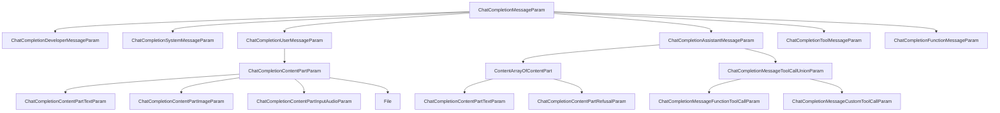

# OpenAI ChatCompletionMessageParam 类型定义

## 概述

OpenAI 的消息类型系统基于`ChatCompletionMessageParam`，这是一个 Union 类型，支持 6 种不同角色的消息类型。

## 类型层次结构



## 主类型定义

### ChatCompletionMessageParam

**类型**: `TypeAlias`  
**定义**: Union 类型，包含 6 种消息角色

```python
ChatCompletionMessageParam: TypeAlias = Union[
    ChatCompletionDeveloperMessageParam,
    ChatCompletionSystemMessageParam,
    ChatCompletionUserMessageParam,
    ChatCompletionAssistantMessageParam,
    ChatCompletionToolMessageParam,
    ChatCompletionFunctionMessageParam,
]
```

## 各角色消息类型详解

### 1. ChatCompletionDeveloperMessageParam

**角色**: `developer`  
**用途**: 开发者消息，用于设置模型行为的高级指令

| 字段      | 类型                                                       | 必需 | 说明                                         |
| --------- | ---------------------------------------------------------- | ---- | -------------------------------------------- |
| `role`    | `Literal["developer"]`                                     | ✓    | 消息角色标识                                 |
| `content` | `Union[str, Iterable[ChatCompletionContentPartTextParam]]` | ✓    | 开发者消息内容                               |
| `name`    | `str`                                                      | ✗    | 可选的参与者名称，用于区分同角色的不同参与者 |

**完整定义**:

```python
class ChatCompletionDeveloperMessageParam(TypedDict, total=False):
    content: Required[Union[str, Iterable[ChatCompletionContentPartTextParam]]]
    role: Required[Literal["developer"]]
    name: str
```

### 2. ChatCompletionSystemMessageParam

**角色**: `system`  
**用途**: 系统消息，用于设置助手的行为和上下文

| 字段      | 类型                                                       | 必需 | 说明             |
| --------- | ---------------------------------------------------------- | ---- | ---------------- |
| `role`    | `Literal["system"]`                                        | ✓    | 消息角色标识     |
| `content` | `Union[str, Iterable[ChatCompletionContentPartTextParam]]` | ✓    | 系统消息内容     |
| `name`    | `str`                                                      | ✗    | 可选的参与者名称 |

**完整定义**:

```python
class ChatCompletionSystemMessageParam(TypedDict, total=False):
    content: Required[Union[str, Iterable[ChatCompletionContentPartTextParam]]]
    role: Required[Literal["system"]]
    name: str
```

### 3. ChatCompletionUserMessageParam

**角色**: `user`  
**用途**: 用户消息，支持文本、图片、音频和文件

| 字段      | 类型                                                   | 必需 | 说明                     |
| --------- | ------------------------------------------------------ | ---- | ------------------------ |
| `role`    | `Literal["user"]`                                      | ✓    | 消息角色标识             |
| `content` | `Union[str, Iterable[ChatCompletionContentPartParam]]` | ✓    | 用户消息内容，支持多模态 |
| `name`    | `str`                                                  | ✗    | 可选的参与者名称         |

**完整定义**:

```python
class ChatCompletionUserMessageParam(TypedDict, total=False):
    content: Required[Union[str, Iterable[ChatCompletionContentPartParam]]]
    role: Required[Literal["user"]]
    name: str
```

**支持的内容类型** (`ChatCompletionContentPartParam`):

- `ChatCompletionContentPartTextParam`: 文本内容
- `ChatCompletionContentPartImageParam`: 图片内容
- `ChatCompletionContentPartInputAudioParam`: 音频输入
- `File`: 文件内容

### 4. ChatCompletionAssistantMessageParam

**角色**: `assistant`  
**用途**: 助手消息，可包含文本、工具调用、函数调用和音频响应

| 字段            | 类型                                                    | 必需 | 说明                                                            |
| --------------- | ------------------------------------------------------- | ---- | --------------------------------------------------------------- |
| `role`          | `Literal["assistant"]`                                  | ✓    | 消息角色标识                                                    |
| `content`       | `Union[str, Iterable[ContentArrayOfContentPart], None]` | ✗    | 助手消息内容，除非指定了`tool_calls`或`function_call`，否则必需 |
| `audio`         | `Optional[Audio]`                                       | ✗    | 先前音频响应的数据                                              |
| `function_call` | `Optional[FunctionCall]`                                | ✗    | **已弃用**，被`tool_calls`替代                                  |
| `name`          | `str`                                                   | ✗    | 可选的参与者名称                                                |
| `refusal`       | `Optional[str]`                                         | ✗    | 助手的拒绝消息                                                  |
| `tool_calls`    | `Iterable[ChatCompletionMessageToolCallUnionParam]`     | ✗    | 模型生成的工具调用                                              |

**完整定义**:

```python
class ChatCompletionAssistantMessageParam(TypedDict, total=False):
    role: Required[Literal["assistant"]]
    audio: Optional[Audio]
    content: Union[str, Iterable[ContentArrayOfContentPart], None]
    function_call: Optional[FunctionCall]
    name: str
    refusal: Optional[str]
    tool_calls: Iterable[ChatCompletionMessageToolCallUnionParam]
```

**嵌套类型**:

#### Audio

```python
class Audio(TypedDict, total=False):
    id: Required[str]  # 先前音频响应的唯一标识符
```

#### FunctionCall (已弃用)

```python
class FunctionCall(TypedDict, total=False):
    arguments: Required[str]  # JSON格式的函数参数
    name: Required[str]        # 要调用的函数名称
```

#### ContentArrayOfContentPart

```python
ContentArrayOfContentPart: TypeAlias = Union[
    ChatCompletionContentPartTextParam,
    ChatCompletionContentPartRefusalParam
]
```

### 5. ChatCompletionToolMessageParam

**角色**: `tool`  
**用途**: 工具响应消息，用于返回工具调用的结果

| 字段           | 类型                                                       | 必需 | 说明                    |
| -------------- | ---------------------------------------------------------- | ---- | ----------------------- |
| `role`         | `Literal["tool"]`                                          | ✓    | 消息角色标识            |
| `content`      | `Union[str, Iterable[ChatCompletionContentPartTextParam]]` | ✓    | 工具消息内容            |
| `tool_call_id` | `str`                                                      | ✓    | 此消息响应的工具调用 ID |

**完整定义**:

```python
class ChatCompletionToolMessageParam(TypedDict, total=False):
    content: Required[Union[str, Iterable[ChatCompletionContentPartTextParam]]]
    role: Required[Literal["tool"]]
    tool_call_id: Required[str]
```

### 6. ChatCompletionFunctionMessageParam

**角色**: `function`  
**用途**: **已弃用**，函数响应消息（被 tool 消息替代）

| 字段      | 类型                  | 必需 | 说明         |
| --------- | --------------------- | ---- | ------------ |
| `role`    | `Literal["function"]` | ✓    | 消息角色标识 |
| `content` | `Optional[str]`       | ✓    | 函数消息内容 |
| `name`    | `str`                 | ✓    | 函数名称     |

**完整定义**:

```python
class ChatCompletionFunctionMessageParam(TypedDict, total=False):
    content: Required[Optional[str]]
    name: Required[str]
    role: Required[Literal["function"]]
```

## 内容部分类型详解

### ChatCompletionContentPartTextParam

**用途**: 文本内容部分

```python
class ChatCompletionContentPartTextParam(TypedDict, total=False):
    text: Required[str]           # 文本内容
    type: Required[Literal["text"]]  # 内容类型标识
```

### ChatCompletionContentPartImageParam

**用途**: 图片内容部分

```python
class ImageURL(TypedDict, total=False):
    url: Required[str]  # 图片URL或base64编码的图片数据
    detail: Literal["auto", "low", "high"]  # 图片细节级别

class ChatCompletionContentPartImageParam(TypedDict, total=False):
    image_url: Required[ImageURL]
    type: Required[Literal["image_url"]]
```

### ChatCompletionContentPartInputAudioParam

**用途**: 音频输入内容部分

```python
class InputAudio(TypedDict, total=False):
    data: Required[str]  # Base64编码的音频数据
    format: Required[Literal["wav", "mp3"]]  # 音频格式

class ChatCompletionContentPartInputAudioParam(TypedDict, total=False):
    input_audio: Required[InputAudio]
    type: Required[Literal["input_audio"]]
```

### ChatCompletionContentPartRefusalParam

**用途**: 拒绝内容部分

```python
class ChatCompletionContentPartRefusalParam(TypedDict, total=False):
    refusal: Required[str]  # 模型生成的拒绝消息
    type: Required[Literal["refusal"]]
```

### File

**用途**: 文件内容部分

```python
class FileFile(TypedDict, total=False):
    file_data: str   # Base64编码的文件数据
    file_id: str     # 已上传文件的ID
    filename: str    # 文件名

class File(TypedDict, total=False):
    file: Required[FileFile]
    type: Required[Literal["file"]]
```

## 工具调用类型详解

### ChatCompletionMessageToolCallUnionParam

**定义**: Union 类型，支持两种工具调用

```python
ChatCompletionMessageToolCallUnionParam: TypeAlias = Union[
    ChatCompletionMessageFunctionToolCallParam,
    ChatCompletionMessageCustomToolCallParam
]
```

### ChatCompletionMessageFunctionToolCallParam

**用途**: 函数工具调用

```python
class Function(TypedDict, total=False):
    arguments: Required[str]  # JSON格式的函数参数
    name: Required[str]       # 函数名称

class ChatCompletionMessageFunctionToolCallParam(TypedDict, total=False):
    id: Required[str]                    # 工具调用ID
    function: Required[Function]         # 模型调用的函数
    type: Required[Literal["function"]]  # 工具类型
```

### ChatCompletionMessageCustomToolCallParam

**用途**: 自定义工具调用

```python
class Custom(TypedDict, total=False):
    input: Required[str]  # 自定义工具的输入
    name: Required[str]   # 自定义工具名称

class ChatCompletionMessageCustomToolCallParam(TypedDict, total=False):
    id: Required[str]                  # 工具调用ID
    custom: Required[Custom]           # 模型调用的自定义工具
    type: Required[Literal["custom"]]  # 工具类型
```

## 关键特性总结

### 1. 角色系统

- **6 种角色**: developer, system, user, assistant, tool, function
- **角色层次**: developer > system > user/assistant > tool/function
- **弃用角色**: function（被 tool 替代）

### 2. 多模态支持

- **文本**: 所有角色都支持
- **图片**: 仅 user 角色支持（通过`ChatCompletionContentPartImageParam`）
- **音频输入**: 仅 user 角色支持（通过`ChatCompletionContentPartInputAudioParam`）
- **音频输出**: 仅 assistant 角色支持（通过`Audio`字段）
- **文件**: 仅 user 角色支持（通过`File`类型）

### 3. 工具调用机制

- **工具调用**: assistant 消息中的`tool_calls`字段
- **工具响应**: tool 消息，通过`tool_call_id`关联
- **两种工具类型**: function 工具和 custom 工具
- **已弃用**: `function_call`字段和 function 角色

### 4. 内容结构

- **简单文本**: 直接使用字符串
- **结构化内容**: 使用内容部分数组（Iterable[ContentPart]）
- **类型标识**: 每个内容部分都有`type`字段标识其类型

### 5. 可选字段

- **name**: 所有角色（除 tool 和 function）都支持可选的 name 字段
- **refusal**: assistant 角色支持拒绝消息
- **audio**: assistant 角色支持音频响应引用

## 使用示例

### 简单文本消息

```python
# System消息
system_msg: ChatCompletionSystemMessageParam = {
    "role": "system",
    "content": "You are a helpful assistant."
}

# User消息
user_msg: ChatCompletionUserMessageParam = {
    "role": "user",
    "content": "Hello, how are you?"
}

# Assistant消息
assistant_msg: ChatCompletionAssistantMessageParam = {
    "role": "assistant",
    "content": "I'm doing well, thank you!"
}
```

### 多模态用户消息

```python
user_msg: ChatCompletionUserMessageParam = {
    "role": "user",
    "content": [
        {
            "type": "text",
            "text": "What's in this image?"
        },
        {
            "type": "image_url",
            "image_url": {
                "url": "https://example.com/image.jpg",
                "detail": "high"
            }
        }
    ]
}
```

### 工具调用和响应

```python
# Assistant发起工具调用
assistant_msg: ChatCompletionAssistantMessageParam = {
    "role": "assistant",
    "tool_calls": [
        {
            "id": "call_123",
            "type": "function",
            "function": {
                "name": "get_weather",
                "arguments": '{"location": "San Francisco"}'
            }
        }
    ]
}

# Tool响应
tool_msg: ChatCompletionToolMessageParam = {
    "role": "tool",
    "tool_call_id": "call_123",
    "content": "The weather in San Francisco is sunny, 72°F"
}
```

## 注意事项

1. **TypedDict with total=False**: 所有类型都使用`total=False`，意味着所有字段默认都是可选的，除非用`Required`标记
2. **Required 标记**: 使用`Required[T]`标记必需字段
3. **已弃用特性**:
   - `function_call`字段（使用`tool_calls`替代）
   - `ChatCompletionFunctionMessageParam`（使用`ChatCompletionToolMessageParam`替代）
4. **内容要求**: assistant 消息的 content 字段在没有`tool_calls`或`function_call`时是必需的
5. **工具调用 ID**: tool 消息必须通过`tool_call_id`关联到对应的 assistant 工具调用

## 版本信息

- **来源**: OpenAI Python SDK
- **生成方式**: 从 OpenAPI 规范自动生成
- **包路径**: `openai.types.chat`
