# OpenAI Responses API 消息类型定义

本文档详细描述了 OpenAI Responses API 中的消息类型定义，特别是 `ResponseInputItemParam` 及其相关类型。这些类型用于 OpenAI 的新一代 Responses API，与传统的 Chat Completions API 相比提供了更丰富的功能和更灵活的消息结构。

## 核心类型概览

OpenAI Responses API 的核心消息类型是 `ResponseInputItemParam`，它是一个联合类型（Union Type），包含多种不同类型的输入项。

```python
ResponseInputItemParam: TypeAlias = Union[
    EasyInputMessageParam,
    Message,
    ResponseOutputMessageParam,
    ResponseFileSearchToolCallParam,
    ResponseComputerToolCallParam,
    ComputerCallOutput,
    ResponseFunctionWebSearchParam,
    ResponseFunctionToolCallParam,
    FunctionCallOutput,
    ResponseReasoningItemParam,
    ResponseCompactionItemParamParam,
    ImageGenerationCall,
    ResponseCodeInterpreterToolCallParam,
    LocalShellCall,
    LocalShellCallOutput,
    ShellCall,
    ShellCallOutput,
    ApplyPatchCall,
    ApplyPatchCallOutput,
    McpListTools,
    McpApprovalRequest,
    McpApprovalResponse,
    McpCall,
    ResponseCustomToolCallOutputParam,
    ResponseCustomToolCallParam,
    ItemReference,
]
```

`ResponseInputParam` 是 `ResponseInputItemParam` 的列表：

```python
ResponseInputParam: TypeAlias = List[ResponseInputItemParam]
```

## 类型结构图

以下 Mermaid 图表展示了 OpenAI Responses API 的核心类型结构：

```mermaid
classDiagram
    ResponseInputParam --> ResponseInputItemParam : List of

    ResponseInputItemParam <|-- EasyInputMessageParam
    ResponseInputItemParam <|-- Message
    ResponseInputItemParam <|-- ResponseOutputMessageParam
    ResponseInputItemParam <|-- ToolCallTypes
    ResponseInputItemParam <|-- ToolCallOutputTypes
    ResponseInputItemParam <|-- OtherSpecialTypes

    class ResponseInputParam {
        List[ResponseInputItemParam]
    }

    class ResponseInputItemParam {
        Union of many types
    }

    class EasyInputMessageParam {
        +content: Union[str, ResponseInputMessageContentListParam]
        +role: Literal["user", "assistant", "system", "developer"]
        +type: Literal["message"]
    }

    class Message {
        +content: ResponseInputMessageContentListParam
        +role: Literal["user", "system", "developer"]
        +status: Literal["in_progress", "completed", "incomplete"]
        +type: Literal["message"]
    }

    class ToolCallTypes {
        ResponseFunctionToolCallParam
        ResponseFunctionWebSearchParam
        ResponseFileSearchToolCallParam
        ResponseCodeInterpreterToolCallParam
        ResponseComputerToolCallParam
        ShellCall
        McpCall
        ...
    }

    class ToolCallOutputTypes {
        FunctionCallOutput
        ComputerCallOutput
        ShellCallOutput
        ...
    }

    class OtherSpecialTypes {
        ResponseReasoningItemParam
        ImageGenerationCall
        ItemReference
        ...
    }

    ResponseInputMessageContentListParam --> ResponseInputContentParam : List of

    class ResponseInputMessageContentListParam {
        List[ResponseInputContentParam]
    }

    ResponseInputContentParam <|-- ResponseInputTextParam
    ResponseInputContentParam <|-- ResponseInputImageParam
    ResponseInputContentParam <|-- ResponseInputFileParam

    class ResponseInputContentParam {
        Union of content types
    }

    class ResponseInputTextParam {
        +text: str
        +type: Literal["input_text"]
    }

    class ResponseInputImageParam {
        +detail: Literal["low", "high", "auto"]
        +type: Literal["input_image"]
        +file_id: Optional[str]
        +image_url: Optional[str]
    }

    class ResponseInputFileParam {
        +type: Literal["input_file"]
        +file_data: str
        +file_id: Optional[str]
        +file_url: str
        +filename: str
    }
```



## 基本消息类型

### EasyInputMessageParam

`EasyInputMessageParam` 是一个简化的消息输入类型，用于向模型提供文本、图像或音频输入。

```python
class EasyInputMessageParam(TypedDict, total=False):
    content: Required[Union[str, ResponseInputMessageContentListParam]]
    """
    文本、图像或音频输入到模型，用于生成响应。也可以包含之前的助手响应。
    """

    role: Required[Literal["user", "assistant", "system", "developer"]]
    """消息输入的角色。

    可以是 `user`、`assistant`、`system` 或 `developer` 之一。
    """

    type: Literal["message"]
    """消息输入的类型。始终为 `message`。"""
```

### Message

`Message` 是一个更结构化的消息类型，专门用于 Responses API。

```python
class Message(TypedDict, total=False):
    content: Required[ResponseInputMessageContentListParam]
    """
    一个包含一个或多个输入项的列表，包含不同内容类型。
    """

    role: Required[Literal["user", "system", "developer"]]
    """消息输入的角色。可以是 `user`、`system` 或 `developer` 之一。"""

    status: Literal["in_progress", "completed", "incomplete"]
    """项目的状态。

    可以是 `in_progress`、`completed` 或 `incomplete` 之一。当通过 API 返回项目时填充。
    """

    type: Literal["message"]
    """消息输入的类型。始终设置为 `message`。"""
```

## 消息内容类型

消息内容由 `ResponseInputMessageContentListParam` 定义，它是 `ResponseInputContentParam` 的列表：

```python
ResponseInputContentParam: TypeAlias = Union[
    ResponseInputTextParam,
    ResponseInputImageParam,
    ResponseInputFileParam
]

ResponseInputMessageContentListParam: TypeAlias = List[ResponseInputContentParam]
```

### ResponseInputTextParam

```python
class ResponseInputTextParam(TypedDict, total=False):
    text: Required[str]
    """输入到模型的文本。"""

    type: Required[Literal["input_text"]]
    """输入项的类型。始终为 `input_text`。"""
```

### ResponseInputImageParam

```python
class ResponseInputImageParam(TypedDict, total=False):
    detail: Required[Literal["low", "high", "auto"]]
    """发送到模型的图像的详细级别。

    可以是 `high`、`low` 或 `auto` 之一。默认为 `auto`。
    """

    type: Required[Literal["input_image"]]
    """输入项的类型。始终为 `input_image`。"""

    file_id: Optional[str]
    """要发送到模型的文件的 ID。"""

    image_url: Optional[str]
    """要发送到模型的图像的 URL。

    可以是完全限定的 URL 或 data URL 中的 base64 编码图像。
    """
```

### ResponseInputFileParam

```python
class ResponseInputFileParam(TypedDict, total=False):
    type: Required[Literal["input_file"]]
    """输入项的类型。始终为 `input_file`。"""

    file_data: str
    """要发送到模型的文件的内容。"""

    file_id: Optional[str]
    """要发送到模型的文件的 ID。"""

    file_url: str
    """要发送到模型的文件的 URL。"""

    filename: str
    """要发送到模型的文件的名称。"""
```

## 工具调用类型

Responses API 支持多种工具调用类型，包括：

### 函数调用

```python
class ResponseFunctionToolCallParam(TypedDict, total=False):
    # 函数工具调用的定义
    # ...
```

### 网络搜索

```python
class ResponseFunctionWebSearchParam(TypedDict, total=False):
    # 网络搜索工具调用的定义
    # ...
```

### 文件搜索

```python
class ResponseFileSearchToolCallParam(TypedDict, total=False):
    # 文件搜索工具调用的定义
    # ...
```

### 代码解释器

```python
class ResponseCodeInterpreterToolCallParam(TypedDict, total=False):
    # 代码解释器工具调用的定义
    # ...
```

### 计算机工具

```python
class ResponseComputerToolCallParam(TypedDict, total=False):
    # 计算机工具调用的定义
    # ...
```

### Shell 调用

```python
class ShellCall(TypedDict, total=False):
    action: Required[ShellCallAction]
    """描述如何运行工具调用的 shell 命令和限制。"""

    call_id: Required[str]
    """由模型生成的 shell 工具调用的唯一 ID。"""

    type: Required[Literal["shell_call"]]
    """项目的类型。始终为 `shell_call`。"""

    id: Optional[str]
    """shell 工具调用的唯一 ID。

    当通过 API 返回此项目时填充。
    """

    status: Optional[Literal["in_progress", "completed", "incomplete"]]
    """shell 调用的状态。

    可以是 `in_progress`、`completed` 或 `incomplete` 之一。
    """
```

### MCP 工具

```python
class McpCall(TypedDict, total=False):
    id: Required[str]
    """工具调用的唯一 ID。"""

    arguments: Required[str]
    """传递给工具的参数的 JSON 字符串。"""

    name: Required[str]
    """运行的工具的名称。"""

    server_label: Required[str]
    """运行工具的 MCP 服务器的标签。"""

    type: Required[Literal["mcp_call"]]
    """项目的类型。始终为 `mcp_call`。"""

    approval_request_id: Optional[str]
    """MCP 工具调用批准请求的唯一标识符。在后续的 `mcp_approval_response` 输入中包含此值，以批准或拒绝相应的工具调用。"""

    error: Optional[str]
    """工具调用的错误（如果有）。"""

    output: Optional[str]
    """工具调用的输出。"""

    status: Literal["in_progress", "completed", "incomplete", "calling", "failed"]
    """工具调用的状态。

    可以是 `in_progress`、`completed`、`incomplete`、`calling` 或 `failed` 之一。
    """
```

## 工具调用输出类型

工具调用执行后会产生相应的输出类型：

### 函数调用输出

```python
class FunctionCallOutput(TypedDict, total=False):
    call_id: Required[str]
    """由模型生成的函数工具调用的唯一 ID。"""

    output: Required[Union[str, ResponseFunctionCallOutputItemListParam]]
    """函数工具调用的文本、图像或文件输出。"""

    type: Required[Literal["function_call_output"]]
    """函数工具调用输出的类型。始终为 `function_call_output`。"""

    id: Optional[str]
    """函数工具调用输出的唯一 ID。

    当通过 API 返回此项目时填充。
    """

    status: Optional[Literal["in_progress", "completed", "incomplete"]]
    """项目的状态。

    可以是 `in_progress`、`completed` 或 `incomplete` 之一。当通过 API 返回项目时填充。
    """
```

### 计算机调用输出

```python
class ComputerCallOutput(TypedDict, total=False):
    call_id: Required[str]
    """产生输出的计算机工具调用的 ID。"""

    output: Required[ResponseComputerToolCallOutputScreenshotParam]
    """与计算机使用工具一起使用的计算机屏幕截图图像。"""

    type: Required[Literal["computer_call_output"]]
    """计算机工具调用输出的类型。始终为 `computer_call_output`。"""

    id: Optional[str]
    """计算机工具调用输出的 ID。"""

    acknowledged_safety_checks: Optional[Iterable[ComputerCallOutputAcknowledgedSafetyCheck]]
    """API 报告的已被开发者确认的安全检查。"""

    status: Optional[Literal["in_progress", "completed", "incomplete"]]
    """消息输入的状态。

    可以是 `in_progress`、`completed` 或 `incomplete` 之一。当通过 API 返回输入项目时填充。
    """
```

### Shell 调用输出

```python
class ShellCallOutput(TypedDict, total=False):
    call_id: Required[str]
    """由模型生成的 shell 工具调用的唯一 ID。"""

    output: Required[Iterable[ResponseFunctionShellCallOutputContentParam]]
    """捕获的 stdout 和 stderr 输出块，以及它们相关的结果。"""

    type: Required[Literal["shell_call_output"]]
    """项目的类型。始终为 `shell_call_output`。"""

    id: Optional[str]
    """shell 工具调用输出的唯一 ID。

    当通过 API 返回此项目时填充。
    """

    max_output_length: Optional[int]
    """为此 shell 调用捕获的组合输出的最大 UTF-8 字符数。"""
```

## 其他特殊类型

### 推理项

```python
class ResponseReasoningItemParam(TypedDict, total=False):
    # 推理项的定义
    # ...
```

### 图像生成调用

```python
class ImageGenerationCall(TypedDict, total=False):
    id: Required[str]
    """图像生成调用的唯一 ID。"""

    result: Required[Optional[str]]
    """以 base64 编码的生成图像。"""

    status: Required[Literal["in_progress", "completed", "generating", "failed"]]
    """图像生成调用的状态。"""

    type: Required[Literal["image_generation_call"]]
    """图像生成调用的类型。始终为 `image_generation_call`。"""
```

### 项目引用

```python
class ItemReference(TypedDict, total=False):
    id: Required[str]
    """要引用的项目的 ID。"""

    type: Optional[Literal["item_reference"]]
    """要引用的项目的类型。始终为 `item_reference`。"""
```

## 与 Chat Completions API 的比较

Responses API 与传统的 Chat Completions API 相比有以下主要区别：

1. **更丰富的消息结构**：Responses API 支持更复杂的消息结构，包括多种内容类型和工具调用。

2. **统一的输入/输出格式**：输入和输出使用相同的类型系统，使得多轮对话更加一致。

3. **更多工具类型**：除了函数调用外，还支持网络搜索、文件搜索、代码解释器、计算机工具等多种工具类型。

4. **状态跟踪**：消息和工具调用都有状态字段，可以跟踪其处理进度。

5. **推理能力**：通过 `ResponseReasoningItemParam` 支持模型的推理过程。

## 使用示例

### 基本文本消息

```python
message = {
    "role": "user",
    "content": "你好，请帮我解释什么是机器学习？",
    "type": "message"
}
```

### 包含图像的消息

```python
message = {
    "role": "user",
    "content": [
        {
            "type": "input_text",
            "text": "这张图片是什么？"
        },
        {
            "type": "input_image",
            "detail": "high",
            "image_url": "https://example.com/image.jpg"
        }
    ],
    "type": "message"
}
```

### 函数调用

```python
function_call = {
    "type": "function_call",
    "name": "get_weather",
    "arguments": {
        "location": "Beijing",
        "unit": "celsius"
    }
}
```

## 结论

OpenAI Responses API 提供了一个强大而灵活的消息类型系统，支持多种内容类型和工具调用。与传统的 Chat Completions API 相比，它提供了更丰富的功能和更统一的接口，适用于更复杂的应用场景。

在设计中间表示（IR）时，需要考虑如何将这些丰富的类型映射到其他提供商的消息格式，或者如何在不同提供商之间进行转换。
