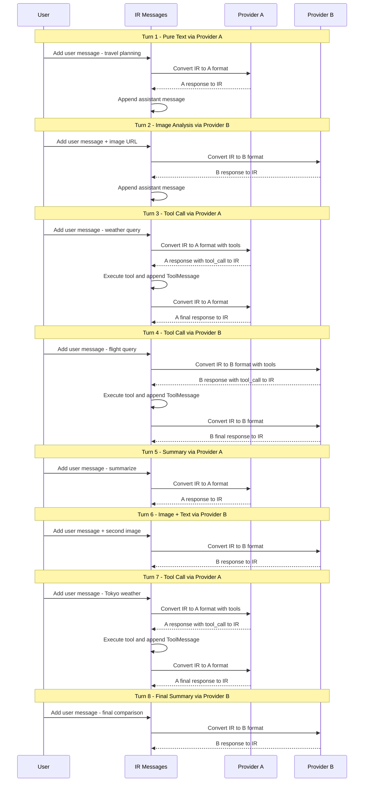
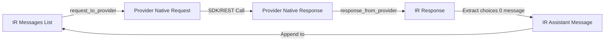
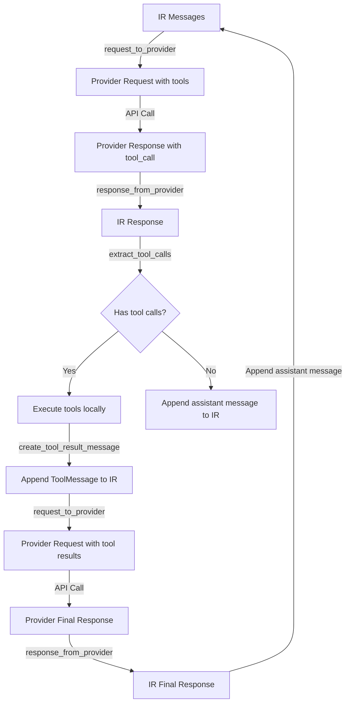

# Cross-Provider Multi-Turn Conversation Examples Architecture

## 1. Overview

本文档设计 LLMIR 项目的跨 provider 多轮对话 examples，展示 4 种 API 标准之间的两两跨 provider 多轮对话，包含图像和工具调用。提供 REST 和 SDK 两种实现方式。

### 1.1 四种 Provider

| 缩写 | Provider | Converter 类 | SDK 调用方式 |
|------|----------|-------------|-------------|
| `oc` | OpenAI Chat Completions | `OpenAIChatConverter` | `openai.chat.completions.create()` |
| `or` | OpenAI Responses | `OpenAIResponsesConverter` | `openai.responses.create()` |
| `an` | Anthropic Messages | `AnthropicConverter` | `anthropic.messages.create()` |
| `gg` | Google GenAI | `GoogleGenAIConverter` | `genai.Client.models.generate_content()` |

### 1.2 六种两两组合

| # | 组合 | 文件后缀 |
|---|------|---------|
| 1 | OpenAI Chat ↔ Anthropic | `oc_an` |
| 2 | OpenAI Chat ↔ Google GenAI | `oc_gg` |
| 3 | OpenAI Chat ↔ OpenAI Responses | `oc_or` |
| 4 | Anthropic ↔ Google GenAI | `an_gg` |
| 5 | Anthropic ↔ OpenAI Responses | `an_or` |
| 6 | Google GenAI ↔ OpenAI Responses | `gg_or` |

---

## 2. 统一对话路径设计

设计一条 **8 轮** 的统一对话路径，覆盖纯文本、图像、工具调用、多轮上下文延续。

对于每对组合 A ↔ B，两个 provider 交替处理请求：奇数轮用 A，偶数轮用 B。

### 2.1 对话路径总览

```
Turn 1 [Provider A] - 纯文本：打招呼 + 设定角色
Turn 2 [Provider B] - 图像分析：发送图像 URL，请求描述
Turn 3 [Provider A] - 工具调用：查询天气（触发 get_current_weather）
Turn 4 [Provider B] - 工具调用：查询航班（触发 get_flight_info）
Turn 5 [Provider A] - 纯文本：基于前面的天气和航班信息做总结
Turn 6 [Provider B] - 图像 + 文本：发送第二张图像，结合上下文提问
Turn 7 [Provider A] - 工具调用：再次查询天气（不同城市）
Turn 8 [Provider B] - 纯文本：最终总结整个对话
```

### 2.2 详细对话路径

#### Turn 1: 纯文本 — 打招呼 + 设定角色 [Provider A]

- **用户消息**: `"You are a helpful travel assistant. I'm planning a trip and need your help with weather, flights, and sightseeing. Let's start - what should I consider when planning a trip to San Francisco?"`
- **包含图像**: 否
- **包含工具调用**: 否
- **转换流程**: IR messages → Provider A native request → Provider A API call → Provider A response → IR messages
- **预期**: 模型返回纯文本旅行建议

#### Turn 2: 图像分析 — 发送图像 URL [Provider B]

- **用户消息**: `"I found this photo of a landmark. Can you tell me what it is and whether it's worth visiting?"` + ImagePart(url)
- **包含图像**: 是（Golden Gate Bridge 图像）
- **包含工具调用**: 否
- **转换流程**: IR messages（含历史） → Provider B native request → Provider B API call → Provider B response → IR messages
- **预期**: 模型识别图像并给出建议

#### Turn 3: 工具调用 — 查询天气 [Provider A]

- **用户消息**: `"Great! What's the current weather like in San Francisco? I want to know if I should pack warm clothes."`
- **包含图像**: 否
- **包含工具调用**: 是（`get_current_weather(location="San Francisco, CA")`）
- **转换流程**:
  1. IR messages → Provider A native request（含 tools） → Provider A API call
  2. Provider A response（tool_call） → IR messages
  3. 执行工具 → 创建 ToolMessage → 追加到 IR messages
  4. IR messages → Provider A native request → Provider A API call
  5. Provider A response（最终文本） → IR messages
- **预期**: 模型调用天气工具，获取结果后给出穿衣建议

#### Turn 4: 工具调用 — 查询航班 [Provider B]

- **用户消息**: `"I'll be flying from New York. Can you check flight information from New York to San Francisco?"`
- **包含图像**: 否
- **包含工具调用**: 是（`get_flight_info(origin="New York", destination="San Francisco")`）
- **转换流程**: 同 Turn 3，但使用 Provider B
- **预期**: 模型调用航班工具，获取结果后给出航班信息

#### Turn 5: 纯文本 — 基于上下文总结 [Provider A]

- **用户消息**: `"Based on the weather and flight information, what's your recommendation for the best time to visit? Please summarize what we know so far."`
- **包含图像**: 否
- **包含工具调用**: 否
- **转换流程**: IR messages（含完整历史） → Provider A native request → Provider A API call → Provider A response → IR messages
- **预期**: 模型综合前面的天气和航班信息给出建议

#### Turn 6: 图像 + 文本 — 第二张图像 [Provider B]

- **用户消息**: `"I also want to visit Tokyo after San Francisco. Here's a photo from Tokyo. What landmarks can you see, and how does it compare to San Francisco?"` + ImagePart(url)
- **包含图像**: 是（Tokyo Tower 图像）
- **包含工具调用**: 否
- **转换流程**: IR messages（含历史 + 新图像） → Provider B native request → Provider B API call → Provider B response → IR messages
- **预期**: 模型识别东京图像，与旧金山对比

#### Turn 7: 工具调用 — 查询东京天气 [Provider A]

- **用户消息**: `"What's the weather like in Tokyo right now? I want to compare it with San Francisco."`
- **包含图像**: 否
- **包含工具调用**: 是（`get_current_weather(location="Tokyo")`）
- **转换流程**: 同 Turn 3
- **预期**: 模型调用天气工具查询东京天气，与旧金山对比

#### Turn 8: 纯文本 — 最终总结 [Provider B]

- **用户消息**: `"Thank you! Please give me a final summary comparing San Francisco and Tokyo as travel destinations, including weather, landmarks, and your overall recommendation."`
- **包含图像**: 否
- **包含工具调用**: 否
- **转换流程**: IR messages（完整历史） → Provider B native request → Provider B API call → Provider B response → IR messages
- **预期**: 模型给出完整的旅行对比总结

### 2.3 对话路径 Mermaid 图



---

## 3. 公共资源设计

### 3.1 文件: `examples/common.py`

包含所有 example 共享的资源。

#### 3.1.1 工具定义（IR ToolDefinition 格式）

```python
tools_spec = [
    {
        "type": "function",
        "name": "get_current_weather",
        "description": "Get the current weather in a given location",
        "parameters": {
            "type": "object",
            "properties": {
                "location": {
                    "type": "string",
                    "description": "The city and state, e.g. San Francisco, CA",
                },
                "unit": {"type": "string", "enum": ["celsius", "fahrenheit"]},
            },
            "required": ["location"],
        },
    },
    {
        "type": "function",
        "name": "get_flight_info",
        "description": "Get flight information between two locations",
        "parameters": {
            "type": "object",
            "properties": {
                "origin": {"type": "string", "description": "The origin city"},
                "destination": {
                    "type": "string",
                    "description": "The destination city",
                },
            },
            "required": ["origin", "destination"],
        },
    },
]
```

#### 3.1.2 图像 URL

使用 Wikipedia 上的公共图像（稳定可访问）：

```python
IMAGE_URLS = {
    "golden_gate": "https://upload.wikimedia.org/wikipedia/commons/thumb/0/0c/GoldenGateBridge-001.jpg/1280px-GoldenGateBridge-001.jpg",
    "tokyo_tower": "https://upload.wikimedia.org/wikipedia/commons/thumb/3/37/TaijuInada_%2822262641988%29.jpg/800px-TaijuInada_%2822262641988%29.jpg",
}
```

#### 3.1.3 工具执行模拟函数

复用现有 `examples/tools.py` 中的函数，在 `common.py` 中重新导出：

```python
from examples.tools import available_tools, get_current_weather, get_flight_info
```

#### 3.1.4 公共辅助函数

```python
def display_turn_header(turn: int, provider_name: str, description: str) -> None:
    """Display a formatted turn header."""

def display_assistant_response(message: Message) -> None:
    """Display assistant's response including text and tool calls."""

def execute_tool_calls(
    tool_calls: List[ToolCallPart], ir_messages: List[Message]
) -> None:
    """Execute all tool calls and append results to message history."""

def send_to_provider_sdk(
    converter, client, model, ir_messages, tools_spec=None, tool_choice=None,
    provider_type="openai_chat"
) -> Message:
    """
    Unified SDK send function.
    Handles the full cycle: IR → provider request → API call → IR response.
    Supports tool call loops (call → execute → re-send).
    """

def send_to_provider_rest(
    converter, api_url, headers, model, ir_messages, tools_spec=None,
    tool_choice=None, provider_type="openai_chat", extra_body=None
) -> Message:
    """
    Unified REST send function.
    Handles the full cycle: IR → provider request → HTTP POST → IR response.
    Supports tool call loops.
    """
```

#### 3.1.5 对话路径定义

```python
CONVERSATION_TURNS = [
    {
        "turn": 1,
        "provider_index": 0,  # Provider A
        "user_text": "You are a helpful travel assistant...",
        "image_url": None,
        "expects_tool_call": False,
        "description": "Pure text - travel planning intro",
    },
    {
        "turn": 2,
        "provider_index": 1,  # Provider B
        "user_text": "I found this photo of a landmark...",
        "image_url": IMAGE_URLS["golden_gate"],
        "expects_tool_call": False,
        "description": "Image analysis - Golden Gate Bridge",
    },
    # ... remaining turns
]
```

### 3.2 保留现有 `examples/tools.py`

现有的 `tools.py` 保持不变，`common.py` 从中导入。

---

## 4. 文件结构设计

### 4.1 新的 `examples/` 目录结构

```
examples/
├── common.py                          # 公共资源：工具定义、图像URL、辅助函数、对话路径
├── tools.py                           # 工具模拟函数（已有，保持不变）
├── README.md                          # Examples 说明文档
│
├── sdk_based/
│   ├── multi_turn_chat.py             # 已有的多 provider 轮转示例（保留）
│   ├── cross_oc_an.py                 # OpenAI Chat ↔ Anthropic
│   ├── cross_oc_gg.py                 # OpenAI Chat ↔ Google GenAI
│   ├── cross_oc_or.py                 # OpenAI Chat ↔ OpenAI Responses
│   ├── cross_an_gg.py                 # Anthropic ↔ Google GenAI
│   ├── cross_an_or.py                 # Anthropic ↔ OpenAI Responses
│   └── cross_gg_or.py                 # Google GenAI ↔ OpenAI Responses
│
├── rest_based/
│   ├── test_openai_chat_rest.py       # 已有（保留）
│   ├── test_anthropic_rest.py         # 已有（保留）
│   ├── test_google_rest.py            # 已有（保留）
│   ├── test_openai_responses_rest.py  # 已有（保留）
│   ├── test_google_sequential_calls.py         # 已有（保留）
│   ├── test_google_sequential_with_tools.py    # 已有（保留）
│   ├── test_google_thought_signature.py        # 已有（保留）
│   ├── cross_oc_an_rest.py            # OpenAI Chat ↔ Anthropic (REST)
│   ├── cross_oc_gg_rest.py            # OpenAI Chat ↔ Google GenAI (REST)
│   ├── cross_oc_or_rest.py            # OpenAI Chat ↔ OpenAI Responses (REST)
│   ├── cross_an_gg_rest.py            # Anthropic ↔ Google GenAI (REST)
│   ├── cross_an_or_rest.py            # Anthropic ↔ OpenAI Responses (REST)
│   └── cross_gg_or_rest.py            # Google GenAI ↔ OpenAI Responses (REST)
```

### 4.2 命名规范

- SDK 版本: `cross_{provider_a}_{provider_b}.py`
- REST 版本: `cross_{provider_a}_{provider_b}_rest.py`
- Provider 缩写: `oc` (OpenAI Chat), `or` (OpenAI Responses), `an` (Anthropic), `gg` (Google GenAI)
- 缩写按字母序排列：`an` < `gg` < `oc` < `or`，所以实际文件名为：
  - `cross_an_gg.py`, `cross_an_oc.py`, `cross_an_or.py`
  - `cross_gg_oc.py`, `cross_gg_or.py`
  - `cross_oc_or.py`

> **修正**: 为了可读性，使用上面的字母序排列。

---

## 5. 代码骨架设计

### 5.1 SDK 版本代码骨架

以 `cross_an_oc.py`（Anthropic ↔ OpenAI Chat）为例：

```python
#!/usr/bin/env python
"""
Cross-Provider Multi-Turn Conversation: Anthropic ↔ OpenAI Chat (SDK)

Demonstrates LLMIR's ability to maintain a unified conversation history
across Anthropic Messages API and OpenAI Chat Completions API,
with image analysis and tool calling.

Requirements:
    pip install -e ".[openai,anthropic]"

Proxy Note:
    OpenAI API calls may require proxy configuration.
    Set HTTP_PROXY/HTTPS_PROXY environment variables if needed.
"""

import os
import sys
from typing import List

import anthropic
from dotenv import load_dotenv
from openai import OpenAI

sys.path.insert(0, os.path.join(os.path.dirname(__file__), "../.."))

from examples.common import (
    CONVERSATION_TURNS,
    IMAGE_URLS,
    display_assistant_response,
    display_turn_header,
    execute_tool_calls,
    tools_spec,
)
from llmir.converters.anthropic import AnthropicConverter
from llmir.converters.openai_chat import OpenAIChatConverter
from llmir.types.ir import (
    Message,
    create_tool_result_message,
    extract_text_content,
    extract_tool_calls,
)

load_dotenv()


# ============================================================================
# Provider Configuration
# ============================================================================

PROVIDERS = {
    "anthropic": {
        "name": "Anthropic",
        "converter": AnthropicConverter(),
        "client": anthropic.Anthropic(api_key=os.getenv("ANTHROPIC_API_KEY")),
        "model": os.getenv("ANTHROPIC_MODEL", "claude-3-haiku-20240307"),
    },
    "openai_chat": {
        "name": "OpenAI Chat",
        "converter": OpenAIChatConverter(),
        "client": OpenAI(
            api_key=os.getenv("OPENAI_API_KEY"),
            base_url=os.getenv("OPENAI_BASE_URL", "https://api.openai.com/v1"),
        ),
        "model": os.getenv("OPENAI_MODEL", "gpt-4.1-nano"),
    },
}

# Provider order: A=anthropic, B=openai_chat
PROVIDER_ORDER = ["anthropic", "openai_chat"]


# ============================================================================
# Provider-Specific Send Functions
# ============================================================================


def send_anthropic(converter, client, model, ir_messages, with_tools=False):
    """Send request via Anthropic SDK and return IR messages."""
    # Build IRRequest
    ir_request = {
        "model": model,
        "messages": ir_messages,
    }
    if with_tools:
        ir_request["tools"] = tools_spec
        ir_request["tool_choice"] = {"mode": "auto", "tool_name": ""}

    # Convert to provider format
    provider_request, warnings = converter.request_to_provider(ir_request)

    # Anthropic requires max_tokens (already handled by converter, default 4096)
    # Call API
    response = client.messages.create(**provider_request)

    # Convert response to IR
    ir_response = converter.response_from_provider(response.model_dump())

    # Extract assistant message from IRResponse
    return ir_response["choices"][0]["message"]


def send_openai_chat(converter, client, model, ir_messages, with_tools=False):
    """Send request via OpenAI Chat SDK and return IR messages."""
    ir_request = {
        "model": model,
        "messages": ir_messages,
    }
    if with_tools:
        ir_request["tools"] = tools_spec
        ir_request["tool_choice"] = {"mode": "auto", "tool_name": ""}

    provider_request, warnings = converter.request_to_provider(ir_request)

    response = client.chat.completions.create(**provider_request)

    ir_response = converter.response_from_provider(response.model_dump())

    return ir_response["choices"][0]["message"]


SEND_FUNCTIONS = {
    "anthropic": send_anthropic,
    "openai_chat": send_openai_chat,
}


# ============================================================================
# Main Conversation Loop
# ============================================================================


def build_user_message(turn_info):
    """Build an IR user message from turn info."""
    content = [{"type": "text", "text": turn_info["user_text"]}]
    if turn_info.get("image_url"):
        content.append({"type": "image", "image_url": turn_info["image_url"]})
    return {"role": "user", "content": content}


def main():
    print("=" * 80)
    print("CROSS-PROVIDER CONVERSATION: Anthropic <-> OpenAI Chat")
    print("=" * 80)

    ir_messages: List[Message] = []

    for turn_info in CONVERSATION_TURNS:
        provider_key = PROVIDER_ORDER[turn_info["provider_index"]]
        provider = PROVIDERS[provider_key]
        send_fn = SEND_FUNCTIONS[provider_key]

        display_turn_header(
            turn_info["turn"], provider["name"], turn_info["description"]
        )

        # Build and append user message
        user_msg = build_user_message(turn_info)
        ir_messages.append(user_msg)
        print(f"User: {turn_info['user_text']}")
        if turn_info.get("image_url"):
            print(f"  [Image: {turn_info['image_url'][:60]}...]")

        # Send to provider
        with_tools = turn_info.get("expects_tool_call", False)
        assistant_msg = send_fn(
            provider["converter"],
            provider["client"],
            provider["model"],
            ir_messages,
            with_tools=with_tools,
        )
        ir_messages.append(assistant_msg)
        display_assistant_response(assistant_msg)

        # Handle tool calls if any
        tool_calls = extract_tool_calls(assistant_msg)
        if tool_calls:
            execute_tool_calls(tool_calls, ir_messages)

            # Re-send to get final response after tool execution
            final_msg = send_fn(
                provider["converter"],
                provider["client"],
                provider["model"],
                ir_messages,
                with_tools=with_tools,
            )
            ir_messages.append(final_msg)
            display_assistant_response(final_msg)

        print()

    # Summary
    print("=" * 80)
    print("CONVERSATION COMPLETE")
    print(f"Total messages in history: {len(ir_messages)}")
    print(f"Providers used: {', '.join(p['name'] for p in PROVIDERS.values())}")
    print("=" * 80)


if __name__ == "__main__":
    main()
```

### 5.2 REST 版本代码骨架

以 `cross_an_oc_rest.py`（Anthropic ↔ OpenAI Chat REST）为例：

```python
#!/usr/bin/env python
"""
Cross-Provider Multi-Turn Conversation: Anthropic ↔ OpenAI Chat (REST)

Uses raw HTTP requests instead of SDK wrappers.

Proxy Note:
    OpenAI API calls may require proxy. Use proxychains or set
    HTTP_PROXY/HTTPS_PROXY environment variables.
"""

import json
import os
import sys
from typing import Any, Dict, List

import requests
from dotenv import load_dotenv

sys.path.insert(0, os.path.join(os.path.dirname(__file__), "../.."))

from examples.common import (
    CONVERSATION_TURNS,
    IMAGE_URLS,
    display_assistant_response,
    display_turn_header,
    execute_tool_calls,
    tools_spec,
)
from llmir.converters.anthropic import AnthropicConverter
from llmir.converters.openai_chat import OpenAIChatConverter
from llmir.types.ir import (
    Message,
    extract_tool_calls,
)

load_dotenv()


# ============================================================================
# REST API Configuration
# ============================================================================

PROVIDERS = {
    "anthropic": {
        "name": "Anthropic",
        "converter": AnthropicConverter(),
        "api_url": os.getenv("ANTHROPIC_BASE_URL", "https://api.anthropic.com")
        + "/v1/messages",
        "headers": {
            "x-api-key": os.getenv("ANTHROPIC_API_KEY", ""),
            "anthropic-version": "2023-06-01",
            "Content-Type": "application/json",
        },
        "model": os.getenv("ANTHROPIC_MODEL", "claude-3-5-sonnet-20241022"),
    },
    "openai_chat": {
        "name": "OpenAI Chat",
        "converter": OpenAIChatConverter(),
        "api_url": os.getenv("OPENAI_BASE_URL", "https://api.openai.com/v1")
        + "/chat/completions",
        "headers": {
            "Authorization": f"Bearer {os.getenv('OPENAI_API_KEY', '')}",
            "Content-Type": "application/json",
        },
        "model": os.getenv("OPENAI_MODEL", "gpt-4.1-nano"),
    },
}

PROVIDER_ORDER = ["anthropic", "openai_chat"]


# ============================================================================
# REST Send Functions
# ============================================================================


def send_rest(provider_config, ir_messages, with_tools=False):
    """Send request via REST API and return IR assistant message."""
    converter = provider_config["converter"]

    ir_request = {
        "model": provider_config["model"],
        "messages": ir_messages,
    }
    if with_tools:
        ir_request["tools"] = tools_spec
        ir_request["tool_choice"] = {"mode": "auto", "tool_name": ""}

    provider_request, warnings = converter.request_to_provider(ir_request)

    # POST to REST API
    response = requests.post(
        provider_config["api_url"],
        headers=provider_config["headers"],
        json=provider_request,
        timeout=60,
    )
    response.raise_for_status()
    response_data = response.json()

    print(f"  [REST] Status: {response.status_code}")

    # Convert response to IR
    ir_response = converter.response_from_provider(response_data)
    return ir_response["choices"][0]["message"]


# ============================================================================
# Main (same loop structure as SDK version)
# ============================================================================


def build_user_message(turn_info):
    """Build an IR user message from turn info."""
    content = [{"type": "text", "text": turn_info["user_text"]}]
    if turn_info.get("image_url"):
        content.append({"type": "image", "image_url": turn_info["image_url"]})
    return {"role": "user", "content": content}


def main():
    print("=" * 80)
    print("CROSS-PROVIDER CONVERSATION (REST): Anthropic <-> OpenAI Chat")
    print("=" * 80)

    ir_messages: List[Message] = []

    for turn_info in CONVERSATION_TURNS:
        provider_key = PROVIDER_ORDER[turn_info["provider_index"]]
        provider = PROVIDERS[provider_key]

        display_turn_header(
            turn_info["turn"], provider["name"], turn_info["description"]
        )

        user_msg = build_user_message(turn_info)
        ir_messages.append(user_msg)
        print(f"User: {turn_info['user_text']}")

        with_tools = turn_info.get("expects_tool_call", False)

        try:
            assistant_msg = send_rest(provider, ir_messages, with_tools=with_tools)
            ir_messages.append(assistant_msg)
            display_assistant_response(assistant_msg)

            # Handle tool calls
            tool_calls = extract_tool_calls(assistant_msg)
            if tool_calls:
                execute_tool_calls(tool_calls, ir_messages)
                final_msg = send_rest(provider, ir_messages, with_tools=with_tools)
                ir_messages.append(final_msg)
                display_assistant_response(final_msg)

        except requests.exceptions.RequestException as e:
            print(f"  [ERROR] HTTP Error: {e}")
            if hasattr(e, "response") and e.response is not None:
                print(f"  Response: {e.response.text[:200]}")

        print()

    print("=" * 80)
    print("CONVERSATION COMPLETE")
    print(f"Total messages: {len(ir_messages)}")
    print("=" * 80)


if __name__ == "__main__":
    main()
```

### 5.3 各 Provider 的 Send 函数差异

每个 provider 的 send 函数需要处理的差异：

| Provider | SDK 调用方式 | 特殊处理 |
|----------|------------|---------|
| OpenAI Chat | `client.chat.completions.create(**provider_request)` | 直接展开 provider_request |
| OpenAI Responses | `client.responses.create(model=..., input=..., tools=..., tool_choice=...)` | 需要分别传参，不能直接展开 |
| Anthropic | `client.messages.create(**provider_request)` | `max_tokens` 已由 converter 自动添加 |
| Google GenAI | `client.models.generate_content(model=..., contents=..., config=...)` | 需要分别传 model/contents/config |

### 5.4 Google GenAI 的特殊处理

Google GenAI 的 `request_to_provider` 返回的 dict 包含 `model`, `contents`, `config` 三个顶层字段。SDK 调用时需要拆分：

```python
def send_google(converter, client, model, ir_messages, with_tools=False):
    ir_request = {"model": model, "messages": ir_messages}
    if with_tools:
        ir_request["tools"] = tools_spec

    provider_request, warnings = converter.request_to_provider(ir_request)

    # Google SDK requires separate parameters
    response = client.models.generate_content(
        model=provider_request["model"],
        contents=provider_request["contents"],
        config=provider_request.get("config"),
    )

    ir_response = converter.response_from_provider(response.model_dump())
    return ir_response["choices"][0]["message"]
```

### 5.5 OpenAI Responses 的特殊处理

OpenAI Responses API 使用 `input` 而非 `messages`，且 SDK 调用方式不同：

```python
def send_openai_responses(converter, client, model, ir_messages, with_tools=False):
    ir_request = {"model": model, "messages": ir_messages}
    if with_tools:
        ir_request["tools"] = tools_spec
        ir_request["tool_choice"] = {"mode": "auto", "tool_name": ""}

    provider_request, warnings = converter.request_to_provider(ir_request)

    # Responses API uses different parameter names
    response = client.responses.create(
        model=provider_request["model"],
        input=provider_request["input"],
        tools=provider_request.get("tools"),
        tool_choice=provider_request.get("tool_choice"),
    )

    ir_response = converter.response_from_provider(response.model_dump())
    return ir_response["choices"][0]["message"]
```

---

## 6. 转换流程详解

### 6.1 核心转换流程

每一轮对话的核心转换流程：



### 6.2 工具调用的扩展流程

当模型返回工具调用时：



### 6.3 跨 Provider 的关键点

跨 provider 对话的核心在于 **IR messages 列表是共享的**。无论哪个 provider 处理当前轮次，它都接收完整的 IR 历史，converter 负责将其转换为该 provider 的原生格式。

```
Turn 1: [user_msg_1] → Provider A → [user_msg_1, assistant_msg_1]
Turn 2: [user_msg_1, assistant_msg_1, user_msg_2] → Provider B → [..., assistant_msg_2]
Turn 3: [..., user_msg_3] → Provider A → [..., assistant_msg_3]
...
```

每个 converter 的 `request_to_provider` 方法会：
- 将 IR messages 转换为该 provider 的消息格式
- 处理角色映射（如 Google 的 `model` vs `assistant`）
- 处理内容格式差异（如 Anthropic 的 `tool_use` vs OpenAI 的 `tool_calls`）
- 处理结构差异（如 Google 的 `contents` vs OpenAI 的 `messages`）

---

## 7. 注意事项

### 7.1 网络代理

- **OpenAI** 和 **Google** 的 API 可能需要代理访问
- SDK 版本：在代码注释中说明需要设置 `HTTP_PROXY`/`HTTPS_PROXY` 环境变量
- REST 版本：可以通过 `proxychains -q python script.py` 运行，或在 `requests` 中配置 proxies
- **Anthropic** 通常不需要代理

### 7.2 Anthropic 的 `max_tokens`

- Anthropic API 要求 `max_tokens` 参数
- `AnthropicConverter.request_to_provider()` 已自动处理：如果 `generation` 配置中没有指定，默认设为 4096
- 无需在 example 中额外处理

### 7.3 Google GenAI 的结构差异

- Google 使用 `contents` 而非 `messages`
- Google 使用 `config` 对象包含 tools、generation 参数等
- `GoogleGenAIConverter.request_to_provider()` 返回 `{"model": ..., "contents": ..., "config": ..., "system_instruction": ...}`
- SDK 调用时需要拆分参数

### 7.4 OpenAI Responses 的扁平结构

- Responses API 使用 `input`（扁平 item 列表）而非 `messages`
- `output` 也是扁平 item 列表
- `OpenAIResponsesConverter.request_to_provider()` 返回 `{"model": ..., "input": [...], "tools": [...], ...}`
- SDK 调用时需要分别传参

### 7.5 图像支持差异

- 所有 4 个 provider 都支持图像 URL 输入
- IR 使用 `ImagePart` 统一表示：`{"type": "image", "image_url": "https://..."}`
- 各 converter 自动处理格式转换：
  - OpenAI Chat: `{"type": "image_url", "image_url": {"url": "..."}}`
  - OpenAI Responses: `{"type": "input_image", "image_url": "..."}`
  - Anthropic: `{"type": "image", "source": {"type": "url", "url": "..."}}`
  - Google: `{"file_data": {"file_uri": "...", "mime_type": "image/jpeg"}}`

### 7.6 API 接口选择

新的 examples 应使用 **新的 6 接口 API**（`request_to_provider`, `response_from_provider` 等），而非旧的 `to_provider`/`from_provider` 向后兼容方法。这样可以：
- 展示完整的 `IRRequest` → provider request → provider response → `IRResponse` 流程
- 利用 `IRResponse` 的结构化 `choices` 字段
- 避免不同 converter 的 `from_provider` 返回类型不一致的问题

### 7.7 环境变量

所有 example 需要以下环境变量（通过 `.env` 文件或环境设置）：

```bash
# OpenAI Chat
OPENAI_API_KEY=sk-...
OPENAI_BASE_URL=https://api.openai.com/v1  # optional
OPENAI_MODEL=gpt-4.1-nano                  # optional

# OpenAI Responses (may use different key/model)
OPENAI_RESPONSES_API_KEY=sk-...
OPENAI_RESPONSES_BASE_URL=https://api.openai.com/v1  # optional
OPENAI_RESPONSES_MODEL=gpt-4o                        # optional

# Anthropic
ANTHROPIC_API_KEY=sk-ant-...
ANTHROPIC_MODEL=claude-3-haiku-20240307  # optional

# Google GenAI
GOOGLE_API_KEY=AI...
GOOGLE_MODEL=gemini-1.5-flash-latest     # optional
```

### 7.8 错误处理

每个 example 应包含基本的错误处理：
- API key 缺失检查（跳过该 provider 而非崩溃）
- HTTP 错误处理（REST 版本）
- SDK 异常处理
- 工具调用执行错误处理

---

## 8. 实现优先级

建议按以下顺序实现：

1. **`examples/common.py`** — 公共资源和辅助函数
2. **`examples/sdk_based/cross_an_oc.py`** — 第一个 SDK 示例（Anthropic ↔ OpenAI Chat，最常见的组合）
3. **`examples/rest_based/cross_an_oc_rest.py`** — 对应的 REST 版本
4. **剩余 5 个 SDK 示例** — 基于第一个示例的模板快速创建
5. **剩余 5 个 REST 示例** — 基于 REST 模板快速创建
6. **`examples/README.md`** — 说明文档

---

## 9. 代码复用策略

### 9.1 模板化

所有 12 个 cross-provider 文件（6 SDK + 6 REST）共享相同的对话循环结构。差异仅在于：
- Provider 配置（client 初始化、model 名称）
- Send 函数（SDK 调用方式不同）

### 9.2 `common.py` 的职责

`common.py` 承担大部分逻辑：
- 对话路径定义（`CONVERSATION_TURNS`）
- 用户消息构建（`build_user_message`）
- 响应显示（`display_assistant_response`）
- 工具执行（`execute_tool_calls`）
- Turn header 显示（`display_turn_header`）

### 9.3 每个 cross-provider 文件的职责

每个文件只需要：
1. 定义两个 provider 的配置
2. 定义两个 provider 的 send 函数
3. 运行对话循环

这使得每个文件约 100-150 行，简洁且易于理解。