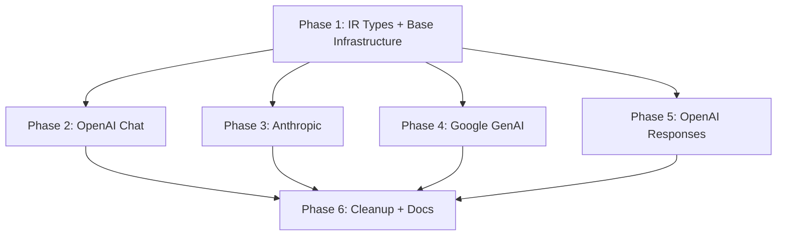

# Stream Converter Improvement Plan

> **Status: ✅ All Phases Completed**
>
> | Phase | Description | Status | Branch |
> |-------|-------------|--------|--------|
> | Phase 1 | IR Type Extensions and Base Infrastructure | ✅ Completed | `feature/stream-phase1-ir-types` |
> | Phase 2 | OpenAI Chat Stream Improvements | ✅ Completed | `feature/stream-phase2-openai-chat` |
> | Phase 3 | Anthropic Stream Improvements | ✅ Completed | `feature/stream-phase3-anthropic` |
> | Phase 4 | Google GenAI Stream Improvements | ✅ Completed | `feature/stream-phase4-google-genai` |
> | Phase 5 | OpenAI Responses Stream Improvements | ✅ Completed | `feature/stream-phase5-openai-responses` |
> | Phase 6 | Code Cleanup and Documentation | ✅ Completed | `feature/stream-phase6-cleanup` |

## 1. Overview

### Current State

The LLMIR stream conversion layer supports 6 IR event types defined in
[`stream.py`](../src/llmir/types/ir/stream.py): `TextDeltaEvent`,
`ReasoningDeltaEvent`, `ToolCallStartEvent`, `ToolCallDeltaEvent`,
`FinishEvent`, and `UsageEvent`. All 4 providers (OpenAI Chat, Anthropic,
Google GenAI, OpenAI Responses) implement `stream_response_from_provider` and
`stream_response_to_provider` methods in their respective converter files.

The core content conversion (text, reasoning, tool calls, finish, usage) is
**functionally complete** for `from_provider` direction. However, systematic
structural deficiencies exist — primarily in the `to_provider` direction —
that prevent the output from being consumed by real SDK clients or used in a
Man-in-the-Middle proxy scenario.

### Improvement Goals

1. **MitM-ready `to_provider` output**: Every provider's `stream_response_to_provider`
   must produce structurally complete SSE events that a real SDK client can consume.
2. **Lossless `from_provider` capture**: Session-level metadata (response ID, model,
   timestamps) must be captured and made available for round-trip conversion.
3. **Stateful stream context**: Introduce a `StreamContext` mechanism to track
   session-level state across individual chunk/event conversions.
4. **BaseConverter stream contract**: Declare abstract stream methods in `BaseConverter`
   to enforce a consistent interface across all providers.
5. **Documentation accuracy**: Retire the outdated `analysis/stream_converter_review.md`
   and replace it with this plan as the authoritative reference.

---

## 2. Problem Inventory

### P0 — Blocks MitM Proxy Scenario

| # | Problem | Impact | Files |
|---|---------|--------|-------|
| P0-1 | **OpenAI Chat `to_provider` missing top-level fields**: Each chunk lacks `id`, `object: "chat.completion.chunk"`, `model`, `created`. First chunk lacks `role: "assistant"` in delta. | SDK clients reject or misparse chunks. | [`openai_chat/converter.py`](../src/llmir/converters/openai_chat/converter.py) |
| P0-2 | **Anthropic `to_provider` missing lifecycle events**: No `message_start`, `content_block_start` (text/thinking), `content_block_stop`, `message_stop` events generated. `content_block_delta` lacks `index` field. | Anthropic SDK client cannot reconstruct the message. | [`anthropic/converter.py`](../src/llmir/converters/anthropic/converter.py) |
| P0-3 | **OpenAI Responses `to_provider` missing lifecycle events**: No `response.created`, `response.in_progress`, `response.output_item.added` (message), `response.content_part.added` events. Both `finish` and `usage` emit `response.completed` causing **duplicate terminal events**. | Responses SDK client receives malformed stream. | [`openai_responses/converter.py`](../src/llmir/converters/openai_responses/converter.py) |
| P0-4 | **Google GenAI `to_provider` tool_call_delta missing `name`**: `tool_call_delta` generates `function_call` with `name: ""` because the stateless converter has no access to the tool name from the earlier `tool_call_start`. | Google SDK receives malformed function call. | [`google_genai/converter.py`](../src/llmir/converters/google_genai/converter.py) |
| P0-5 | **IR layer lacks session-level metadata event**: No IR event type carries response ID, model name, or creation timestamp. This information is needed by `to_provider` to populate top-level fields. | Cannot produce structurally complete output for any provider. | [`stream.py`](../src/llmir/types/ir/stream.py) |
| P0-6 | **Stateless design prevents context propagation**: Anthropic `ToolCallDeltaEvent.tool_call_id` is always `""`. Google `to_provider` cannot recover tool name for deltas. OpenAI Chat cannot populate `id`/`model` per chunk. | Fundamental architectural limitation. | All converter files |

### P1 — Improves Completeness and Correctness

| # | Problem | Impact | Files |
|---|---------|--------|-------|
| P1-1 | **`from_provider` discards session metadata**: OpenAI Chat ignores `id`/`model`/`created`/`role` from chunks. Anthropic ignores `message.id`/`message.model` from `message_start`. OpenAI Responses ignores `response.created` payload. | Metadata lost; cannot round-trip. | All converter files |
| P1-2 | **Provider-specific events silently dropped**: Anthropic `content_block_stop`/`message_stop`/`ping`/`content_block_start(text/thinking)`. Google `executable_code`/`code_execution_result`/`inline_data`/`grounding_metadata`. OpenAI Chat `refusal`/`logprobs`/`system_fingerprint`. OpenAI Responses all `*.done` events, `refusal.delta/done`, `content_part.added/done`. | Information loss in proxy scenarios. | All converter files |
| P1-3 | **BaseConverter does not declare stream abstract methods**: 4 converters each implement stream methods independently with no base class contract. Parameter naming is inconsistent (`chunk` vs `event`). | No compile-time enforcement; inconsistent API. | [`base/converter.py`](../src/llmir/converters/base/converter.py) |
| P1-4 | **`_normalize()` duplicated across all 4 converters**: Nearly identical static method in each converter. | Code duplication; maintenance burden. | All converter files |
| P1-5 | **Anthropic `ToolCallDeltaEvent.tool_call_id` always empty**: Delta events don't repeat the ID; stateless converter cannot fill it. | Consumer cannot correlate deltas to tool calls. | [`anthropic/converter.py`](../src/llmir/converters/anthropic/converter.py) |
| P1-6 | **OpenAI Chat stream usage lacks detailed fields**: `prompt_tokens_details` and `completion_tokens_details` not extracted in stream path (but handled in non-stream `response_from_provider`). | Inconsistency between stream and non-stream paths. | [`openai_chat/converter.py`](../src/llmir/converters/openai_chat/converter.py) |

### P2 — Nice-to-Have Improvements

| # | Problem | Impact | Files |
|---|---------|--------|-------|
| P2-1 | **Unknown event type returns empty `{}`**: All 4 converters return `{}` for unrecognized IR event types in `to_provider`. | Silent failure; hard to debug. | All converter files |
| P2-2 | **No `ErrorEvent` in IR**: No standard way to propagate mid-stream errors. | Error information lost. | [`stream.py`](../src/llmir/types/ir/stream.py) |
| P2-3 | **Anthropic `message_start` emits partial `UsageEvent`**: Only `input_tokens` available; `completion_tokens=0`. May confuse consumers. | Misleading usage data. | [`anthropic/converter.py`](../src/llmir/converters/anthropic/converter.py) |
| P2-4 | **`analysis/stream_converter_review.md` outdated**: P0 issues listed there (missing `ReasoningDeltaEvent`, `thinking_delta` mapping) have been fixed. Document no longer reflects reality. | Misleading documentation. | [`analysis/stream_converter_review.md`](../analysis/stream_converter_review.md) |

---

## 3. Architecture Improvements

### 3.1 New IR Stream Event Types

#### `StreamStartEvent` — Session metadata carrier

This event is emitted once at the beginning of a stream, carrying session-level
metadata that `to_provider` methods need to populate structural fields.

```python
class StreamStartEvent(TypedDict):
    """Stream session start event.

    Emitted once at the beginning of a stream to carry session-level
    metadata such as response ID, model name, and creation timestamp.
    These fields are needed by to_provider methods to produce
    structurally complete provider-specific output.
    """

    type: Required[Literal["stream_start"]]
    id: Required[str]           # Response/message ID
    model: Required[str]        # Model name
    created: NotRequired[int]   # Unix timestamp
```

#### `StreamEndEvent` — Terminal stream signal

```python
class StreamEndEvent(TypedDict):
    """Stream session end event.

    Emitted once at the end of a stream. Providers that require
    explicit terminal events (e.g., Anthropic message_stop,
    OpenAI Responses response.completed) use this to generate them.
    """

    type: Required[Literal["stream_end"]]
```

#### `ContentBlockStartEvent` — Content block lifecycle

```python
class ContentBlockStartEvent(TypedDict):
    """Content block start event.

    Emitted when a new content block begins. Used by providers with
    block-level lifecycle events (Anthropic content_block_start,
    OpenAI Responses response.content_part.added).
    """

    type: Required[Literal["content_block_start"]]
    block_index: Required[int]
    block_type: Required[Literal["text", "thinking", "tool_use"]]
    choice_index: NotRequired[int]
```

#### `ContentBlockEndEvent` — Content block lifecycle

```python
class ContentBlockEndEvent(TypedDict):
    """Content block end event.

    Emitted when a content block finishes.
    """

    type: Required[Literal["content_block_end"]]
    block_index: Required[int]
    choice_index: NotRequired[int]
```

#### Updated `IRStreamEvent` union

```python
IRStreamEvent = Union[
    StreamStartEvent,
    ContentBlockStartEvent,
    TextDeltaEvent,
    ReasoningDeltaEvent,
    ToolCallStartEvent,
    ToolCallDeltaEvent,
    ContentBlockEndEvent,
    FinishEvent,
    UsageEvent,
    StreamEndEvent,
]
```

### 3.2 Stateful Stream Context

#### Problem Analysis

The current stateless design means each `stream_response_from_provider` and
`stream_response_to_provider` call operates in isolation. This causes:

- **Anthropic**: `ToolCallDeltaEvent.tool_call_id` is always `""` because the
  ID was only sent in the earlier `content_block_start` event.
- **Google GenAI**: `to_provider` for `tool_call_delta` cannot recover the
  tool name (only available in the preceding `tool_call_start`).
- **OpenAI Chat**: `to_provider` cannot populate `id`/`model`/`created` in
  every chunk because these are session-level values.
- **OpenAI Responses**: `to_provider` cannot track which output items have
  been announced via `response.output_item.added`.

#### Proposed Solution: `StreamContext`

```python
class StreamContext:
    """Maintains state across stream chunk/event conversions.

    Created once per stream session. Passed to stream conversion methods
    to enable stateful tracking of session metadata, content block indices,
    and tool call mappings.
    """

    def __init__(self):
        # Session metadata (populated from StreamStartEvent or first chunk)
        self.response_id: str = ""
        self.model: str = ""
        self.created: int = 0

        # Content block tracking
        self.current_block_index: int = -1
        self.block_type_map: Dict[int, str] = {}  # index -> block_type

        # Tool call tracking
        self.tool_call_id_map: Dict[int, str] = {}    # block_index -> tool_call_id
        self.tool_name_map: Dict[int, str] = {}        # block_index -> tool_name
        self.tool_call_index_map: Dict[str, int] = {}  # tool_call_id -> tool_call_index

        # Lifecycle tracking (for to_provider)
        self.stream_started: bool = False
        self.announced_items: set = set()  # track which items have been announced
        self.is_first_content_chunk: bool = True
```

#### Method Signature Changes

```python
# BaseConverter abstract methods
@abstractmethod
def stream_response_from_provider(
    self,
    provider_chunk: Dict[str, Any],
    context: Optional[StreamContext] = None,
) -> List[IRStreamEvent]:
    ...

@abstractmethod
def stream_response_to_provider(
    self,
    ir_event: IRStreamEvent,
    context: Optional[StreamContext] = None,
) -> Union[Dict[str, Any], List[Dict[str, Any]]]:
    ...
```

Key changes:
- `context` parameter is **optional** for backward compatibility. When `None`,
  methods behave as they do today (stateless).
- `stream_response_to_provider` return type changes to
  `Union[Dict[str, Any], List[Dict[str, Any]]]` because a single IR event
  (e.g., `StreamStartEvent`) may need to produce multiple provider events
  (e.g., Anthropic's `message_start` + `content_block_start`).

### 3.3 BaseConverter Stream Abstract Methods

Add to [`base/converter.py`](../src/llmir/converters/base/converter.py):

```python
from ..types.ir.stream import IRStreamEvent

class BaseConverter(ABC):
    # ... existing methods ...

    # ==================== Stream Interface ====================

    @abstractmethod
    def stream_response_from_provider(
        self,
        provider_chunk: Dict[str, Any],
        context: Optional["StreamContext"] = None,
    ) -> List[IRStreamEvent]:
        """Convert a provider stream chunk/event to IR stream events.

        Args:
            provider_chunk: Provider-specific stream chunk or event dict.
            context: Optional stream context for stateful conversion.

        Returns:
            List of IR stream events extracted from the chunk.
        """
        pass

    @abstractmethod
    def stream_response_to_provider(
        self,
        ir_event: IRStreamEvent,
        context: Optional["StreamContext"] = None,
    ) -> Union[Dict[str, Any], List[Dict[str, Any]]]:
        """Convert an IR stream event to provider stream chunk(s).

        Args:
            ir_event: IR stream event.
            context: Optional stream context for stateful conversion.

        Returns:
            Provider-specific stream chunk dict, or a list of dicts
            when a single IR event maps to multiple provider events.
        """
        pass
```

Also extract `_normalize()` to `BaseConverter` as a static method to
eliminate duplication across all 4 converters.

---

## 4. Per-Provider Improvements

### 4.1 OpenAI Chat Completions

**File**: [`src/llmir/converters/openai_chat/converter.py`](../src/llmir/converters/openai_chat/converter.py)

#### `stream_response_from_provider` changes

1. **Emit `StreamStartEvent`** from the first chunk that contains `id`/`model`/`created`:
   ```python
   if context and not context.stream_started:
       if chunk.get("id"):
           events.append(StreamStartEvent(
               type="stream_start",
               id=chunk["id"],
               model=chunk.get("model", ""),
               created=chunk.get("created", 0),
           ))
           context.response_id = chunk["id"]
           context.model = chunk.get("model", "")
           context.created = chunk.get("created", 0)
           context.stream_started = True
   ```

2. **Extract detailed usage fields** (`prompt_tokens_details`,
   `completion_tokens_details`) to match non-stream `response_from_provider`.

3. **Emit `StreamEndEvent`** after the final chunk (when `finish_reason` is
   present and no more data expected).

#### `stream_response_to_provider` changes

1. **Populate top-level fields** from `StreamContext`:
   ```python
   base_chunk = {
       "id": context.response_id if context else "",
       "object": "chat.completion.chunk",
       "created": context.created if context else 0,
       "model": context.model if context else "",
   }
   ```

2. **Add `role: "assistant"`** to the first text/reasoning delta chunk:
   ```python
   if context and context.is_first_content_chunk:
       delta["role"] = "assistant"
       context.is_first_content_chunk = False
   ```

3. **Handle `StreamStartEvent`**: Emit an initial chunk with `role: "assistant"`
   and empty content.

4. **Handle `StreamEndEvent`**: Emit `[DONE]` sentinel or empty final chunk.

### 4.2 Anthropic Messages API

**File**: [`src/llmir/converters/anthropic/converter.py`](../src/llmir/converters/anthropic/converter.py)

#### `stream_response_from_provider` changes

1. **Emit `StreamStartEvent`** from `message_start`:
   ```python
   if event_type == "message_start":
       message = event.get("message", {})
       events.append(StreamStartEvent(
           type="stream_start",
           id=message.get("id", ""),
           model=message.get("model", ""),
       ))
   ```

2. **Emit `ContentBlockStartEvent`** from `content_block_start` for all block
   types (text, thinking, tool_use):
   ```python
   block_type_map = {"text": "text", "thinking": "thinking",
                     "tool_use": "tool_use", "server_tool_use": "tool_use"}
   events.append(ContentBlockStartEvent(
       type="content_block_start",
       block_index=event.get("index", 0),
       block_type=block_type_map.get(block_type, "text"),
   ))
   ```

3. **Fill `tool_call_id` in `ToolCallDeltaEvent`** using context:
   ```python
   if context:
       block_index = event.get("index", 0)
       tool_call_id = context.tool_call_id_map.get(block_index, "")
   ```

4. **Emit `ContentBlockEndEvent`** from `content_block_stop`.

5. **Emit `StreamEndEvent`** from `message_stop`.

#### `stream_response_to_provider` changes

1. **Handle `StreamStartEvent`**: Generate `message_start` event with full
   message metadata:
   ```python
   return {
       "type": "message_start",
       "message": {
           "id": ir_event["id"],
           "type": "message",
           "role": "assistant",
           "model": ir_event["model"],
           "content": [],
           "usage": {"input_tokens": 0, "output_tokens": 0},
       },
   }
   ```

2. **Handle `ContentBlockStartEvent`**: Generate `content_block_start` with
   appropriate block type and `index` field.

3. **Add `index` field** to all `content_block_delta` events using context.

4. **Handle `ContentBlockEndEvent`**: Generate `content_block_stop`.

5. **Handle `StreamEndEvent`**: Generate `message_stop`.

6. **Merge `finish` + `usage`**: When both arrive, combine into a single
   `message_delta` event (matching real Anthropic behavior).

### 4.3 Google GenAI

**File**: [`src/llmir/converters/google_genai/converter.py`](../src/llmir/converters/google_genai/converter.py)

#### `stream_response_from_provider` changes

1. **Emit `StreamStartEvent`** from the first chunk (Google doesn't have
   explicit session metadata, but `model_version` may be present).

2. **Emit `StreamEndEvent`** after the chunk containing `finish_reason`.

#### `stream_response_to_provider` changes

1. **Fix `tool_call_delta` missing `name`**: Use `StreamContext.tool_name_map`
   to recover the tool name:
   ```python
   if context:
       tool_call_id = ir_event["tool_call_id"]
       name = context.tool_name_map.get(
           context.tool_call_index_map.get(tool_call_id, -1), ""
       )
   ```

2. **Handle `StreamStartEvent`/`StreamEndEvent`**: These are no-ops for Google
   (Google chunks are self-contained `GenerateContentResponse` objects).

### 4.4 OpenAI Responses API

**File**: [`src/llmir/converters/openai_responses/converter.py`](../src/llmir/converters/openai_responses/converter.py)

#### `stream_response_from_provider` changes

1. **Emit `StreamStartEvent`** from `response.created` or `response.in_progress`:
   ```python
   if event_type == "response.created":
       response = event.get("response", {})
       events.append(StreamStartEvent(
           type="stream_start",
           id=response.get("id", ""),
           model=response.get("model", ""),
           created=int(response.get("created_at", 0)),
       ))
   ```

2. **Emit `ContentBlockStartEvent`** from `response.content_part.added`.

3. **Emit `ContentBlockEndEvent`** from `response.content_part.done`.

4. **Emit `StreamEndEvent`** from `response.completed`.

#### `stream_response_to_provider` changes

1. **Handle `StreamStartEvent`**: Generate `response.created` and
   `response.in_progress` events:
   ```python
   return [
       {
           "type": "response.created",
           "response": {
               "id": ir_event["id"],
               "object": "response",
               "model": ir_event["model"],
               "status": "in_progress",
               "output": [],
           },
       },
       {
           "type": "response.in_progress",
           "response": {"id": ir_event["id"], "status": "in_progress"},
       },
   ]
   ```

2. **Handle `ContentBlockStartEvent`**: Generate `response.output_item.added`
   (for message items) and `response.content_part.added`.

3. **Fix duplicate `response.completed`**: Only `StreamEndEvent` should
   generate `response.completed`. `FinishEvent` and `UsageEvent` should
   update context state but not emit terminal events independently:
   ```python
   # finish → update context only
   if event_type == "finish":
       if context:
           context.finish_reason = ir_event["finish_reason"]
       return {}  # or return [] if using list return

   # usage → update context only
   if event_type == "usage":
       if context:
           context.usage = ir_event["usage"]
       return {}

   # stream_end → emit response.completed with accumulated state
   if event_type == "stream_end":
       return {
           "type": "response.completed",
           "response": {
               "id": context.response_id,
               "status": _reason_to_status(context.finish_reason),
               "usage": _format_usage(context.usage),
               "output": [...],
           },
       }
   ```

4. **Handle `ContentBlockEndEvent`**: Generate `response.content_part.done`
   and `response.output_text.done` / `response.function_call_arguments.done`.

---

## 5. Implementation Plan

### ✅ Phase 1: IR Type Extensions and Base Infrastructure

**Scope**: Extend IR stream types; add `StreamContext`; update `BaseConverter`.

**Changes**:
- ✅ [`src/llmir/types/ir/stream.py`](../src/llmir/types/ir/stream.py):
  Add `StreamStartEvent`, `StreamEndEvent`, `ContentBlockStartEvent`,
  `ContentBlockEndEvent`. Update `IRStreamEvent` union and `__all__`.
- ✅ New file `src/llmir/converters/base/stream_context.py`:
  Implement `StreamContext` class.
- ✅ [`src/llmir/converters/base/converter.py`](../src/llmir/converters/base/converter.py):
  Add abstract `stream_response_from_provider` and `stream_response_to_provider`.
  Extract `_normalize()` as a base static method.
- ✅ [`src/llmir/converters/base/__init__.py`](../src/llmir/converters/base/__init__.py):
  Export `StreamContext`.

**Dependencies**: None.

**Expected output**: New types compile; existing tests still pass (new abstract
methods have default `pass` or are added with backward-compatible signatures).

### ✅ Phase 2: OpenAI Chat Stream Improvements

**Scope**: Fix P0-1 (missing top-level fields) and P1-6 (detailed usage).

**Changes**:
- [`src/llmir/converters/openai_chat/converter.py`](../src/llmir/converters/openai_chat/converter.py):
  - `stream_response_from_provider`: Emit `StreamStartEvent` from first chunk;
    extract detailed usage; emit `StreamEndEvent`.
  - `stream_response_to_provider`: Populate `id`/`object`/`model`/`created`
    from context; add `role: "assistant"` to first chunk; handle new event types.
- [`tests/converters/openai_chat/test_stream.py`](../tests/converters/openai_chat/test_stream.py):
  Add tests for `StreamStartEvent` emission, top-level field population,
  detailed usage extraction, `StreamEndEvent`.

**Dependencies**: Phase 1.

### ✅ Phase 3: Anthropic Stream Improvements

**Scope**: Fix P0-2 (missing lifecycle events), P1-5 (empty tool_call_id).

**Changes**:
- [`src/llmir/converters/anthropic/converter.py`](../src/llmir/converters/anthropic/converter.py):
  - `stream_response_from_provider`: Emit `StreamStartEvent` from `message_start`;
    emit `ContentBlockStartEvent`/`ContentBlockEndEvent`; fill `tool_call_id`
    from context; emit `StreamEndEvent` from `message_stop`.
  - `stream_response_to_provider`: Handle all new event types; generate
    `message_start`, `content_block_start`, `content_block_stop`, `message_stop`;
    add `index` to all block-level events.
- [`tests/converters/anthropic/test_stream.py`](../tests/converters/anthropic/test_stream.py):
  Add tests for lifecycle event generation, `tool_call_id` population via
  context, `index` field presence.

**Dependencies**: Phase 1.

### ✅ Phase 4: Google GenAI Stream Improvements

**Scope**: Fix P0-4 (tool_call_delta missing name).

**Changes**:
- [`src/llmir/converters/google_genai/converter.py`](../src/llmir/converters/google_genai/converter.py):
  - `stream_response_from_provider`: Emit `StreamStartEvent`/`StreamEndEvent`.
  - `stream_response_to_provider`: Use context to recover tool name for
    `tool_call_delta`; handle new event types (mostly no-ops for Google).
- [`tests/converters/google_genai/test_stream.py`](../tests/converters/google_genai/test_stream.py):
  Add tests for tool name recovery, new event type handling.

**Dependencies**: Phase 1.

### ✅ Phase 5: OpenAI Responses Stream Improvements

**Scope**: Fix P0-3 (missing lifecycle events, duplicate `response.completed`).

**Changes**:
- [`src/llmir/converters/openai_responses/converter.py`](../src/llmir/converters/openai_responses/converter.py):
  - `stream_response_from_provider`: Emit `StreamStartEvent` from
    `response.created`; emit `ContentBlockStartEvent`/`ContentBlockEndEvent`
    from `content_part.added`/`content_part.done`; emit `StreamEndEvent`
    from `response.completed`.
  - `stream_response_to_provider`: Handle all new event types; fix duplicate
    `response.completed` by deferring terminal event to `StreamEndEvent`;
    generate `response.created`, `response.in_progress`,
    `response.output_item.added`, `response.content_part.added`.
- [`tests/converters/openai_responses/test_stream.py`](../tests/converters/openai_responses/test_stream.py):
  Add tests for lifecycle event generation, no duplicate terminal events.

**Dependencies**: Phase 1.

### ✅ Phase 6: Code Cleanup and Documentation

**Scope**: Remove duplication; update documentation.

**Changes**:
- ✅ Extract `_normalize()` to `BaseConverter` as a base static method.
  Removed from Anthropic, OpenAI Chat, and OpenAI Responses converters.
  Google GenAI retains its own override due to extra tuple-unwrapping logic.
- ✅ ~~Update or retire [`analysis/stream_converter_review.md`](../analysis/stream_converter_review.md).~~
  — *Done: file has been deleted.*
- ✅ `StreamContext` has comprehensive docstrings explaining usage patterns.
- P2-1 (unknown event type returns `{}`) deferred — current behavior is
  acceptable for the initial implementation.

**Dependencies**: Phases 2–5.

### Dependency Graph



Phases 2–5 are independent of each other and can be implemented in parallel
or in any order after Phase 1 is complete.

### Branch Strategy

- **Main development branch**: `feature/stream-converter-improvements` (already
  created; contains the BaseConverter stream abstract methods and this plan
  document).
- Each Phase is implemented on a sub-branch off
  `feature/stream-converter-improvements`:
  - Phase 1: `feature/stream-phase1-ir-types`
  - Phase 2: `feature/stream-phase2-openai-chat`
  - Phase 3: `feature/stream-phase3-anthropic`
  - Phase 4: `feature/stream-phase4-google-genai`
  - Phase 5: `feature/stream-phase5-openai-responses`
  - Phase 6: `feature/stream-phase6-cleanup`
- Each Phase is merged back into `feature/stream-converter-improvements` via PR
  upon completion.
- **Phase 1** is a prerequisite for Phases 2–5 and must be completed first.
- **Phases 2–5** are independent of each other and can be implemented in
  parallel or in any order.
- **Phase 6** is executed after all of Phases 2–5 are complete.
- Once all Phases are done, `feature/stream-converter-improvements` is merged
  back into `main` via PR.

---

## 6. Test Strategy

### New Tests Required

#### Phase 1: IR Types

- **`tests/test_ir_types.py`**: Verify new event TypedDicts can be instantiated
  with required fields and are included in `IRStreamEvent` union.
- **`tests/test_stream_context.py`**: Unit tests for `StreamContext` state
  management (tool call tracking, block index tracking, metadata storage).

#### Phase 2–5: Per-Provider Stream Tests

For each provider, add the following test categories:

1. **Lifecycle event emission** (`from_provider`):
   - `StreamStartEvent` emitted from first chunk/event with correct metadata.
   - `ContentBlockStartEvent`/`ContentBlockEndEvent` emitted at correct points.
   - `StreamEndEvent` emitted at stream termination.

2. **Structural completeness** (`to_provider`):
   - Output contains all required top-level/structural fields.
   - Lifecycle events (provider-specific) are generated in correct order.
   - No duplicate terminal events.

3. **Stateful context tests**:
   - Tool call ID populated in delta events via context.
   - Tool name recovered in `to_provider` via context.
   - Session metadata (id, model) propagated to output chunks.

4. **Backward compatibility**:
   - All existing tests continue to pass when `context=None`.
   - Methods work correctly without context (stateless mode).

5. **Full stream round-trip tests**:
   - Simulate a complete stream sequence (start → content → tool calls → finish → usage → end).
   - Convert `from_provider` → IR events → `to_provider`.
   - Verify structural completeness of reconstructed provider stream.

6. **Cross-provider stream tests**:
   - Provider A `from_provider` → IR events → Provider B `to_provider`.
   - Verify content fidelity across provider boundaries.

### Existing Test Modifications

- [`tests/converters/openai_chat/test_stream.py`](../tests/converters/openai_chat/test_stream.py):
  Update `TestStreamResponseToProvider` to verify top-level fields when context
  is provided. Update round-trip tests to use context.
- [`tests/converters/anthropic/test_stream.py`](../tests/converters/anthropic/test_stream.py):
  Update to verify `index` field in `to_provider` output. Update
  `tool_call_delta` tests to verify `tool_call_id` population with context.
- [`tests/converters/google_genai/test_stream.py`](../tests/converters/google_genai/test_stream.py):
  Update `tool_call_delta` `to_provider` test to verify `name` field
  population with context.
- [`tests/converters/openai_responses/test_stream.py`](../tests/converters/openai_responses/test_stream.py):
  Update to verify no duplicate `response.completed` events. Add lifecycle
  event tests.